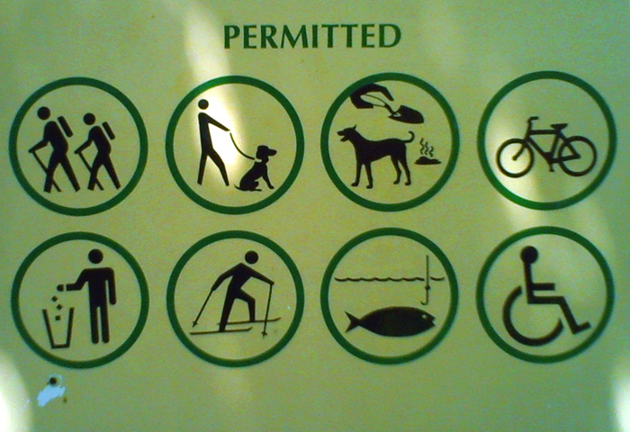

class: center, middle
# Nurturing Community Growth

Rich Bowen

???

Intro:

Rich Bowen, Apache board member and Foundation member since 2001

Professional community manager since about 2008, in various communities.

---

## Good ideas and bad code build communities, the other three combinations do not

*Stefano Mazzochi*

s.apache.org/badcode

???

Start with a quote from Stefano, from October 2000.

What he is saying here is that communities spring up when there are problems to solve, and some general agreement about the direction in which the solution lays.

If you have already solved the problem, you don’t build a community, because there is no shared goal.

Communities form around shared purpose.

---

## The Four Opens

### Open Source
### Open Design
### Open Development
### Open Community

openinfra.dev/four-opens/

???

There are many things that define what free/open software is. The most basic is that it’s under an open source license. But the other aspects are what create an actual open project.

Today we’re going to focus on community, but these pillars are deeply intertwined.

---

## Community > Code

Effective communities are built around a shared purpose. At Apache, that purpose is to produce software

???

At Apache, we like to say “Community over code”, or “Community is more important than the code”, but this is complicated, because the community exists because of the code, and so the two things are inextricably linked.

---

## So … how do we build community?

Here’s a few tips I’ve learned over the years:

---

## First User Experience

???

Nobody starts as a contributor - they start as a users. Having a good
initial experience with your project is the only way that they are going
to stick around long enough to become a contributor.

Ensure that you have detailed step-by-step instructions to take a new
user from downloading the sofware to successfully using it that first
time. Conduct user testing on complete beginners, and ensure that they
can successfully get it working. Identify the places where the
instructions are lacking, and fill in the details. Include lots of
pictures.

---

## Code of Conduct

<small>Photo CC by 192004829@N02 on Flickr</small>

???

A code of conduct sends the message to potential contributors that you
care about creating a welcoming space. Not having one signals that this
is either not a priority for you, or that you simply haven't given it
any thought.

These days, a lot of people look for this first, and move on if you
don't have one.

---

## Transparency
<small>Photo CC by emsylouharris, Flickr</small>

???

First, and most importantly, everything must be done where everyone can see it.

Anything that happens in secret/private, excludes someone, and tells them they are less welcome than others.

There is always an inner circle, but what they do should be visible to all, so that people understand how they might become part of that inner circle.

---

## A Path to Membership

???

If you visit my home, you’ll see this path behind the fence, leading down to the stream

In any community, beginners need to know that there is a path to greater involvement. That path must be discoverable, not hidden, or many people will believe that they are just forever on the outside of that inner circle.

Clearly telling people how to become more involved, and encouraging them to walk that path, is essential to gaining new community members.

Eg: 5 accepted code changes, 6 months participation on the list, etc, etc.

---

## Permission

<small><cite>Photo CC by jodigreen, Flickr</cite></small>

???

You may believe that, because it’s open source, everyone is permitted to participate. But not everyone feels invited.

People like to be asked.

Make it explicitly clear that they’re invited, welcomed, permitted to participate. Celebrate every contribution (say thank you. Put their name in the release notes.)

Document the exact step-by-step process for participating

Note that code contributions are not the only type of participation

---

## Welcome

<small>Photo CC by 90371939@N00 on Flickr</small>

???

Some open source projects are actively hostile to beginners.  But most
are simply neutral. They expect beginners to just find their own way.

Actively welcoming beginners makes them much more likely to stick
around. Having someone designated to this task to ensure that it happens
every time can greatly improve your retention of new contributors.

The GitHub model of contribution, where you can make a pull request
without ever talking with anyone, or engaging on any mailing list,
reduces any potential sense of connectedness. But when the focus is on
the community, rather than on the code, people want to belong.

Consider creating a "welcome packet" with all of the necessary
information for someone that has just arrived. Include information about
how and what to contribute, and about the path to becoming a
member/maintainer.

---

## Respect
<small>Photo CC by twicepix, on Flickr</small>

???

An important part of welcome is respect. Treat beginners as though they
are potentially the next leaders, rather than as though they are, and
always will be, outsiders.

---

## Safety Nets

???

If you're doing open development right, then there is little to no risk
in inviting new contributors. Changes are not accepted blindly, but have
a review/approval process. Mistakes can be reverted.

When you know that you have this kind of a safety net, it can make you
more comfortable welcoming inexperienced contributors, because you know
they can't break anything.

Of course that also means that you need to be able to review changes,
and not just leave them waiting.

---

## THANK YOU!

 * rbowen@apache.org
 * @rbowen

