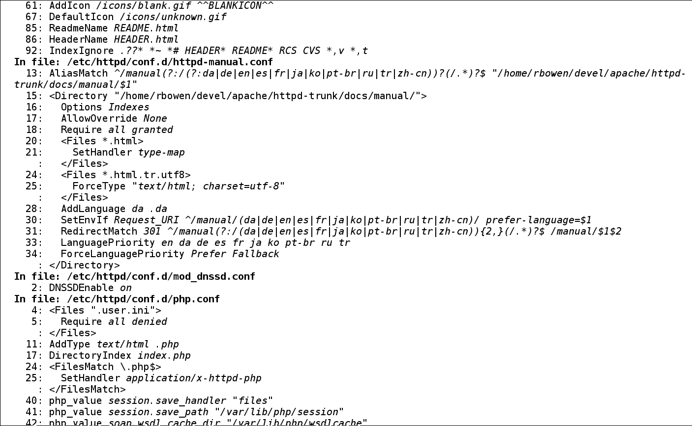
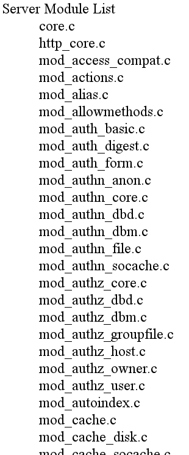
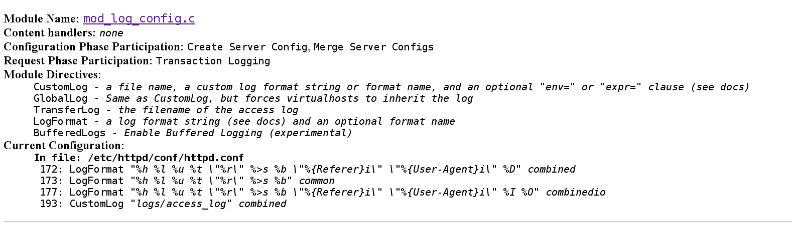
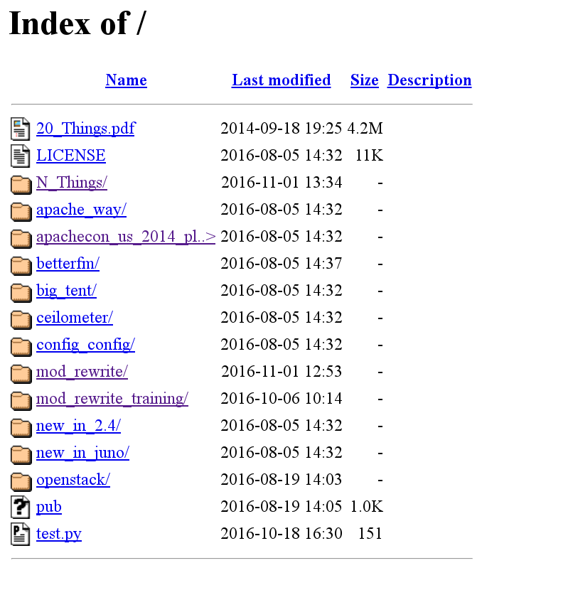
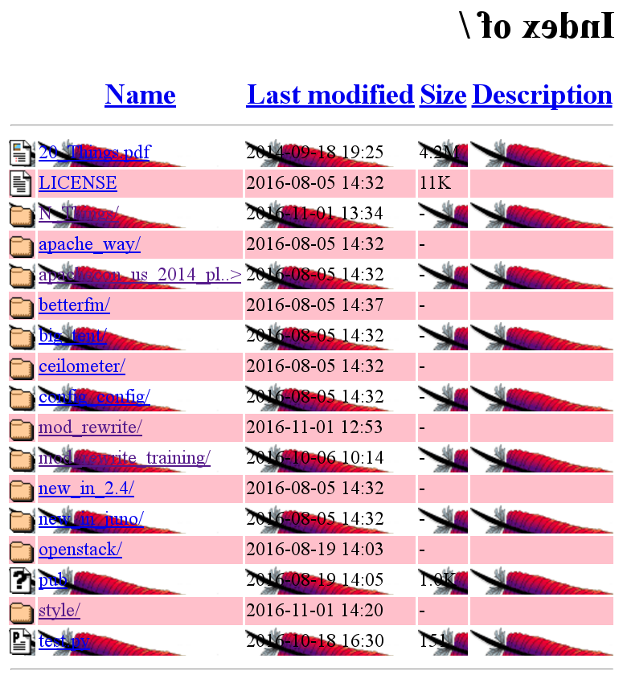
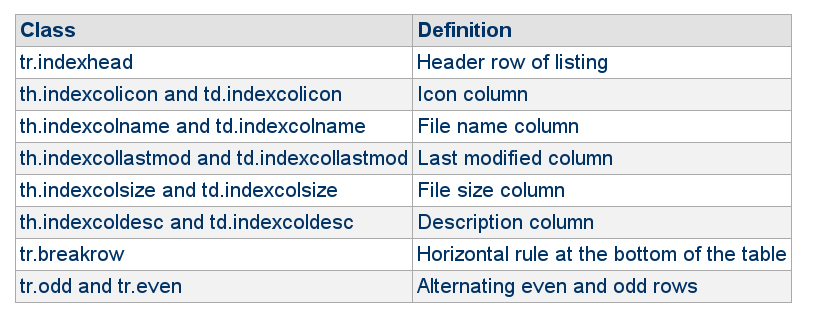

background-image: url(/N_Things/images/feather.png)
class: center, middle
# Apache Cookbook

N Things You Didn't Know Apache httpd Could Do

Rich Bowen - rbowen@apache.org

SLIDES ARE AT: http://boxofclue.com/presentations/

---

???
Of course I know what that is, and I can't believe that anybody else
doesn't know

or ...

Wow, that's really useful.

---

So, without further ado ...

---

class: center, middle
# 1: FallbackResource

---

## In ancient times ...

    RewriteCond %{REQUEST_FILENAME} !-f
    RewriteCond %{REQUEST_FILENAME} !-d
    RewriteCond %{REQUEST_URI} \
        (alias1|alias2|special|other) [NC]
    RewriteRule ^ /index.php [PT]

???
This is called the Front Controller model, or the Fallback Resource
model

---

## Problems

* Fragile.
* Have to go out of your way to exclude all the things that might break
  it
* Syntax is ugly and cumbersome

---

## 2.2.16 and later ...

    FallbackResource /index.php

* Yep, that's it.
* Serves as the *fallback* when other resources aren't available
* Goes in a <VirtualHost> or <Directory> block, as needed

???
Whatever configuration Wordpress or Drupal or whatever sent you, delete
it, and replace it with this.

---

## Pro-tip

For the last year or so, `FallbackResource /index.php` has been the
answer to almost half of the questions that are asked on #httpd on
Freenode.

---

class: center, middle
# 2: server-info?config

---

---

* All your configuration settings
* What file they live in
* What order they are applied

---

## Config ...

        <Location /server-info>
            SetHandler server-info
            
            # Might also want to ...
            Require local
        </Location>

---

And, by the way, mod_info can also ...

---

## /server-info?list

---

## /server-info?mod_log_config.c

---

## Also ...

* ?hooks - list hooks and which modules are attached to them.

* ?server - Same as httpd -V

---

class: center, middle
# 3: Per-module LogLevel configuration

---

## You could ...

    LogLevel Debug

Nice idea, but mod_proxy is really noisy and the rest gets lost in the
noise.

---

##  2.3.6 and later

        LogLevel warn ssl:debug

* Everything logs at level `warn`
--

* Except ssl, which is encouraged to speak its mind.

---

## Trace

* Some modules provide detailed trace information
* trace1 - trace8
* trace8 is very, very noisy

---

## Replaces per-module logging directives like `RewriteLog`

* 2.2

        RewriteLog /var/log/rewrite.log
        RewriteLogLevel 5

* in 2.4

        LogLevel warn rewrite:trace5

---

## Log files

* All entries go to the error log
* Think "debug log" instead
* Use `grep` to isolate the messages from one module:

        tail -f /var/log/www/error_log | grep "rewrite:"

---

class: center, middle
# 4: Configurable error log format

---

## ErrorLogFormat

* As of 2.4 ...
* Like `LogFormat`, with may of the same things available
* Specify what information you want in your error log

        ErrorLogFormat "[%{u}t] [%-m:%l] [pid %P:tid %T] %7F: %E:
            [client\ %a] %M% ,\ referer\ %{Referer}i"

---

## %L

* The `%L` variable can be put in the access log and the error log
* A unique log entry identifier
* Correlate error log entries with access log entries, even on very busy
  servers.

---

class: center, middle
# 5: IndexStyleSheet

---

---

class: center, middle
## boring

---

## Apply styles ...

        IndexOptions +HTMLTable
        IndexStyleSheet /styles/index_styles.css

---

---

class: center, middle
## Much better, right?

---

## What you can do ...

---

class: center, middle
# 6: Proxy Balancer

---

## mod_proxy_balancer

* One front end server running mod_proxy and mod_proxy_balancer
* Multiple backend servers running HTTP, FTP, or AJP protocol servers

---

## mod_heartbeat/mod_heartmonitor

* Determines whether back ends are still alive
* Responds accordingly if they're not

---

## Config

        <Proxy balancer://mycluster>
            BalancerMember http://1.2.3.4:8009 loadfactor=1
            BalancerMember http://1.2.3.5:8009 loadfactor=1
            # Less powerful server, don't send as many requests there
            BalancerMember http://1.2.3.6:8009 loadfactor=5
        </Proxy>

        ProxyPass / balancer://mycluster/

---

## Balancer manager

        <Location /balancer-manager>
            SetHandler balancer-manager
        </Location>

---

class: center, middle
# 7: If

---

## If

* 2.4 and later
* Evaluated at request time

---

## If

    <If $req{Host} = ‘example.com’>
        Redirect / http://www.example.com/
    </If>

--- 
## If

    <If %{REQUEST_METHOD} IN GET,HEAD,OPTIONS>

---

## If 

    <If "%{QUERY_STRING} =~ /(delete|commit)=.*?elem/">

---

## Also

* Also provides `<ElseIf>` and `<Else>` syntax for complete flow control

---

class: center, middle
# 8: ext_filter

---

## Example ...

    ExtFilterDefine fixtext mode=output \
        intype=text/html \
        cmd="/bin/sed s/verdana/arial/g"

    <Location />
        SetOutputFilter fixtext
    </Location>

---

## ok, silly example

* Yes, it's slow
* And not usually the best possible solution
* But good for rapid prototyping and quick fixes

---

## Better example ...

        ExtFilterDefine c-to-html mode=output \
            intype=text/c outtype=text/html \
            cmd="/usr/bin/enscript --color -W html -Ec -o - -"

        <Directory "/www/htdocs/c">
            SetOutputFilter c-to-html
            AddType text/c .c
            ExtFilterOptions DebugLevel=1
        </Directory>

---

## Enscript

* Pretty-prints C source code
* Color syntax highlighting
* Only processes files that are type text/c

---

class: center, middle
# 9: mod_substitute

---

## mod_substitute

* mod_rewrite edits URLs
* mod_substitute modifies content

---

## Regex

        Substitute s/ariel/helvetica/in
        Substitute s/\bdamn\b/darn/i

---

## more useful example ...

        # For stuff from behind the proxy ...
        Substitute s/localhost/www.example.com/i

---

class: center, middle
# 10: Require, RequireAll, RequireNone, RequireAny

---

# New and improved

* Better, simpler syntax for combining require directives

---

## In ancient times

        Order deny,allow
        allow from all
        deny from 128.44.245.12
        # Crap, which way around do those go...

---

## Now ...

        Require not ip 128.44.245.12
        # There, isn't that better?

---

## Also ...

    <RequireAny>
      Require method GET POST OPTIONS
      Require valid-user
    </RequireAny>

---

## And

    Require expr \
        %{TIME_HOUR} >= 9 & %{TIME_HOUR} <= 17

???
Arbitrary expressions to your heart's content

---

## And ...

    <Directory /www/mydocs>
        <RequireAll>
            <RequireAny>
                Require user superadmin
                <RequireAll>
                    Require group admins
                    Require ldap-group cn=Administrators,o=Airius
                    <RequireAny>
                        Require group sales
                        Require ldap-attribute dept="sales"
                    </RequireAny>
                </RequireAll>
            </RequireAny>
            <RequireNone>
                Require group temps
                Require ldap-group cn=Temporary Employees,o=Airius
            </RequireNone>
        </RequireAll>
    </Directory>

---

## Also, the simple stuff:

    # Used to be "allow from all"
    Require all granted

    # Used to be "deny from all"
    Require all denied

---

## Smart host-based authz:

    require ip 10.1
    require ip 10.1.0.0/16
    require host example.org
    require local

???
local knows about localhost, 127.0.0.12, ipv6 addresses, and if the
client and server address are the same.

---

class: center, middle
# 11: CheckSpelling

---

## CheckSpelling

    CheckSpelling On

    CheckCaseOnly On

    CheckBaseNameMatch On

---

## Good for ...

* Windows users
* Simple typos
* Misprinted brochures

---

## Performance

* Acts as a 404 handler, so doesn't really affect performance

---

## mod_speling

* Ha, ha, the module name is misspelled
* Funny, huh?

---

## CheckSpelling On

* Letter transposition (idnex.html)
* Letter/Number confusion (1ndex.html)
* Missing letters (indx.html)
* Wrong upper/lower case (INDEX.html)

---

## CheckCaseOnly On

* Like the name says

---

## CheckBaseNameMatch On

* Files with the same basename, but different extensions
* For example, pony.gif will correct to pony.jpg if needed

---

## Multiple choice

* If more than one name matches, you'll get a list from which to choose

---

## Security

* *May* expose files you didn't really mean to be public
* Perhaps they shouldn't be on your server

---

class: center, middle
# 12: mod_deflate

---

## Deflate

    AddOutputFilterByType DEFLATE \
        text/html text/plain text/xml

---

## Deflate

* All content gzipped on the way out to the client
* Browsers decompress it as it arrives
* 2-3 times performance improvement
* Can log compression percentage

---

## Logging

    DeflateFilterNote Input instream
    DeflateFilterNote Output outstream
    DeflateFilterNote Ratio ratio

    LogFormat '"%r" %{outstream}n/%{instream}n (%{ratio}n%%)' deflate
    CustomLog logs/deflate_log deflate

---

## Caveats

* Works best for sites that are text- heavy
* Don’t try to deflate non-textual data. Doesn't help

---

class: center, middle
# 13: mod_dialup

---

## No, seriously

    <Location "/mysite">
        ModemStandard "V.92"
    </Location>

---

## ... why?

* Some people want to throttle their clients for some reason
* Possibly for testing of low-bandwidth scenarios?
* Who the heck knows
* If you need it, you'll know

---

## See also: mod_ratelimit

	<Location "/downloads">
		SetOutputFilter RATE_LIMIT
		SetEnv rate-limit 400
	</Location>

---

class: center, middle
# 14: mod_dumpio

---

## Eavesdropping

    DumpIOInput On
    DumpIOOutput On

* Logs the *entire* request, and the *entire* response.

---

???
This will generate a BIG log

---

class: center, middle
# 15: graceful-stop

---

## graceful

* Don't accept new connections
* Stop the server, but allow connections to complete first

    apachectl graceful-stop

---

## Caveat

* Some third-party distributions do bad things to apachectl

---

class: center, middle
# 16: RewriteMap dbd

---

## dbd

    RewriteMap breed "dbd:SELECT id FROM puppies WHERE breed = %s"
    RewriteRule ^/dog/(.+) /breed.php?id=${breed:$1} [PT]

---

## dbd vs fastdbd

* `dbd` does the query each time
* `fastdbd` caches between server restarts

???
How often does your data change?

---

class: center, middle
# 17: Macros

---

## mod_macro

* Define a macro once
* Use it many times

---

## Example

		Macro VHost $name $domain>
		<VirtualHost *:80>
			ServerName $domain
			ServerAlias www.$domain

			DocumentRoot "/var/www/vhosts/$name"
			ErrorLog "/var/log/httpd/$name.error_log"
			CustomLog "/var/log/httpd/$name.access_log" combined
		</VirtualHost>
		</Macro>

---

## Then ...

		Use VHost example example.com
		Use VHost myhost hostname.org
		Use VHost apache apache.org

* Evaluated at server startup time

---

class: center, middle
# 18: mod_security

---

## mod_security

* "HTTP firewall"
* Request filtering and magic

---

## Example

	# Tell it what you want it to do when something bad happens ...
	SecDataDir /tmp
	SecTmpDir /tmp
	SecRequestBodyAccess On
	SecDefaultAction log,deny,status:406,capture,phase:2

---

## Then, define "bad"

	# Spammer keyword filtering
	SecRule ARGS "Offshore banking" "id:5000000,msg:'banking spam'"
	SecRule ARGS "Anonymous bank account" "msg:'banking spam',id:5000001"
	SecRule ARGS "best-account.fi" "msg:'banking spam',id:5000002"
	SecRule ARGS "goyard" "msg:'blog comment spam',id:5000003"
	SecRule ARGS "(rayban|gaiss)" "msg:'blog comment spam',id:5000004"
	SecRule ARGS "cheap ?(jordan|uggs)" "msg:'Commercial spam',id:5000005"
	SecRule ARGS "jordan ?shoes" "msg:'Commercial spam',id:5000006"
	SecRule ARGS "air jordan" "msg:'Commercial spam',id:5000007"
	SecRule ARGS "cheap oakley" "msg:'Commercial spam',id:5000008"
	SecRule ARGS "(oakley|ralph lauren|Ray Ban)" "msg:'Commercial spam',id:5000009"
	SecRule ARGS "louis ?vuitton" "msg:'Commercial spam',id:5000010"
	SecRule ARGS "oakley ?sunglas" "msg:'Commercial spam',id:5000011"
	SecRule ARGS "(M|m)ichael ?kors" "msg:'Commercial spam',id:5000012"
	SecRule ARGS "abercrombie" "msg:'Commercial spam',id:5000013"
	SecRule ARGS "mulberry bags" "msg:'Commercial spam',id:5000014"
	SecRule ARGS "(canada goose|ugg boots)" "msg:'Commercial spam',id:5000015"
	SecRule ARGS "(prada|burberry|louboutin|moncler|parajumpers)" "msg:'Commercial spam',id:5000016"
	SecRule ARGS "(nike air)" "msg:'Commercial spam',id:5000017"
	SecRule ARGS "(north face)" "msg:'Commercial spam',id:5000018"
	SecRule ARGS "tiffany ?(brace|jewel)" "msg:'Commercial spam',id:5000019"
	SecRule ARGS "lacoste" "msg:'Commercial spam',id:5000020"
	SecRule ARGS "LR[a-z]{3}\d{3}" "msg:'Persistent Spammer',id:5000021"
	SecRule ARGS "(zoloft|acyclovir|zithromax)" "msg:'Pharm spam',id:5000022"
	SecRule ARGS "GScraper" "msg:'Evil Spammers',id:5000023"

---

## Caveat

* This is only a tiny part of what mod_security can do
* It's also only a small part of "security" - don't rely solely on this

---

## What else?

* SQL injection detection
* XSS detection
* Malformed HTTP
* Special characters/encoding/escaping

---

## Rules

Thousands of example rules available at https://github.com/SpiderLabs/owasp-modsecurity-crs

---

class: center, middle
# 19: Define

---

## Define

	Define DOCROOT /home/rbowen/devel/presentations/

	DocumentRoot ${DOCROOT}

	# Further relax access to the default document root:
	<Directory ${DOCROOT}>
		Options Indexes FollowSymLinks
		AllowOverride None
		Require all granted
	</Directory>

---

## Set once, use everywhere

* Allows you to set variables like DocRoot that you're likely to use multiple times
* Be careful when using in conjuction with mod_macro (Variable clashes)
* Use UnDefine to clean up, if you're paranoid

---

class: center, middle
# 20: Fix it yourself

---

## Patches Welcome

* If the docs are wrong, you can help fix them: http://httpd.apache.org/docs-project/
* ... or leave a comment at the bottom of the page
* If the code is wrong, you can help fix it: http://httpd.apache.org/dev/
* ... or file a bug at http://issues.apache.org

---

## Come ask us

* Lots of us spend way too much time on IRC
* #httpd on the Freenode IRC network
* Pro tip: fajita is the bot, and knows more than anyone else

---

class: center, middle
# N: What's yours?

???
Anybody got a cool trick you want to share?

---

class: center, middle
# finis

\#httpd on Freenode
