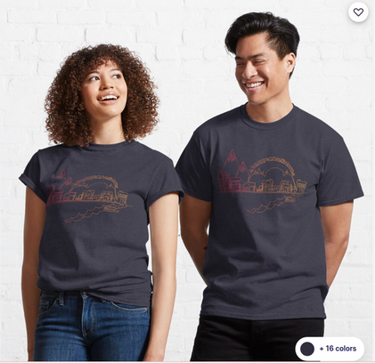

class: center, middle
# ApacheCon @Home 2020

Welcome to ApacheCon, day three!

???

34th ApacheCon, first Virtual ApacheCon!

---

# Thank you to our sponsors!

---

# Platinum

&nbsp;
&nbsp;
 
&nbsp;
&nbsp;

 
&nbsp;
&nbsp;
&nbsp;
&nbsp;
&nbsp;
&nbsp;
&nbsp;
&nbsp;

&nbsp;
&nbsp;
&nbsp;
&nbsp;

???

* Instaclustr	
* Red Hat
* DataStax
* VMware
* Apple	
* Amazon
* IBM
* Imply

---

# Gold

 

 

???

* (OpenLogic by) Perforce Software
* Cerner
* RX-M

---

# Bronze

 

 

???

* Codethink
* US PostsgreSQL Association
* muse.dev

---

# Get Your ApacheCon Tshirt

## s.apache.org/acah-tshirt

---

# Print your ApacheCon Badge

## s.apache.org/acah-badge

---

# Ways to connect:

* Chat on the Hopin platform
* Slack: **s.apache.org/apachecon-slack**
* Hallway track (listed in Sessions)

---

# Today's Highlights

* Visit our sponsor booths for more information!
* Hallway track/networking, all day
* Follow us on Twitter - @apachecon - for schedule updates and other information

---

# Event survey

## s.apache.org/acah-survey

---
 
# Keynote: Edmon Begoli

&nbsp;

Leads R&D at Oak Ridge National Laboratory

???

* Edmon Begoli, PhD works at Oak Ridge National Laboratory (ORNL), where he leads research and development programs aimed at scaling and improving the resilience of critical decision making.

* Edmon is a committer with Apache Software Foundation, and is a joint faculty professor of Computer Science at the University of Tennessee, EECS department.

---

#  Anil Inamdar, Instaclustr

&nbsp;

 
Head of US Consulting and Delivery, Instaclustr

???

---

# TBD: Imply.io

&nbsp;
&nbsp;
&nbsp;

 
Imply.io

???

---

## apachecon.com/acah2020/tracks

