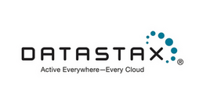

class: center, middle
# ApacheCon @Home 2020

Welcome to ApacheCon!

???

34th ApacheCon, first Virtual ApacheCon!

---

# Thank you to our sponsors!

---

# Platinum

&nbsp;
&nbsp;
 
&nbsp;
&nbsp;

 
&nbsp;
&nbsp;
&nbsp;
&nbsp;
&nbsp;
&nbsp;
&nbsp;
&nbsp;

&nbsp;
&nbsp;
&nbsp;
&nbsp;

???

* Instaclustr	
* Red Hat
* DataStax
* VMware
* Apple	
* Amazon
* IBM
* Imply

---

## Daily seminars in the Imply booth

 * 9/29: 12:30-1:30pm EST
 * 9/30: 1:30-2:30pm EST
 * 10/1: 2:30-3:30pm EST

Meet the New Hot Analytics Stack - Apache Kafka, Spark and Druid

???

Come learn why thousands of companies use Apache Druid and Imply (powered by Apache Druid) for hot analytics alongside their data warehouses.
Learn from the experts at Imply, the creators of Apache Druid, as they show you how to:

 *   Graphically load streaming data from Kafka and Spark, and create dimensions and metrics
 *   Combine streaming and historical data from your data lake or data warehouse
 *   Get alerts, build and explore real-time dashboards, and see AI-powered explanations
 *   Perform drag-and-drop visual data exploration with sub-second response times

---

# Gold

 

 

???

* (OpenLogic by) Perforce Software
* Cerner
* RX-M

---

# Bronze

 

 

???

* Codethink
* US PostsgreSQL Association
* muse.dev

---

# Code of Conduct

## apachecon.com/acah2020/conduct.html

???

Violators will be thrown off of the platform. No, there will not be any
refunds.

---

# Get Your ApacheCon Tshirt

## s.apache.org/acah-tshirt

(See @apachecon on Twitter for this URL)

---

# Print your ApacheCon Badge

## https://s.apache.org/acah-badge

---

# Today's Highlights

* Visit our sponsor booths for more information!
* Hallway track/networking, all day
* Follow us on Twitter - @apachecon - for schedule updates and other information

---

# Bug Bash

## s.apache.org/bugbash

Thanks to Muse.dev!

---
 
# State of the Feather

David Nalley, President, The Apache Software Foundation

---

# Keynote: Thomas Huang

Technical Group Supervisor and Strategic Lead for Interactive Analytics, NASA Jet Propulsion Laboratory

---

#  Sam Lightstone: IBM

&nbsp;
&nbsp;
&nbsp;
&nbsp;

 
Chief Technology Officer for AI Strategy, IBM

???

*  Double inflection point: Open Source meets AI

* Sam Lightstone: Chief Technology Officer for AI Strategy, IBM

* Sam Lightstone is IBM Chief Technology Officer for AI Strategy, IBM Fellow and a Master Inventor in the IBM Data and AI group. He is also chair of the Data and AI Technical Team, the working group of IBM’s technical executives in the division. He has been the founder and co-founder of several large-scale initiatives including AI databases, next generation data warehousing, data virtualization, autonomic computing for data systems, serverless cloud SQL query, and cloud native database services. He co-founded the IEEE Data Engineering Workgroup on Self-Managing Database Systems. Sam has more than 65 patents issued and pending and has authored 4 books and over 30 papers. Sam’s books have been translated into Chinese, Japanese and Spanish. In his spare time he is an avid guitar player and fencer. His Twitter handle is @samlightstone.

---

# Jonathan Ellis

&nbsp;
&nbsp;
&nbsp;

 
Co-founder and CTO, DataStax

???

* DataStax Astra and Apache Cassandra: Sustainable Open Source in the Cloud Era

* Jonathan Ellis, Co-founder and CTO, DataStax

* Jonathan Ellis is a co-founder of DataStax. Before DataStax, Jonathan was Project Chair of Apache Cassandra for six years, where he built the Cassandra project and community into an open-source success. Previously, Jonathan built an object storage system based on Reed-Solomon encoding for data backup provider Mozy that scaled to petabytes of data and gigabits per second throughput.

---

## apachecon.com/acah2020/tracks

