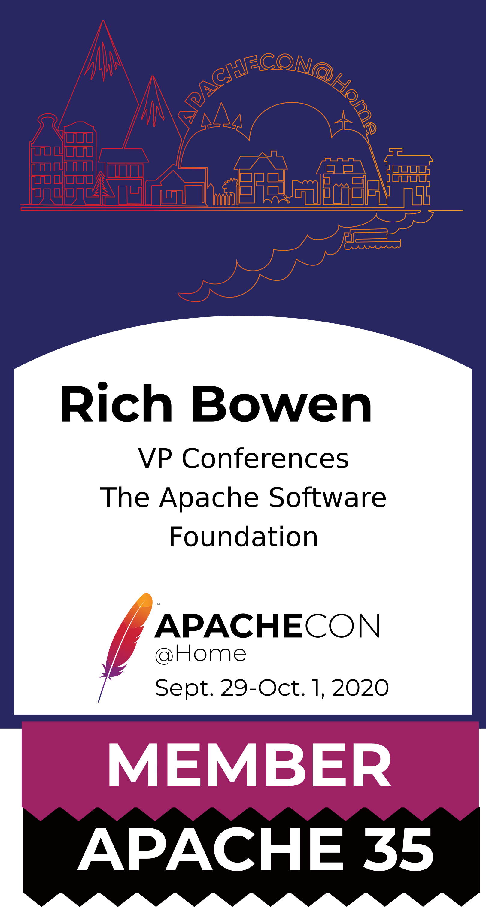
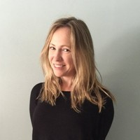

class: center, middle
# ApacheCon @Home 2020

Welcome to ApacheCon, day two!

???

34th ApacheCon, first Virtual ApacheCon!

---

# Thank you to our sponsors!

---

# Platinum

&nbsp;
&nbsp;
 
&nbsp;
&nbsp;

 
&nbsp;
&nbsp;
&nbsp;
&nbsp;
&nbsp;
&nbsp;
&nbsp;
&nbsp;

&nbsp;
&nbsp;
&nbsp;
&nbsp;

???

* Instaclustr	
* Red Hat
* DataStax
* VMware
* Apple	
* Amazon
* IBM
* Imply

---

# Gold

 

 

???

* (OpenLogic by) Perforce Software
* Cerner
* RX-M

---

# Bronze

 

 

???

* Codethink
* US PostsgreSQL Association
* muse.dev

---

# Get Your ApacheCon Tshirt

## s.apache.org/acah-tshirt

---

# Print your ApacheCon Badge

## s.apache.org/acah-badge

---

# Today's Highlights

* Visit our sponsor booths for more information!
* Hallway track/networking, all day
* Follow us on Twitter - @apachecon - for schedule updates and other information

---
 
# Keynote: Camile Fornier

&nbsp;

Head of Platform Engineering, Two Sigma

???

* Camille Fournier is the head of Platform Engineering at Two Sigma, a financial company in New York City. Prior to joining Two Sigma she was the Chief Technology Officer of Rent the Runway, a transformative brand that offers unprecedented access to designer fashion, disrupting the way millions of women get dressed.

She is PMC member for both Apache ZooKeeper and the Dropwizard web framework. She is the author of the book "The Manager’s Path: A Guide for Tech Leaders Navigating Growth and Change."

---

#  Kim Huang, Red Hat

&nbsp;

 
Content strategist, Red Hat

???

---

# Catherine McGarvey

&nbsp;
&nbsp;
&nbsp;

 
VP Engineering, VMWare

???

Catherine McGarvey is the VP of Engineering at VMware, leading engineering for developer facing communities. She has had the privilege of being involved in a number of OS communities including Apache Geode, RabbitMQ, Kubernetes, cloud foundry and knative.

---

## apachecon.com/acah2020/tracks

