# The Apache Way

Rich Bowen, Executive Vice President

The Apache Software Foundation

rbowen@apache.org

---

## Apache Group

- Sharing code patches for the abandoned NCSA httpd ("Scratching your own itch")
- Equals, even from the beginning - no technical lead

Note:

- To understand the ASF, we have to go back to the beginning
- Brian wanted his website to work
- He gathered a bunch of friends who also wanted their websites to work

---

## Roots

- Created from the beginning to be a flat management structure
- Brian Behlendorf started the httpd project, but was not the technical leader
- Today, projects have a "chair", but that's a secretary/facilitator, not a leader

Note:

Bottom-up leadership - lead by example rather than by edict. Contrast with OpenStack or Linux

---

## The Numbers

- Projects = 149
- Incubating Projects = 34
- Board/President Committees = 10 
- Board Members = 9

- Foundation Members = ~530
- PMC Committee Members = ~1500
- Committers = ~5000

- Sponsors = 25, plus various in-kind sponsorships

Note:

From those humble beginnings, we have grown very quickly ...

---

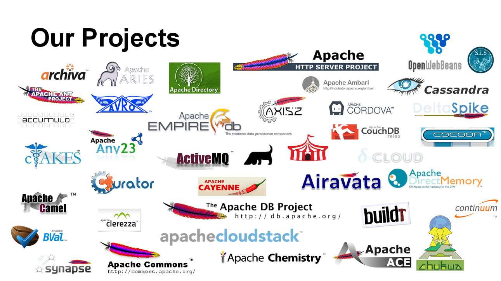

Notes:

The web server project, of course ...

Cloudstack, Ant, Cassandra

---

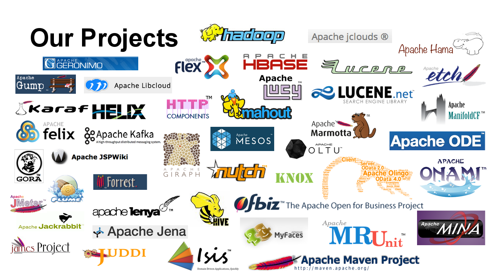

Notes:

Hadoop, Mahout, Maven, Lucene

---

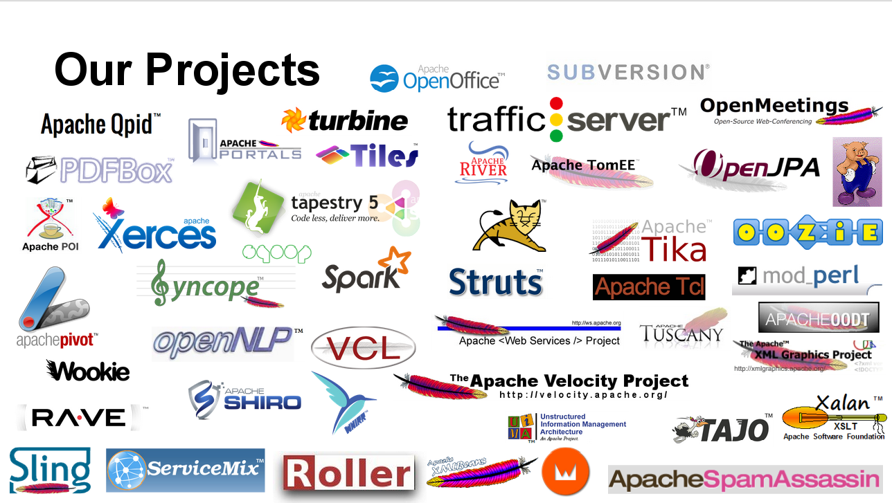

Notes:

OpenOffice, Qpid, Subversion, SpamAssassin

---

## ASF: Legal Structure

- Member-based corporation - individuals, not companies, can be members
- Members nominate and elect new members
- Members elect a board - 9 seats
- Annual members meetings via IRC. Board meets monthly.
- Each PMC has a Chair - eyes and ears of the board (oversight only)

---

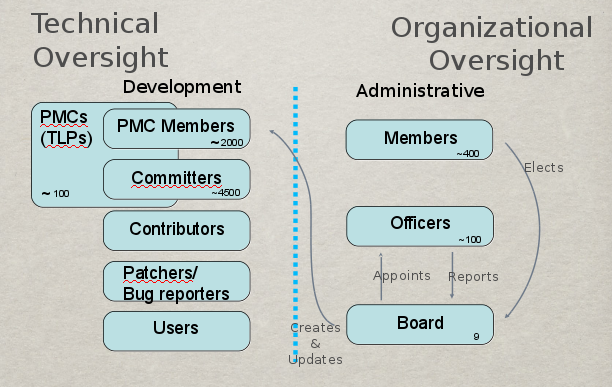

---

## Projects

- Responsible for their own code, community and direction
- Board provides oversight, but has no say on what code gets written, what direction projects take, what new projects we should start etc
- Foundation provides support support (eg infra, branding, press) so that projects can focus just on their code + community

Note:

Difficulties with structure 

- 'Hats' - What role are you in right now?
- Who speaks for the project? 
- Who speaks for the foundation? 
- Can be difficult to make a decision quickly.
- Seen as wielding too much power when board member speaks as developer

---

## Mission

- Provide a means for individual volunteers to be sheltered from legal suits directed at the Foundation’s project
- Protect the ‘Apache’ brand, as applied to its software products, from being abused by other organizations
- Provide legal and technical infrastructure for open source software development and to perform appropriate oversight of such software

Note:

- Legal protection
- Brand protection
- Get out of your way so that you can develop software

---

## Vision

The Apache Software Foundation provides support for the Apache community
of open-source software projects. The Apache projects are characterized
by a collaborative, **consensus based development process**, an open and
pragmatic software license, and a desire to create **high quality software
that leads the way in its field**. We consider ourselves not simply a
group of projects sharing a server, but rather a community of developers
and users.

Note:

- Consensus-based development - community-created
- High quality software - Code should be exceptional

---

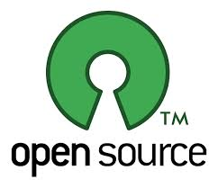

## Why Open source?

- Avoid vendor lock-in
- Control your destiny
- Better security record (more eyes)
- Frequent releases
- Direct user input

Note:

Why Open Source? (Me)

- Having a real impact in the development and direction of IT
- Personal satisfaction: I wrote that!
- Sense of membership in a community
- Sense of accomplishment - very quick turnaround times
- Developers and engineers love to tinker - huge opportunity to do so

---

## Apache License

- A liberal open source software license - BSD-like 
- Business friendly 
- Requires attribution 
- Includes Patent Grant 
- Easily reused by other projects & organizations

Note:

Business friendly - can reuse our project code (with appropriate
attribution) to build your product, your service, your company.

---

## The Apache Way - Why the ASF Works

* Meritocracy
* Transparency
* Community

Note:

Our approach is based on three pillars, often referred to as “The Apache
Way”:

Meritocracy - Individuals come to our projects as individuals, and grow
the community’s trust and appreciation by what they do and how they do
it.

Transparency - Our projects are developed and evolved in the open,
ensuring that everyone that wants to contribute is able to.

Community - We believe that great software is an emergent property of
great communities, and therefore place community health over all else.

---

## The Results

* Vendor Neutrality
* Diversity
* Trusted
* Safe

Note:

Our focus on Meritocracy, Transparency and Community results in:

* Vendor Neutrality - We are a natural meeting place for competitors to collaborate together on shared goals.
* Diversity - Our flexible model of governance lets projects evolve independently, yet ensures they remain independent and diverse communities.
* Trusted - We are trusted by organizations around the globe to serve as a home for their more important software projects.
* Safe - Our governance model, intellectual property processes and licensing framework provide a safe environment for contributors and users alike.

---

## Best ideas win

- Merit is based on what you do, not who you are
- Merit never expires, but you have to stay active
- Those with merit, get more responsibility
- Provides incentive to Do More
- The best ideas win

Note:

- Not authority to act autonomously - community must still agree to decisions
- Privileges: commit, and a vote in direction
- All votes hold same weight - no technical lead (This can be frustrating sometimes, but overall ensures that a project is independent from external influence.)
- Commuity must agree on direction, individuals make it happen

---

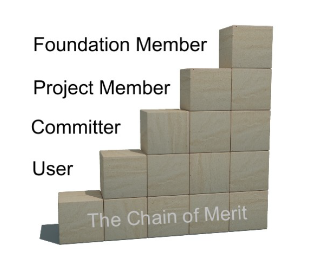

---

## Merit

-  Any constructive contribution earns merit
-  Not just code
    -  Evangelism
    -  Bug reports and triage
    -  Testing
    -  Documentation
    -  Design feedback
    -  User support
    -  Etc.

---

## Community > Code

- Since we are all volunteers, people’s time and interests change
- A healthy community is “warm and inviting” and encourages a continued influx of developers as others leave
- Poisonous people/communities turn people off, and the project will die
- End result - better code, long-term code

Note:

One of our sayings is "Community > Code", which is shorthand for saying
that the community actually matters more than the code itself. A
sustainable community leads to code you can depend on, but good code,
all by itself, isn't sustainable, because the world changes around you.

---

## Consensus-based decisions

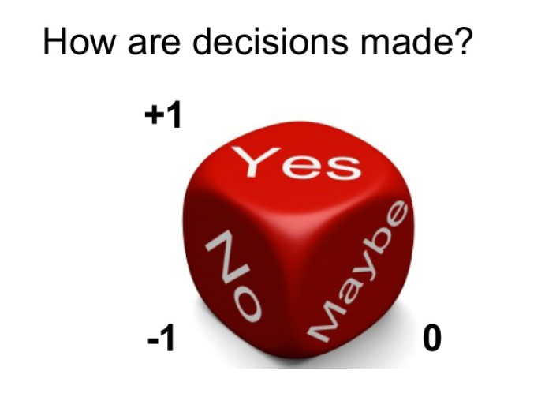

Note:

- voting
    - +1 - yes
    - +0 - no real comment
    - -1 - veto
- Also, -0, -0.5, +0.5, etc... to indicate non-binding opinions

---

## Collaborative Development

- Code is developed by the community
- Voting ensures at least 3 active developers
- Time requirement on votes ensures representation across many timezones
- Development done online and on-list - If it didn’t happen on-list, it didn’t happen

Note:

If you don't have enough people to vote on releases, then that's a
leading indicator that something is seriously wrong with the project,
and something needs to change.

---

## Mailing Lists

- Every project has:
    - dev@ - primary list
    - users@ - user-to-user support
    - commits@
- Archived - http://mail-archives.apache.org/
- Asynchronous
- Accommodate all personalities

Note:

- Asynchronous - Developers in other time zones, languages have equal access
- Archived - a permanent public record of what the project did
- Allow 72 hours for important decisions to accommodate all time zones
- some people are less aggressive than others and find email less intimidating
- Most lists are in English, so having asynchronous access lets people translate in their own time

---

## Non-coding teams

* Infrastructure
* Public relations/Press
* Travel Assistance
* Legal
* Trademarks
* Security
* Fundraising
* Events/Community

---

## (Nearly) All Volunteer

* If you want something done, volunteer and do it
* A few paid contractors (The boring stuff)
    - Press
    - Infrastructure
    - Administration
- Although many developers are paid by companies to work on Apache code, the ASF will never pay for code development

---

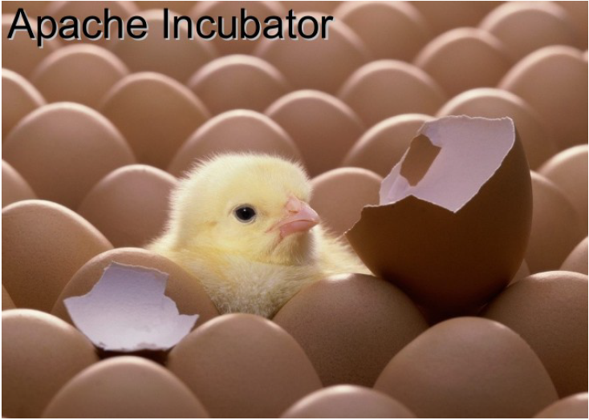

Note: 

- Entry point for all new projects
- Indoctrinates the project into the Apache Way
    - Educational: Do they know how we do things?
- Ensures and tracks IP
    - Legal: Can we release the code under our license?
- Community: Is the project diverse and sustainable?

---

## Ways to Contribute

- Documentation, Tutorials and Examples
- Helping others with queries and questions
- Issue / bug tracker triage
- Testing new fixes, helping reproduce problems
- Bug Fixes and New Features
- Writing add-ons and extensions
- Mentoring, volunteering for the Foundation
- Sponsorship

---

## Mentorship - Multiply your impact

Note:

- Train up two people to replace you
- Jim encouraged me to stop complaining and actually fix stuff
- Ken encouraged me to speak at a conference

---

## How companies can contribute

- You can allow your employees to participate
- You can sponsor the foundation financially (See me afterwards!)
- You can donate your useful code to the foundation, so the whole world
  can benefit

Note:

- No corporate memberships. You are not buying influence.

---

## Platinum Sponsors

$100k annually

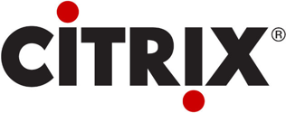

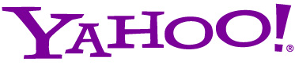

---

## Gold Sponsors

$40k annually

---

## Silver Sponsors

$20k annually

---

## Bronze Sponsors

$5k annually

**Accor**

**Basis Technology**

**Cerner**

**Cloudsoft Corporation**

**Liip AG SA Ltd**

**LucidWorks**

**Talend**

**Twitter**

---

## Infrastructure in-kind sponsors

Server hosting and bandwidth provided by Oregon State University Open
Source Lab (OSUOSL) (USA), SURFnet and FUB(EU).

Secondary DNS provided by No-IP Managed DNS, develooper.com manages the
bitnames DNS services. Hyperreal.org is our other provider.

Donation of servers: Sun, IBM, HP, Dell and Calxeda.

Donation of virtualization software: VMWare.

Donation of wildcard SSL certificates: Thawte.

Donation of server hosting by RackSpace

---

## Where does it go?

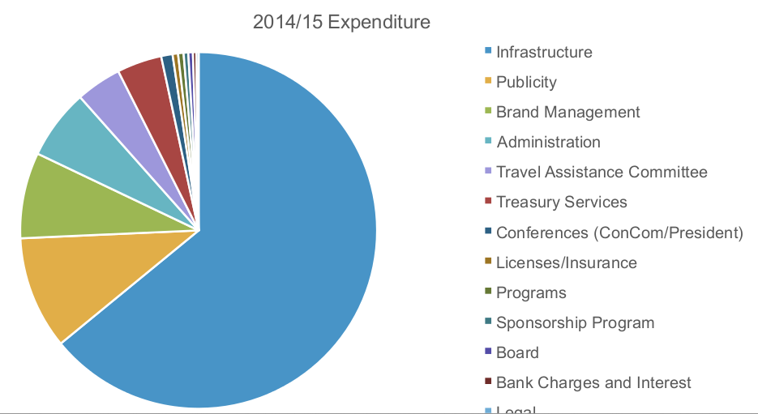

---

## Where does it go?

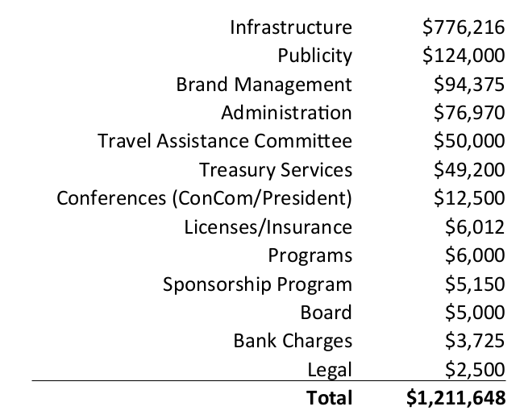

---

## Individual donations

* In addition to corporate sponsorships, we accept individual donations

* Paypal, Amazon, Bitcoin, Check

* http://s.apache.org

---

Thank you

- http://www.apache.org/
- Twitter - @TheASF
- rbowen@apache.org

<small>A collaborative slidedeck with contributions from 
Nick Burch, Ross Gardler, Lars Eilebrecht, Justin Erenkrantz, Isabel
Drost, Sally Khudairi and many others</small>
