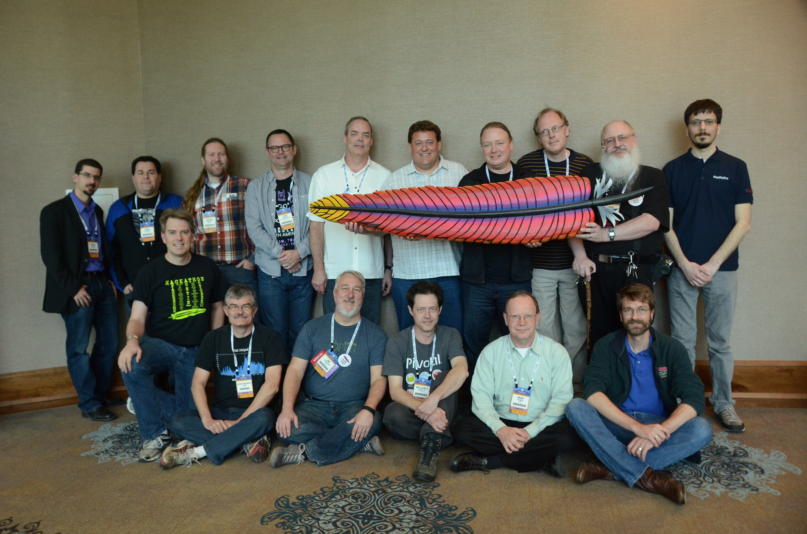
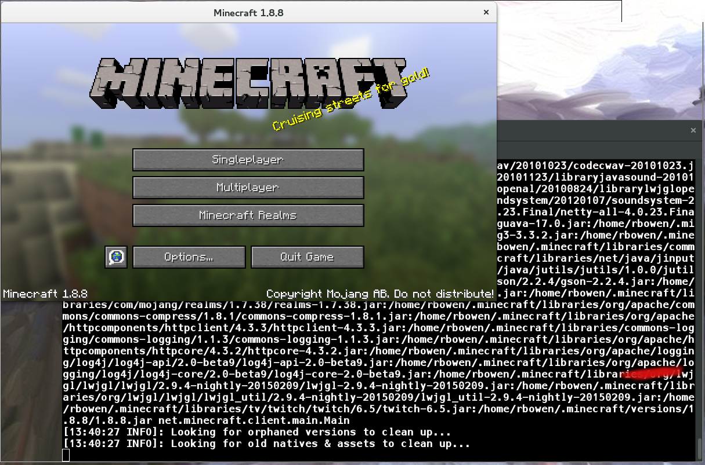
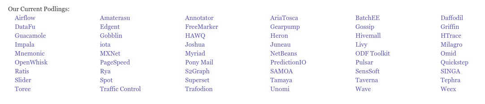
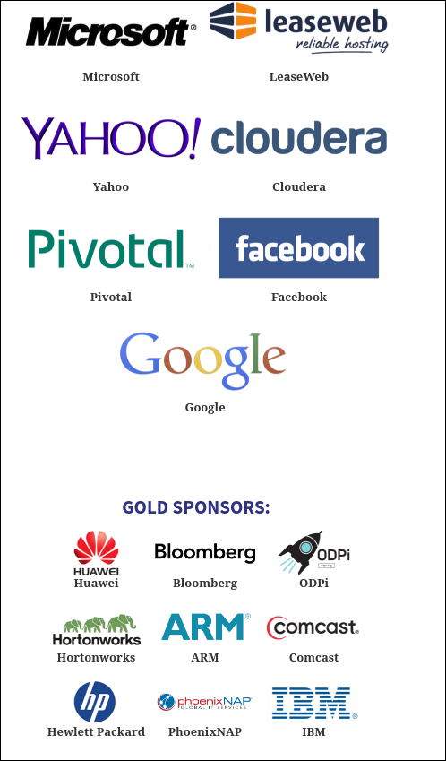

class: center, middle
# The Apache Way

Rich Bowen - Member and Director,

The Apache Software Foundation

rbowen@apache.org

MesosCon 2017, Prague

---

## The Apache Way is ...

- A method of developing software
- A method of running communities
- A method of governing a Foundation

### Community > Code

---

## Apache Group

- Sharing code patches for the abandoned NCSA httpd ("Scratching your own itch")
- Equals, even from the beginning - no technical lead

???

- To understand the ASF, we have to go back to the beginning
- Brian wanted his website to work
- He gathered a bunch of friends who also wanted their websites to work

---

---

## Roots

- Created from the beginning to be a flat management structure
- Brian Behlendorf started the httpd project, but was not the technical leader
- Today, projects have a "chair", but that's a secretary/facilitator, not a leader

???

Bottom-up leadership - lead by example rather than by edict.

---

## httpd has grown a little ...

??? But the methodology stays the same

---

## Today (httpd)

- 118 contributors
- About a dozen in the last 60 days
- Very few of the original contributors are still involved
- New members brought on every year, based on the quality of their
  contributions

???

And so, this idea was spread to many more projects (278 and
counting ...)

---

## Principles

* Collaborative decision making
* Flat organization - everyone has an equal voice
* Resolve conflicts by voting, and move on

???

In reality, some people have earned a louder voice than others,
but everyone is able to attain to that level.

---

## Alternative governance models

* BDFL
* Technical lead who (maybe?) cycles out
* Company-driven project management

---

## At the Foundation level ...

---

## Mission

- Provide a means for individual volunteers to be sheltered from legal suits directed at the Foundation’s project
- Protect the ‘Apache’ brand, as applied to its software products, from being abused by other organizations
- Provide legal and technical infrastructure for open source software development and to perform appropriate oversight of such software

???

- Legal protection
- Brand protection
- Get out of your way so that you can develop software

---

## Vision

The Apache Software Foundation provides support for the Apache community
of open-source software projects. The Apache projects are characterized
by a collaborative, **consensus based development process**, an open and
pragmatic software license, and a desire to create **high quality software
that leads the way in its field**. We consider ourselves not simply a
group of projects sharing a server, but rather a community of developers
and users.

???

- Consensus-based development - community-created
- High quality software - Code should be exceptional

---

## ASF: Legal Structure

- Member-based corporation - individuals, not companies, can be members
- Members nominate and elect new members
- Members elect a board - 9 seats
- Annual members meetings via IRC. Board meets monthly.
- Each PMC has a Chair - eyes and ears of the board (oversight only)

???

Members meeting must be at least once a month. Can be more often.

The ASF is a legal entity - a non-profit - and must conduct itself
according to certain laws and bylaws.

---

---

## From the project's perspective

The foundation is 

* Service provider
* Mentor

???

The Foundation provides the tools to make it possible for projects
to run themselves, and tries to mostly stay out of their way. The board
is responsible to our constituency (the general public) to ensure that
projects govern themselves in ways that are sustainable, and which live
up to our very high standards.

The Foundation doesn't drive technical direction.

---

## Projects

- Responsible for their own code, community and direction
- Board provides oversight, but has no say on what code gets written, what direction projects take, what new projects we should start etc
- Foundation provides support support (eg infra, branding, press) so that projects can focus just on their code + community

???

Difficulties with structure 

- 'Hats' - What role are you in right now?
- Who speaks for the project? 
- Who speaks for the foundation? 
- Can be difficult to make a decision quickly.
- Seen as wielding too much power when board member speaks as developer

---

## If it didn't happen on the mailing list ...

- All decisions must be done in the open
- Private discussions happen - bring it back to the list!
- Provide time for feedback from those that weren't there

---

## Why Open source?

- Avoid vendor lock-in
- Control your destiny
- Better security record (more eyes)
- Frequent releases
- Direct user input

???

Why Open Source? (Me)

- Having a real impact in the development and direction of IT
- Personal satisfaction: I wrote that!
- Sense of membership in a community
- Sense of accomplishment - very quick turnaround times
- Developers and engineers love to tinker - huge opportunity to do so

---

## Apache License

- A liberal open source software license - BSD-like 
- Business friendly 
- Requires attribution 
- Includes Patent Grant 
- Easily reused by other projects & organizations

???

Business friendly - can reuse our project code (with appropriate
attribution) to build your product, your service, your company.

Why we insist on one license:

Many companies and organizations have built products on top of ASF code.
ASF code drives the software business. It's in your car, in your
television, in your Windows servers, in your phone, and in your video
games. And it powers the space program and the medical world.

---

???

Apache code is EVERYWHERE, because of this license.

---

## The Apache Way - Why the ASF Works

* Individual Merit
* Transparency
* Community

???

Our approach is based on three pillars, often referred to as “The Apache
Way”:

Merit - Individuals come to our projects as individuals, and grow
the community’s trust and appreciation by what they do and how they do
it.

Transparency - Our projects are developed and evolved in the open,
ensuring that everyone that wants to contribute is able to.

Community - We believe that great software is an emergent property of
great communities, and therefore place community health over all else.

---

## The Results

* Vendor Neutrality
* Diversity
* Trusted
* Safe

???

Our focus on Individual Merit, Transparency and Community results in:

* Vendor Neutrality - We are a natural meeting place for competitors to collaborate together on shared goals.
* Diversity - Our flexible model of governance lets projects evolve independently, yet ensures they remain independent and diverse communities.
* Trusted - We are trusted by organizations around the globe to serve as a home for their more important software projects.
* Safe - Our governance model, intellectual property processes, and licensing framework provide a safe environment for contributors and users alike.

---

## Best ideas win

- Merit is based on what you do, not who you are
- Merit never expires, but you have to stay active
- Those with merit, get more responsibility
- Provides incentive to Do More
- The best ideas win

???

- Not authority to act autonomously - community must still agree to decisions
- Privileges: commit, and a vote in direction
- All votes hold same weight - no technical lead (This can be frustrating sometimes, but overall ensures that a project is independent from external influence.)
- Community must agree on direction, individuals make it happen

---

## Merit

-  Any constructive contribution earns merit
-  Not just code
    -  Promotion (Social media, events, etc)
    -  Bug reports and triage
    -  Testing
    -  Documentation
    -  Design (product or website, for example)
    -  User support
    -  Etc.

---

## Community > Code

- Since we are all volunteers, people’s time and interests change
- A healthy community is “warm and inviting” and encourages a continued influx of developers as others leave
- Poisonous people/communities turn people off, and the project will die
- End result - better code, long-term code

???

One of our sayings is "Community > Code", which is shorthand for saying
that the community actually matters more than the code itself. A
sustainable community leads to code you can depend on, but good code,
all by itself, isn't sustainable, because the world changes around you.

---

## Collaborative Development

- Code is developed by the community
- Voting ensures at least 3 active developers
- Time requirement on votes ensures representation across many timezones
- Development done online and on-list - If it didn’t happen on-list, it didn’t happen

???

If you don't have enough people to vote on releases, then that's a
leading indicator that something is seriously wrong with the project,
and something needs to change.

---

## Myths

There are many myths that surround the ASF ...

* Too many rules
* Tied to outdated technology
* The Foundation controls everything about your project

---

## Lots Of Rules

* We have few actual rules. 
* We have lots of documentation about what we think works, but the board
  (the governing body of the ASF) doesn't like to interfere
* The board has interfered only 2 or 3 times in the history of the
  Foundation.

???

A core principle is that projects are autonomous. Even when the board
strenuously disagrees with a project's decisions, we will almost never
intervene in their process.

---

## Mailing Lists

- Every project has (at least)
    - dev@ - primary list
    - users@ - user-to-user support
    - commits@
- Archived - http://mail-archives.apache.org/
- Asynchronous
- Accommodate all personalities

???

- Asynchronous - Developers in other time zones, languages have equal access
- Archived - a permanent public record of what the project did
- Allow 72 hours for important decisions to accommodate all time zones
- some people are less aggressive than others and find email less intimidating
- Most lists are in English, so having asynchronous access lets people translate in their own time

---

## What do we "control"?

* We protect usage of our marks
* We ensure that projects operate in vendor-neutral ways
* We protect the _provenance_ of our code

???

"Provenance" - where it came from, how it got here, our legal right to
distribute it.

---

## Non-coding teams

* Infrastructure (not non-coding actually)
* Public relations/Press
* Travel Assistance
* Legal
* Trademarks
* Security
* Fundraising
* Events/Community

???

There's lots of places to get involved in the ASF even if you're not a
programmer.

---

## (Nearly) All Volunteer

* If you want something done, volunteer and do it
* A few paid contractors (The boring stuff)
    - Press
    - Infrastructure
    - Administration
- Although many developers are paid by companies to work on Apache code, the ASF never pays for code development

---

## Incubator

- Entry point for all new projects
- Indoctrinates the project into the Apache Way
    - Educational: Do they know how we do things?
- Ensures and tracks IP
    - Legal: Can we release the code under our license?
- Community: Is the project diverse and sustainable?

---

### Podlings

---

## Ways to Contribute

- Documentation, Tutorials and Examples
- Helping others with queries and questions
- Issue / bug tracker triage
- Testing new fixes, helping reproduce problems
- Bug Fixes and New Features
- Writing add-ons and extensions
- Mentoring, volunteering for the Foundation
- Sponsorship

---

### Mentorship - Multiply your impact

???

The work that you do through your "offspring" will outlast your
personal participation. It's a way to extend your impact far into the
future.

- Ken encouraged me to speak at a conference

---

## How organizations can contribute

- You can allow your employees to participate
- You can sponsor the foundation financially (See me afterwards!)
- You can donate your useful code to the foundation, so the whole world
  can benefit

???

- No corporate memberships. You are not buying influence.

---

### Speaking of Sponsors ...

---

## Where does it go? (2015)

---

## Why do companies sponsor?

* To "give back" to the community
* Because they understand that it costs money to produce Free Software,
  and want to ensure the sustainability of the projects they rely on.
* Because they understand the tragedy of the commons
* For publicity and search engine karma (Yes, really)

---

Questions?
 

* http://apache.org/
* http://blogs.apache.org/
* http://feathercast.apache.org/
- Twitter - @TheASF
- rbowen@apache.org

<small>A collaborative slidedeck with contributions from 
Nick Burch, Ross Gardler, Lars Eilebrecht, Justin Erenkrantz, Isabel Drost-Fromm, Sally Khudairi and many others</small>
