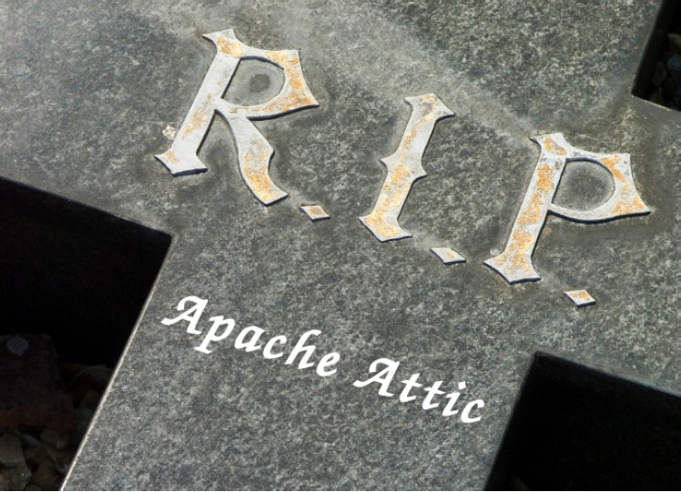

# The Apache Way

LinuxCon Tokyo 2014

Rich Bowen - rbowen@apache.org

---

# The Apache Way

- The History
- The License
- The Foundation
- The Projects

---

# whoami

- Rich Bowen
- Executive Vice President, The Apache Software Foundation
- ASF Member
- Contributor to the Apache httpd project
- Red Hat employee
- Open Source enthusiast for about 20 years

---

# The ASF

- The Apache Software Foundation
- Originally, 'The Apache Group'
- Incorporated in 1999

---

# Roots

- Set up from the beginning to be a flat management structure
- Brian Behlendorf started things going, but was not the leader
- Today, projects have a chairman, but that's not a secretary, not a leader

---

# Apache Group

- 8 people 
- sharing code on abandoned NCSA httpd
- Apache web server releases
    - 0.6.2 (first public release) April 1995
    - 1.0 released 1st December 1995

---

# The Numbers

- Projects = 145
- Incubating Projects = 34
- Board/President Committees = 10 
- Board Members = 9
- Foundation Members = ~530
- PMC Committee Members = ~1500
- Committers = ~3500
- ICLAs = ~5100 

---

<small>
Abdera, Accumulo, ACE, ActiveMQ, Airavata, Ambari, Any23, Ant, APR,
Archiva, Aries, Attic, Avro, Axis, Bigtop, Bloodhound, Buildr, BVal,
Camel, Cassandra, Cayenne, Chemistry, Chukwa, Clerezza, Click,
CloudStack, Cocoon, Commons, Continuum, Cordova, CouchDB, Creadur,
Crunch, cTAKES, Curator, CXF, DB, Deltacloud, DeltaSpike, DirectMemory,
Directory, Empire-db, Etch, Felix, Flex, Flume, Forrest, Geronimo,
Giraph, Gora, Gump, Hadoop, Hama, HBase, Helix, Hive, HttpComponents,
HTTP Server, Incubator, Isis, Jackrabbit, James, jclouds, Jena, JMeter,
JSPWiki, jUDDI, Kafka, Karaf, Knox, Labs, Lenya, Libcloud, Logging,
Lucene, Lucene.Net, Lucy, Mahout, ManifoldCF, Marmotta, Maven, Mesos,
MINA, MRUnit, MyFaces, Nutch, ODE, OFBiz, Oltu, Onami, OODT, Oozie, Open
Climate Workbench, OpenJPA,
OpenMeetings, OpenNLP, OpenOffice, OpenWebBeans, PDFBox, Perl, Pig,
Pivot, POI, Portals, Qpid, Rave, River, Roller, Santuario, ServiceMix,
Shindig, Shiro, SIS, Sling, SpamAssassin, Spark, Sqoop, Stanbol, Steve,
Struts, Subversion, Synapse, Syncope, Tapestry, Tcl, Thrift, Tika,
Tiles, Tomcat, TomEE, Traffic Server, Turbine, Tuscany, UIMA, VCL,
Velocity, Web Services, Whirr, Wicket, Wink, Wookie, Xalan, Xerces, XML
Graphics, ZooKeeper
</small>

---

# The ASF

- Non-profit corporation founded in 1999
- 501( c )3 public charity
- Volunteer organization (The ASF doesn’t pay anyone to work on Apache projects) 
- Virtual world-wide organization - Membership of Individuals
- Exists to provide the organizational, legal, and financial support for various OSS projects - let the developers develop

---

# Legal Structure

- Member-based corporation - individuals only
- Members nominate and elect new members
- Members elect a board - 9 seats
- Semi-annual meetings via IRC
- Each PMC has a Chair - eyes and ears of the board (oversight only)

---

---

- A number of projects
- Each responsible for their own code, community and direction
- Board provides oversight, but has no say on what code gets written, what direction projects take, what new projects we should start etc
- Various support (eg infra, branding, press) to help projects focus just on their code + community

---

## Difficulties with structure

- 'Hats' - What role are you in right now?
- Who speaks for the project?
- Who speaks for the foundation?

note:: Impossible to make a decision quickly. Seen as wielding too much power when board member speaks as developer

---

# Mission

- **Provide a means for individual volunteers to be sheltered from legal suits directed at the Foundation’s projects**

---

# Mission

- *Provide a means for individual volunteers to be sheltered from legal suits directed at the Foundation’s projects*
- **Protect the ‘Apache’ brand, as applied to its software products, from being abused by other organizations**

---

# Mission

- *Provide a means for individual volunteers to be sheltered from legal suits directed at the Foundation’s projects*
- *Protect the ‘Apache’ brand, as applied to its software products, from being abused by other organizations*
- **Provide legal and technical infrastructure for open source software development and to perform appropriate oversight of such software**

---

# Vision

The Apache Software Foundation provides support for the Apache community
of open-source software projects. The Apache projects are characterized
by a collaborative, **consensus based development process**, an open and
pragmatic software license, and a desire to create **high quality software
that leads the way in its field**. We consider ourselves not simply a
group of projects sharing a server, but rather a community of developers
and users.

---

# Vision - Summary

- Community created code
- Our code should be exceptional

---

# Why Open source?

- Access to the source code
- Avoid vendor lock-in (or worse!)
- Much better software
- Better security record (more eyes)
- Much more nimble development - frequent releases
- Direct user input

---

# Why Open Source (Me)

- Having a real impact in the development and direction of IT
- Personal satisfaction: I wrote that!
- Sense of membership in a community
- Sense of accomplishment - very quick turnaround times
- Developers and engineers love to tinker - huge opportunity to do so

---

# Open Source Lies

- No quality or quality control
- Prevents or slows development
- Have to “give it away for free”
- No real innovation 

---

# Different Emphases

- The Licensing - OSI Approved
- The Freedom - As in Free Speech, not Free Beer
- The Development Model - Open, consensus-based

---

# Licenses

- Different licenses reflect different emphases, too
- Focus on the user
- Focus on the developer 

---

# Apache License

- A liberal open source software license - BSD-like 
- Business friendly 
- Requires attribution 
- Includes Patent Grant 
- Easily reused by other projects & organizations

---

# License Differences

- Mainly involve the licensing of derivative works
- Only really applies during (re)distribution of work
- Where the “freedom” should be mostly focused: the user or the code itself
- Be careful when mixing licenses!

---

# The Best License

- Depends on what you're trying to accomplish

note:: Oviously I have a preference

---

# The Apache Way

- Meritocracy 
- Peer-based
- Consensus decision making 
- Collaborative development 
- Responsible oversight
- Individual Participation

---

# Meritocracy

- “Govern by Merit”
- Merit is based on what you do
- Merit never expires
- Those with merit, get more responsibility
- Provides incentive to Do More

---

---

# Meritocracy

- Has become a dirty word
- English-speaking white males tend to attribute merit to other English-speaking white males
- Can be difficult for people of another gender/ethnicity/language to
  break in
- This is a problem that we need to fix

---

> We cannot solve our problems with the same thinking we used when we created them.

Albert Einstein

---

# Merit

-  Any constructive contribution earns merit
-  Permissively licensed only
-  Not just code
    -  Evangelism
    -  Bug reports and triage
    -  Testing
    -  Documentation
    -  Design feedback
    -  User support
    -  Etc.

---

# Merit

- Merit does not buy you authority
    - The community must still agree
- Merit buys you privileges, e.g.
    - Commit access
    - Conflict resolution capabilities

- Community agrees on direction
- Individuals then make it happen

---

# Peer-based

- Developers represent themselves - individuals
- Mutual trust and respect
- All votes hold the same weight (no BDFL)
- Community created code
    - Healthy communities create healthy code
    - Poisonous communities don’t
- Feel as part of a community

---

# Community > Code

- Since we are all volunteers, people’s time and interests change
- A healthy community is “warm and inviting” and encourages a continued influx of developers as others leave
- Poisonous people/communities turn people off, and the project will die
- End result - better code, long-term code

---

---

# Consensus-based decisions

- voting
    - +1 - yes
    - +0 - no real comment
    - -1 - veto
- Also, -0, -0.5, +0.5, etc... to indicate non-binding opinions

---

# Vetoes

- The main intent is to gauge developer acceptance
- Vetos must be justifiable and have sound technical merit
- If valid, vetos cannot be overruled, but can be withdrawn as the situation evolves
- Vetos are very rare

---

# RTC

- Review Then Commit (RTC)
- A patch is submitted to the project for inclusion
- If at least 3 +1s and no -1s, code is committed
- Good for stable branches
- Ensures enough “eyes on the code” on a direct-to-release path

---

# CTR

- Commit Then Review (CTR)
- A patch is committed directly to the code
- Review Process happens post commit
- Good for development branches
- Depends on people doing reviews after the fact
- Allows very fast development

---

# Collaborative Development

- Code is developed by the community
- Voting ensures at least 3 active developers
- Development done online and on-list
- If it didn’t happen on-list, it didn’t happen

---

# Collaborative Development

- Mailing lists are the preferred method
- Archived
- Asynchronous
- Available to anyone - public list

---

# Collaborative Development

- Other methods are OK, if not primary
    - Wikis
    - IRC
    - F2F
- Always bring back to the list

---

# Why mailing lists?

- Developers in other time zones
- English not everyone's first language
- Some people are less aggressive than others
- Allow 72 hours on important decisions

---

# What lists?

- Listed on project website
- dev@project.apache.org
    - Primary list
- commits@project.apache.org
    - Automated source change notification
- users@project.apache.org (optional)
    - User-to-user support
- http://mail-archives.apache.org

---

# Responsible Oversight

- Ensure license compliance
- Track IP
- Quality code
- Quality community

---

# Bottom-Up Management

- Board does not say “we want X”
- Developers say “X is cool”
    - We enable developers to do cool stuff
    - Apache developers are at the forefront of innovation
- Not interested in a single runner
    - We want relay teams
    - Community is critical to the Apache Way
- Apache is about support communities

---

# Example: Git

- Various projects wanted to experiment with Git, whereas we had traditionally used svn
- After much debate, Infrastructure provided Git for projects to try out
- Board expressed concern about how it might affect community dynamics, and those concerns continue, but in the end it was up to the projects themselves
- Projects now have the choice of SCM

---

# Non-development teams

* Infrastructure
* Public relations/Press
* Travel Assistance
* Legal
* Trademarks
* Security
* Fundraising
* Events/Community

---

# (Nearly) All Volunteer

* If you want something done, volunteer and do it
* A few paid contractors (The boring stuff)
    - Press
    - Infrastructure
    - Administration
- NO PAID COMMITTERS

---

---

# Apache Incubator

- Entry point for all new projects and codebases
- Indoctrinates the project into the Apache Way
- Ensures and tracks IP

---

- Legal: Can we release the code under our license?
- Community: Is the project diverse and sustainable?
- Educational: Do they know how we do things?

---

---

# Contributor License Agreement

- aka: iCLA (for individual)
- Required of all committers
- Guarantees:
    - The person has the authority to commit the code
    - That the ASF can relicense the code
    - Does NOT assign copyright

---

# Development

- The ASF never pays for development of projects
- Some contributors are corporate sponsored, some aren’t but as far as the ASF is concerned it makes no difference! 
- Diversity == Independence
- Code is one form of contributing, not the only form.

---

# Other Foundations

- Foundations (independent) are critical for widespread adoption of s/w
- ASF: totally vendor neutral - Sponsors don’t control/manage/direct the foundation nor projects
- There are other ways of doing things. This works for us.

---

# Ways to Contribute

- Documentation, Tutorials and Examples
- Helping others with queries and questions
- Issue / bug tracker triage
- Testing new fixes, helping reproduce problems
- Bug Fixes and New Features
- Writing add-ons and extensions
- Mentoring, volunteering for the Foundation

---

## How companies can contribute

- No such thing as corporate membership - only individuals
- You can allow your employees to participate
- You can sponsor financially (See me afterwards!)
- You can donate your useful code to the foundation, so the whole world
  can benefit

---

## Mentorship - Multiply your impact

---

## The End

- http://www.apache.org/
- @TheASF
- rbowen@apache.org

<small>A collaborative slidedeck with contributions from 
Nick Burch, Ross Gardler, Lars Eilebrecht, Justin Erenkrantz, Isabel
Drost, and many others</small>
