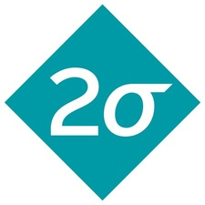
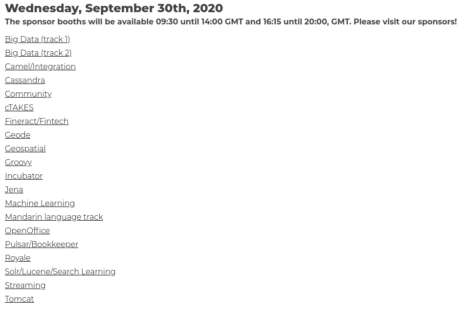

class: center, middle
# ApacheCon @Home 2020

Welcome to ApacheCon, day two!

???

34th ApacheCon, first Virtual ApacheCon!

---

# Thank you to our sponsors!

---

# Platinum

&nbsp;
&nbsp;
 
&nbsp;
&nbsp;

 
&nbsp;
&nbsp;
&nbsp;
&nbsp;
&nbsp;
&nbsp;
&nbsp;
&nbsp;

&nbsp;
&nbsp;
&nbsp;
&nbsp;

???

* Instaclustr	
* Red Hat
* DataStax
* VMware
* Apple	
* Amazon
* IBM
* Imply

---

## Daily seminars in the Imply booth

 * Today: 1:30-2:30pm Eastern US time
 * Tomorrow: 2:30-3:30pm Eastern US time

## Meet the New Hot Analytics Stack - Apache Kafka, Spark and Druid

???

Come learn why thousands of companies use Apache Druid and Imply (powered by Apache Druid) for hot analytics alongside their data warehouses.
Learn from the experts at Imply, the creators of Apache Druid, as they show you how to:

 *   Graphically load streaming data from Kafka and Spark, and create dimensions and metrics
 *   Combine streaming and historical data from your data lake or data warehouse
 *   Get alerts, build and explore real-time dashboards, and see AI-powered explanations
 *   Perform drag-and-drop visual data exploration with sub-second response times

---

## Seminar in Instaclustr booth

* 1 pm Pacific, 4pm Eastern US times, today
* Paul Brebner, Instaclustr Technology Evangelist

## Building a real-time data processing pipeline using Apache Kafka, Kafka Connect, Elasticsearch and Kibana

???

With the rapid onset of the global Covid-19 Pandemic from the start of this year the USA Centers for Disease Control and Prevention (CDC) had to quickly implement a new Covid-19 specific pipeline to collect testing data from all of the USA’s states and territories, and carry out other critical steps including integration, cleaning, checking, enrichment, analysis, and enforcing data governance and privacy etc. The pipeline then produces multiple consumable results for federal and public agencies. They did this in under 30 days, using Apache Kafka.
In this presentation we'll build a similar (but simpler) pipeline for ingesting, integrating, indexing, searching/analysing and visualising some publicly available data in around 30 minutes. We'll briefly introduce each technology and component, and walk through the steps of using Apache Kafka, Kafka Connect, Elasticsearch and Kibana to build the pipeline and visualise the results.

---

# Gold

 

 

???

* (OpenLogic by) Perforce Software
* Cerner
* RX-M

---

# Bronze

 

 

???

* Codethink
* US PostsgreSQL Association
* muse.dev
* .
* Other thanks

---

# Bug Bash

## s.apache.org/bugbash

Thanks to Muse.dev!

???

* Muse.dev is running a bug bash on some of the participating projects.
Sign up at the above URL to participate.

* Drop by the booth for more details and the #bugbash channel on Slack

---

# Get Your ApacheCon Tshirt

## s.apache.org/acah-tshirt

---

# Print your ApacheCon Badge

## s.apache.org/acah-badge

---

# Ways to connect:

* Chat on the Hopin platform
* Slack: **s.apache.org/apachecon-slack**
* Hallway track (listed in Sessions)
* Polls

---

# Today's Highlights

* Visit our sponsor booths for more information!
* Hallway track/networking, all day
* Follow us on Twitter - @apachecon - for schedule updates and other information

---
 
# Keynote: Camille Fournier

&nbsp;

Head of Platform Engineering, Two Sigma

???

* Camille Fournier is the head of Platform Engineering at Two Sigma, a financial company in New York City. Prior to joining Two Sigma she was the Chief Technology Officer of Rent the Runway, a transformative brand that offers unprecedented access to designer fashion, disrupting the way millions of women get dressed.

She is PMC member for both Apache ZooKeeper and the Dropwizard web framework. She is the author of the book "The Manager’s Path: A Guide for Tech Leaders Navigating Growth and Change."

---

#  Kim Huang, Red Hat

&nbsp;

 
Content strategist, Red Hat

???

---

# Catherine McGarvey

&nbsp;
&nbsp;
&nbsp;

 
VP Engineering, VMWare

???

Catherine McGarvey is the VP of Engineering at VMware, leading engineering for developer facing communities. She has had the privilege of being involved in a number of OS communities including Apache Geode, RabbitMQ, Kubernetes, cloud foundry and knative.

---

## apachecon.com/acah2020/tracks

