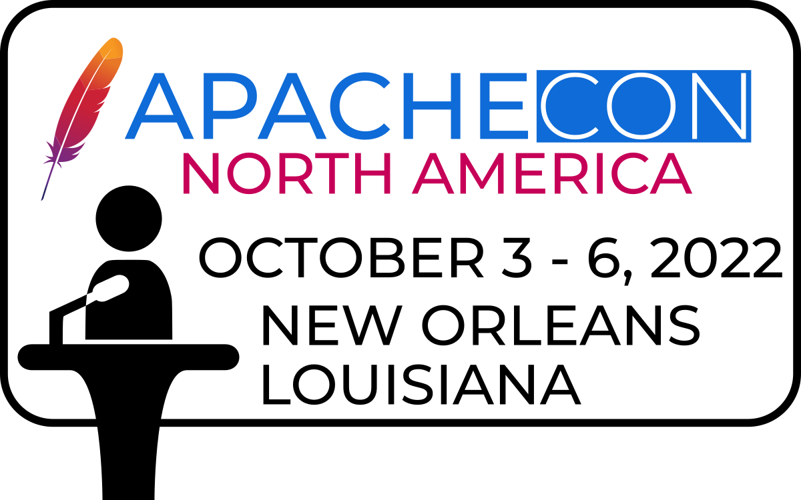

class: center, middle
## Welcome to ApacheCon!

---
## Thanks to our sponsors
### Platinum

 

&nbsp; &nbsp; &nbsp; &nbsp; &nbsp; 

???
AWS, Cloudera, Google Cloud, Gradle

---
## Thanks to our sponsors
### Gold

  &nbsp; &nbsp; &nbsp;

  &nbsp; &nbsp; &nbsp; &nbsp;   

&nbsp; &nbsp; &nbsp; &nbsp; 

???

Gold Sponsors DataStax, Instaclustr, Red Hat, Salesforce, and Sonatype;

---
## Thanks to our sponsors
### Silver

???

Silver Sponsor Apple;

---
## Thanks to our sponsors
### Bronze

 

???

Bronze Sponsors Aiven, datagrate, and DBeaver.

---
## Keynote

William (whurley) Hurley

The Role Of Open Source in Quantum Computing

???

CEO @Strangeworks, Eisenhower Fellow, Innovator in Residence @MIT, Sr. Member @IEEE, Chairman of the Quantum Computing Standards Workgroup, Ambassador to CERN and Society, contributor to TechCrunch, and the co-author of "Quantum Computing For Babies”. 

---
## Keynote

Paul Vixie

Security and Performance Implications of QUIC

???

Paul Vixie, VP/DE, Security, Amazon Web Services

---
## Today's Events

Tonight: BoFs, 5:50pm

Lightning Talks tonight

---
## Announcements
 
Lunch is on your own, and there are numerous lovely options within a short walk.

Visit the link on your badge (or use the QR code) for current updates

---
## Have a great day!

### Twitter: @apachecon

### Slack: https://s.apache.org/apachecon-slack

### https://apachecon.com

