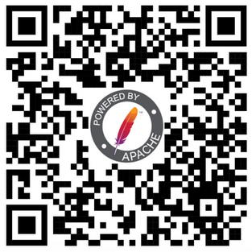

class: center, middle
## Welcome to ApacheCon!

---
## Thanks to our sponsors
### Platinum

 

&nbsp; &nbsp; &nbsp; &nbsp; &nbsp; &nbsp; &nbsp; &nbsp; &nbsp; &nbsp; &nbsp; 

???
AWS, Cloudera, Google Cloud, Gradle

---
## Thanks to our sponsors
### Gold

  &nbsp; &nbsp; &nbsp;

  &nbsp; &nbsp; &nbsp; &nbsp;   

&nbsp; &nbsp; &nbsp; &nbsp; 

???

Gold Sponsors DataStax, Instaclustr, Red Hat, Salesforce, and Sonatype;

---
## Thanks to our sponsors
### Silver

 

???

Silver Sponsors: Apple, OpenSearch

---
## Thanks to our sponsors
### Bronze

 &nbsp; &nbsp; &nbsp; 

&nbsp; &nbsp; &nbsp; &nbsp; &nbsp; &nbsp; &nbsp;  &nbsp; &nbsp; 

???

Bronze Sponsors Aiven, datagrate, Bloomberg and DBeaver

---
## Events

Tonight: BoFs start 5:50pm

Tomorrow: Lightning talks! Get your ideas ready.

Speakers: Reception this evening. Bring your badge!

---
## Announcements

Visit the Infrastructure team table at [LOCATION]

Lunch is on your own, and there are numerous lovely options within a short walk

???

The **ASF Infra team** will be present at the conference (exact location TBD) and will be available for answering questions and discussing ideas for future improvements to our services. We'll also be having a BoF session discussing the future of service offerings (TBD).

---
## Announcements

Code of Conduct reminder

Visit the link on your badge (or use the QR code) for current updates

Mask policy reminder - and there are masks at the Apache Community Development booth (Sponored by Bona Fide Masks!) if you need any.

???

Reminder: We will throw you out if you do not abide by the code of
conduct. Note that this conference is not a dating site.

Thank you for keeping our at-risk attendees safe.

---
## Alternate Activities

Did you bring a partner/spouse/friend/family?

https://s.apache.org/apachecon2022-altern-invite

???

Before keynote intro: Thank you to staff, planners, TAC, track chairs, and
speakers.

---
## Keynote

David Nalley

President, The Apache Software Foundation

The State of the Feather

---
## Keynote

Kerry Donny-Clark

Engineering Manager, Google

Apache Beam as a platform for machine learning workflows

???

Kerry Donny-Clark is a manager of the Apache Beam team at Google. Before this he has been a professional yo-yo player, an English teacher in Japan, a cancer researcher, an elven fighter/mage, a janitor, a circus performer, and various kinds of software engineer.

---
## Have a great day!

### Twitter: @apachecon

### Slack: https://s.apache.org/apachecon-slack

### https://apachecon.com

