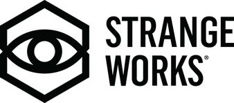

class: center, middle
## Welcome to ApacheCon!

---
## Thanks to our sponsors
### Platinum

 

&nbsp; &nbsp; &nbsp; &nbsp; &nbsp; &nbsp; &nbsp; &nbsp; &nbsp; &nbsp; &nbsp; 

???
AWS, Cloudera, Google Cloud, Gradle

---
## Thanks to our sponsors
### Gold

  &nbsp; &nbsp; &nbsp;

  &nbsp; &nbsp; &nbsp; &nbsp;   

&nbsp; &nbsp; &nbsp; &nbsp; 

???

Gold Sponsors DataStax, Instaclustr, Red Hat, Salesforce, and Sonatype;

---
## Thanks to our sponsors
### Silver

 

???

Silver Sponsor Apple, OpenSearch

---
## Thanks to our sponsors
### Bronze

 &nbsp; &nbsp; &nbsp; 

&nbsp; &nbsp; &nbsp; &nbsp; &nbsp; &nbsp; &nbsp;  &nbsp; &nbsp; 

???

Bronze Sponsors Aiven, datagrate, Bloomberg and DBeaver

---
## Today's Events

Tonight: BoFs, 5:50pm

---
## Lightning Talks

Tonight, 5:50pm, Rhythms II

---
## Keynote

William (whurley) Hurley

The Role Of Open Source in Quantum Computing

???

CEO @Strangeworks, Eisenhower Fellow, Innovator in Residence @MIT, Sr. Member @IEEE, Chairman of the Quantum Computing Standards Workgroup, Ambassador to CERN and Society, contributor to TechCrunch, and the co-author of "Quantum Computing For Babies”. 

---
## Keynote

Paul Vixie

Security and Performance Implications of QUIC

???

Paul Vixie, VP/DE, Security, Amazon Web Services

Paul Vixie left school in 1980 to work on BSD UNIX and the Internet. In the following 40 years he founded five companies including the first anti-spam company (MAPS), the first neutral commercial internet exchange business (PAIX), and the first non-profit Internet infrastructure company (ISC). His notable artifacts include Cron, BIND, and a bunch of DNS related Internet RFC documents. He received his Ph.D. from Keio University in 2011, and was inducted into the Internet hall of fame in 2014. His day job as of 2022 is VP and Distinguished Engineer at AWS Security.

---
## Have a great day!

### Twitter: @apachecon

### Slack: https://s.apache.org/apachecon-slack

### https://apachecon.com

