# ApacheCon US 2014

Denver, Colorado

http://na.apachecon.com/

---

## Thanks to our sponsors!

Community Partner: The Apache Software Foundation

---

## Diamond Sponsors

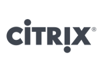

 

---

## Gold Sponsors

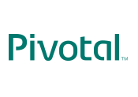

---

## Silver Sponsors

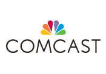

 

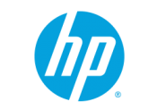

 

---

## Bronze Sponsors

 

 

 

---

## Media Partners

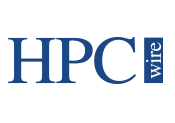

 

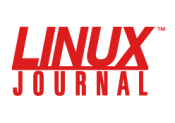

 

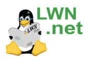

 

---

## What's When?

http://apacheconnorthamerica2014.sched.org/

Sign up and make your own personalized schedule.

<small>Photo by J Aaron Farr on Flickr</small>

---

## Booth Crawl and Reception

Monday, April 7th - 6:00pm to 7:30pm

All attendees welcome

Sponsored by Adobe

<small>Photo by Peter Royal on Flickr</small>

---

## Lightning Talks!

Sponsored by wandisco

Tuesday, April 8, 5:45 pm

<small>Photo by Dag Peak on Flickr</small>

---

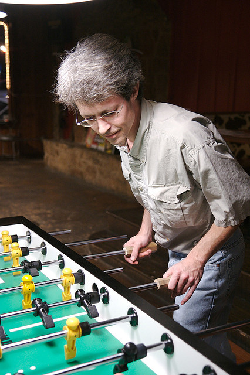

## Closing Reception

Wednesday, April 9th - 6:00 - 9:30pm at the Viewhouse

Held jointly with CloudStack Collaboration Conference attendees

Sponsored by Citrix

<small>Photo by Ted Leung on Flickr</small>

---

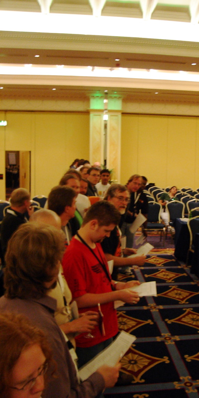

## Key Signing

Wednesday, April 9th, 5:30

Come expand the web of trust

<small>Photo by Bertrand Delacretaz on Flickr</small>

---

## Keynotes - Monday

Hilary Mason

Samisa Abeysinghe

James Watters

<small>Photo by Mark Cox on Flickr</small>

---

## Keynotes, Tuesday

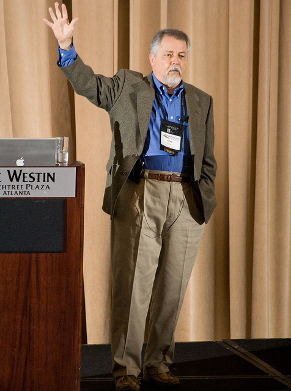

Upayavira

Mark Hinkle

Jim Zemlin

<small>Photo by Ted Leung on Flickr</small>

---

## Keynotes, Wednesday

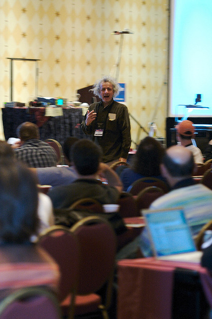

Allison Randal

Jason Hibbets

<small>Photo by Ted Leung on Flickr</small>

---

## BarCampApache

Thursday, April 10

<small>Photo by J Aaron Farr on Flickr</small>

---

## Hackathons

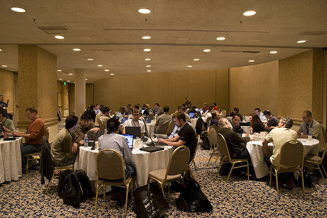

Monday through Friday, free to any ApacheCon attendee

Come hack on your favorite ASF project, or meet the developers

<small>Photo by TomDZ on Flickr</small>

---

## CloudStack Collaboration Conference

April 9-11th

Free to ApacheCon attendees

<small>Photo by Mark Hinkle on Flickr</small>

---

## Share the experience!

Tag with **#apachecon** and **#apacheconNA2014** 
when you share your
experience on Twitter, Flickr, Facebook, Google+, etc.

We are *@apachecon* on Twitter

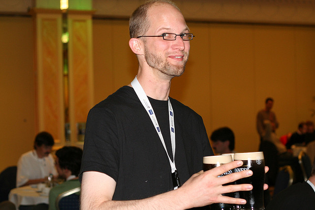

<small>Photo by Noirin Shirly on Flickr</small>

---

## What's next?

Follow us on Twitter (@apachecon) to be first to find out about
ApacheCon Europe, and other upcoming events.

<small>Photo by Mark Cox on Flickr</small>
