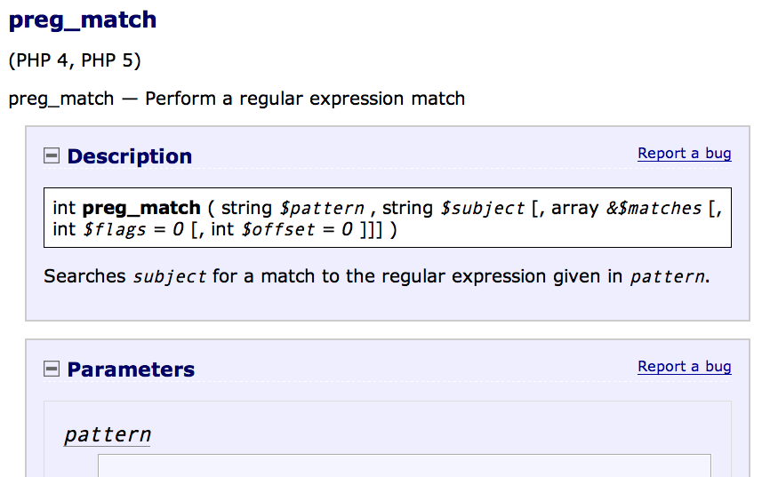

# RTFM? Write A Better FM

Rich Bowen

EVP, Apache Software Foundation

rbowen@apache.org

http://boxofclue.com/

---

## Write A Better FM

Stop being a jerk, and try to understand your audience

Rich Bowen - rbowen@apache.org

@rbowen

http://rcbowen.com/

SLIDES ARE AT: http://boxofclue.com/

---

## Disclaimer

* There are numerous books that say all of this better

* Lots of people have actual qualifications for this kind of thing

---

Also ...

---

Also ...

http://conf.writethedocs.org/

---

Note:

Kathy gets credit for saying this, but I've been saying it for
years. If your documentation is terrible, people will find a
different solution. If your documentation is ok, but your customer
support is terrible, your community will fail. A great product with bad
docs is less usable than a terrible product with great docs and a
friendly community.

---

## The Common Wisdom

* Documentation in Open Source is terrible
* Nobody wants to do it
* This is simply a reality of Open Source, and we have to put up with it

---

## The Truth

* Lots of people want to write docs. Some of them can even write a coherent sentence.
* We make it way too hard for them to participate.
* So, they flock to third-party forums, and Stack Overflow, where they share misconceptions and worst-practice "solutions" with one another.

---

## Better Docs

If we want better docs, we need to lower the barrier to entry for new docs authors.

We also need for the experts to be easier to talk to, so that those potential contributors can get their questions answered.

---

## Have you noticed ...

The more likely a support channel is to tell you to RTFM, the worse the FM is likely to be?

Kindness and patience in the community directly correlate to a helpful
tone, and user focus in the documentation.

---

## So, what do we do?

There's a lot to be said for "Just Start Writing", but as a docs team
you need to step back and answer a few questions.

---

## Who?

[CC alexkess, Flickr]

Note:

Figure out who the audience is. Personas help. Actually talk to people. Realize that they are not all young white men.

---

## ドキュメント

* Not all young white English-speaking men who grew up watching Monty Python.

---

---

## Inside Jokes

* Form a sense of community

* Point out to others that they're not part of the community

* Tread carefully

Note:

This suggestion has resulted in VERY strong responses from
people who feel that I'm robbing the personality from their writing.
Be warned.

---

## Haystack

---

## Colloquialisms

* Make your documentation feel conversational and welcoming

* Alienate people who don't know what they mean

* Tread carefully

---

## Where?

* If you build it, they still won't come.
* Find out where the audience is. 
* Go there. IRC/Mailing lists/Forums/G+/Facebook/Twitter
* Talk to people. Drop helpful URLs.

Note:

Story: "social site" at $College, and discouraging people from
using Facebook because it's not the "official" site.

Drop URLs to draw them back to the 'official' forum

---

## What?

* What are they asking?
* When your product is young, you answer the questions that you expect to be asked
* As it matures, you should listen to what's actually being asked

Note:

Find out what they're actually asking. Realize that your "frequently asked questions" might not be the right ones. Answering the wrong questions isn't helpful.

---

<blockquote>
We may know what they need to know, but only they can tell us what they
need to know.
</blockquote>

-- Anne Gentle

---

## Solutions

If you don't provide solutions to real problems, people will come up
with their own solutions, which might not be quite the best idea.

Note:

People want solutions. They don't care if it's elegant. They care if it works. But sometimes "works" doesn't work, long term.

---

<blockquote>
End-users do not necessarily care about the source of the information,
or whether it was written by a professional; they judge the information
solely on its ability to solve their problem.
</blockquote>

-- Anne Gentle

---

## Work for it

Note:

We have a tendency to want to make them 
work for the information, either in a 
mistaken notion that this will make them 
remember it, or merely because we had to 
work for it, so they should too.

---

## Smart Questions

There is an ancient and hallowed tradition: if you get a 
reply that reads “RTFM”, the person who sent it thinks 
you should have Read The F\*\*\*ing Manual. He or she is 
almost certainly right. Go read it.

RTFM has a younger relative. If you get a reply that reads 
“STFW”, the person who sent it thinks you should have 
Searched The F\*ing Web. He or she is almost certainly 
right. Go search it. (The milder version of this is when 
you are told “Google is your friend!”)

Note:

Good answers are the asker's responsibility.

---

## Eric is Wrong

It is not a "hallowed tradition".

It's bad manners, and it's juvenile.

It's time to grow up.

[CC Jumer, Flickr]

---

[CC Sarahkim, Flickr]

* Laziness

* Impatience

* Hubris

Note:

The three virtues of a programmer are the opposite of the three
virtues of a human being: Dilligence, Patience, Humility. (Larry
Wall.)

---

## Laziness

* Answer the question thoroughly, once
* Save your answer
* Next time, give them a URL
* Better to do something well, once, than to do to it poorly, again and again

---

## Patience

* Impatience with the question comes across as disrespect for the questioner
* Arrogance and disrespect are at the heart of the RTFM mindset
* If you cannot be patient, please let someone else answer the question, and find a different hobby

---

Love is patient, love is kind ... it does not keep a record of offenses.
    (I Corinthians 13 - The Bible)

---

## Humility

* You don't know everything
* The documentation isn't perfect yet
* Remember that once you, too, were completely ignorant

Note:

Try to remember that moment that you were a complete newbie,
asking stupid questions. Cherish that moment. If you can't remember,
then it's probably been too long since you learned something new.

---

* The RTFM attitude is indicative of arrogance and impatience, whereas truly great documentation is the result of patience and humility.

* (Yes, they should read the docs. No, you should not be rude.)

---

## Stupid questions

* There is such a thing as a stupid question.
* Your attitude towards stupid questions says a lot about you.
* It's your job to guide them to the right question, and its answer.

---

## Scope

* You must decide the scope of your documentation
* Document your scope
* Decide not to answer the wrong questions, but figure out where to send people for those answers
* Be polite about it

Note:

That's what hyperlinks are for, after all.

---

## How?

* Start Here
* Reference Guide
* Tutorials
* Learning/Understanding
* Cookbook/Recipe

Note:

Kathy Sierra

Learning/Understanding is about the learner experimenting, hacking,
extending what's there to make something new.

---

## Reference Manual

* Comprehensive and exhaustive
* Correct
* Consistent format
* Best practice
* Lots of examples
* All examples must be tested

---

## Correct

* Obvious, right?
* You'd think

---

## Comprehensive

* What the heck are sprintf(3) and printf(3)?
* Goes back to scope, though, as to how comprehensive you really should be

---

## Comprehensive

* "Comprehensive" needs to be clearly defined
* Do the PHP docs need to cover the history of computing?
* Do the Apache docs need to cover HTML?

---

## Consistent format

---

## Consistent format

---

## Best Practice

* Beginners often just want it to work
* The *best* answer is often more complicated than the *good enough* answer
* Doing it right now saves time and tears later

---

## See also ...

---

* Don't tell them how *not* to do something
* They *will* cut and paste it

---

## Examples

* Simple
* Copious
* Tested
* Consistent use of a fictitious site/project/implementation

Note:

Create an example company, PetStore.com or whatever

---

## Examples - Simple

* Simplest example that illustrates the concept
* Explained in exhaustive detail
* Perhaps followed by more complex examples

---

## Examples - Copious

* Simplest example that illustrates the concept
* Explained in exhaustive detail
* Perhaps followed by more complex examples
* Everyone likes a cookbook

---

## But not too copious ...

* Having 73 howtos for slightly different scenarios can scare off beginners
* Docs days might focus on combining "almost the same" documents into
  one general purpose one.

---

## Examples - Useful

Example from the Apache 1.3 mod_rewrite documentation

Note:

The description was literally "..."

---

## Examples - Tested

* Few things spread faster than incorrect examples
* Test every example. Even ones that seem trivial
* Incorrect examples lead to many, many hours of lost productivity

---

## Examples Inc.

* Construct an imaginary project/company/site/whatever
* Consistently refer to it in the documentation 
* example.org or Acme Widgets, Inc, for example
* Changing the hero of your story in the middle confuses the reader

Note:

Eyes of the Dragon - Naomi and Frisky

---

## HowTos and Tutorials

* Complete - cover even the trivial steps.
* Never say "easy", "trivial", "simple", "obvious", or "of course", or any other words or phrases that mean that. Your reader is there because it's not.
* Test it. Repeatedly. On multiple systems.
* Let your inexperienced co-workers read it.

---

## Complete

* Complete - cover even the trivial steps.

This is a delicate balance - between 
deciding what's in scope, and not 
leaving them to figure out everything 
on their own

---

## Silly

---

## FAQs

* FAQs are often an admission that the documentation is insufficient
* Should be a call for improving the docs, or even a scratch-pad for the new docs
* Most FAQs should be answered with "here's where that's covered in the docs."

---

## Format

* The choice of a documentation format can be quite divisive
* Choosing wrong can lead to many problems
* Of course, there is no right choice, either

---

## Formats

* Easy to edit
* Multiple output formats
* Translation-friendly
* Text (ie, non-binary format)
* Revision control

--- 

## Formats

* rst
* asciidoc
* markdown
* Wikis, possibly

---

## Avoid

* Binary formats
* XML/Docbook
* HTML

---

## Searchable

* Excellent documentation without a decent search isn't worth anything
* There is no excuse for not having a good search. Google will do it for you for free.

---

* Make it easier for people to participate in creating those docs
* Make it easy for people to complain
* Take their complaints seriously
* Don't get offended when they tell you the docs suck
* Do something about it

---

Note:

Add a note

---

## Most projects

* Create an account
* Get a checkout
* Subscribe to this list
* Create a ticket in Bugzilla
* Email a patch
* Follow up on that list

---

* ... Give up and go away angry

* Note: Github has, of course, greatly improved this situation
* ... if your docs are in revision control. (They should be.)

---

* Make it obvious how to submit comments, improvements, errata
* Don't ignore them once they're submitted
* Be quick to offer commit bits to repeat contributors

Note:

Give out commit rights to the docs LIKE CANDY. Nobody can screw it up -
that's why you're using revision control. There's no reason *not* to
give them commit.

---

## Go to the source

* The developers (often) don't like writing docs
* When they realize you do, they'll be willing to answer your questions

---

## Also, the source

* Learn to read the source code
* It will save you many tears in the long run
* However, don't require programming knowledge to participate in the documentation

---

## Error messages

* Error messages are documentation, too

        else if (!(status & LP_PERRORP)) { if (last != 
        LP_PERRORP) { last = LP_PERRORP; printk
        (KERN_INFO "lp%d on fire\n", minor); } }

            Linux printer driver, circa 2.2.1

---

If your error message tells what to do to fix it, they'll love you
forever.

            ap_log_error(APLOG_MARK, APLOG_WARNING, 0, cmd->server, APLOGNO(00664)
                         "RewriteOptions: MaxRedirects option has been "
                         "removed in favor of the global "
                         "LimitInternalRecursion directive and will be "
                         "ignored.");

---

## Harness the Whiners

Note:

* Whiners -> Contributors: HARD
* Potential contributors -> Whiners: EASY

---

Result: Your documentation still sucks, and you've alienated someone who wanted, albeit misguidedly, to help.

---

Result: Your documentation might get better, and, even if it doesn't, you've told one person that you care what your customers think.

---

Even if everyone else in the world is a jerk, you don't have to be.

---

## FINIS

Email: rbowen@apache.org

Twitter: @rbowen

Slides: http://boxofclue.com/

