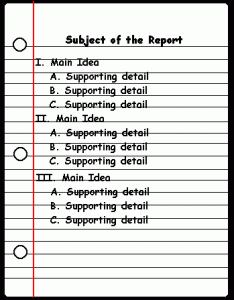
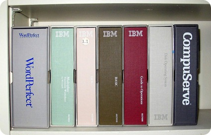
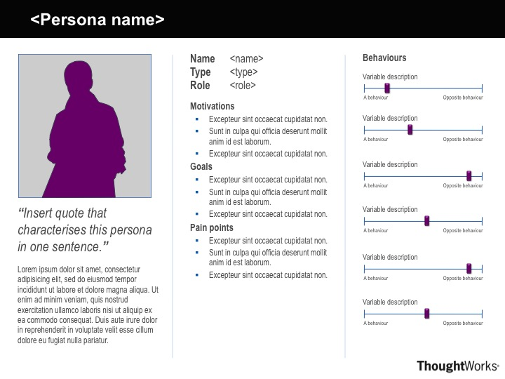
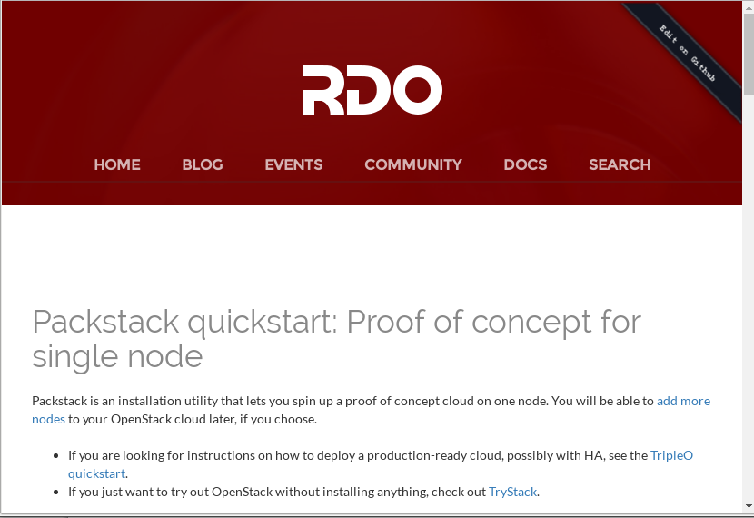

# RTFM? Write A Better FM

Rich Bowen

rbowen@redhat.com

Slides: http://boxofclue.com/

LinuxCon North America, 2016

### TL;DR: Your community is your documentation

---

## $> whoami

* Docs guy on the Apache HTTP server for about 20 years
* Written a few books about Apache httpd
* Struggling with the question of “what makes good docs” for most of that time
* Day Job: Community guy for OpenStack at Red Hat

---

## Outline

1. Your community is your documentation
2. Know who your audience is
3. The customer is not an idiot
4. Be welcoming of new docs, but not too welcoming

???
This presentation has had many incarnations, because there’s so many different things I want to say. So, I’ve tried to get it down to these points.

---

## RTFM

*Definition*: **RTFM (Read The F'ing Manual). (Occasionally ironically
rendered as Read The Fine Manual.) A phrase uttered at people who have
asked a question that we, the enlightened, feel is beneath our dignity
to answer, but not beneath our dignity to use as an opportunity to
squish a newbie's ego.**

???
It has been pointed out to me that not everyone is even familiar
with the term RTFM. That's actually good news.

---

## 1) Your community is your documentation

* Community > Code
* Community > Docs
---
## Setting the tone

* Your community sets the tone of your documentation
* Your documentation sets the tone of your community

---
##Definitions
Documentation is:

* Formal docs
* IRC conversations
* Mailing list conversations
* Conferences/Events/Meetups
* Third-party howto websites

???
These things are increasingly further out of our control as the list proceeds. You get to decide how much you participate in each layer, and, thus, how much influence you exert over the culture.

---
# Definition
Customer

* Anybody that uses the product/project
* Not limited to people that paid for it
* Treating people like customers is about respect. Yes, we know you’re “just a volunteer.” Try to behave like they’re worth your time, anyways.
---

# Example: Perl

* Academic language
* Dedicated to elegant, but, more importantly clever, solutions to problems
* Documentation is exhaustive and academic
* Community attracts playful hubris
* Reputation of unreadable code
* Consider the feedback loop

???
Perl

* Playful, with lots of hubris - showing off clever solutions.

* This leads to a community reputation for complex, byzantine code.

* Which in turn attracts a community of people who like to solve problems in elegant, if not particularly transparent, ways.

* But Larry *started* by trying to develop a language for doing
  text-based parsing in elegant "do what I mean" ways.

---

## Example: PHP

* Web programming for everyone
* Very solution-oriented (community and docs, both)
* Lots of solution-specific examples in docs
* Community attracts non-programmers, or, at least, people who want a solution and don’t care about academic correctness
* Reputation of sloppy, insecure code
* Consider the feedback loop

???
PHP - web development for everyone. This leads to solutions-oriented documentation, with lots of user-contributed simple solutions. This, in turn, attracts a community of people that want to solve problems and don't care much about elegance, security, or best programming practice.

---
## Choose your adventure

* You have a lot of influence over your project’s culture
* Choose wisely

---
# Community > Docs

* Docs (as defined above) are delivered by a community, not by a writer working in his dark office

---
## Choose your community

* By who you choose to be, you pick who will come hang out with you
* Don’t pick the jerks

???
You don't "choose your team" in the traditional sense. Rather, yo uset
the tone, and attract a team who want to be around that kind of
community.

---
## Let your community choose itself

* WARNING: Don’t choose a community that’s all copies of you
* That’s boring, and kills innovation

???
Don’t choose you community by picking “the right people”. Rather, choose your community by being the right people.

But you do "choose" the community by how you respond to people when they
arrive. You can, and often do, chase them off.

---
# 2) Know who your audience is

???
When it actually comes to writing documentation, knowing who your
audience is is the most important thing.

---
## Personas
* Detailed profiles of several of your audience
* Consider their opinions when making documentation decisions
* Actual user interviews help, if you have the time/budget

???
When you're writing a particular document, stop and ask yourself, what
does Claire actually need to know in this situation? What problem is
Pierre actually trying to solve?

---
# ドキュメント
Your audience is not all white English-speaking young men who grew up watching Monty Python skits.

???
Nobody expects you to be an expert on other cultures. However, as your
community grows (and you do want it to grow, right?) there are some
things that you will encounter, and should think about.

---

???
Great docs, but I feel like maybe I'm missing something.
---
# Inside Jokes

* Create/Reinforce a strong sense of community
* Point out to others that they're not part of the community. (See also, “Othering”)
* Tread carefully

???

Othering: The process of perceiving or portraying someone or something as fundamentally different or alien.
It also makes it easier to dismiss someone’s opinions, or worthiness, if they are somehow not like us.

This suggestion has resulted in VERY strong responses from people who feel that I'm robbing the personality from their writing. Be warned.

---
## Colloquialisms

---
# Colloquialisms
* Make your documentation feel conversational and welcoming
* Can alienate (or, at best, confuse) people who don't know what they mean
* Tread carefully
---
## What is your audience asking?
<blockquote>
"We may know what they need to know, but only 
they can tell us what they need to know."
</blockquote>
Anne Gentle
---
## Where are they asking it?

As much as you want to, you can't control where the conversation
happens. Sometimes, it happens on Stack Overflow

???
* And IRC channels you're not on
* And mailing lists you're not on
* And third-party forums and websites.

What you do about this is a matter of how much time you have, but you
can't just ignore it.

---

# 3) The customer is not an idiot
This seems to be the one that we have the hardest time with.

---
# We find it hard to accept that the customer is not an idiot because:
* We know that we are brilliant
* We worked hard to achieve our brilliance
* We do not know the context of the problem that they are trying to solve
* We do not know what tools they have at their disposal
* Their proposed solution is not the one that we would have come up with
---

???
Most of us that are writing the docs had to work hard to achieve our
knowledge. We taught ourselves, experimented, made mistakes, and learned
from those mistakes. Now you come along and want to get all of that for
free.

It’s not fair.

---
# Also, conditioning

There is an ancient and hallowed tradition: if you get a
reply that reads “RTFM”, the person who sent it thinks
you should have Read The F___ng Manual. He or she is
almost certainly right. Go read it.

RTFM has a younger relative. If you get a reply that reads
STFW, the person who sent it thinks you should have
Searched The F__ing Web. He or she is almost certainly
right. Go search it. (The milder version of this is when
you are told “Google is your friend!”)

*http://www.catb.org/esr/faqs/smart-questions.html*

???
It has become common knowledge that this is THE DOCUMENT about how to
ask questions in public forums. The word 'idiot' appears first in the
3rd paragraph. The idea that is communicated throughout is that the asker
is an imbecile, and the answer is just a little lower than God.

---
# It’s ok to be rude, because we’re more important than you

Much of what looks like rudeness in hacker circles is
not intended to give offense. Rather, it's the
product of the direct, cut-through-the-bullshit
communications style that is natural to people
who are more concerned about solving problems
than making others feel warm and fuzzy.

*http://www.catb.org/esr/faqs/smart-questions.html*

???
Or, at least, our time is more important than yours.
---
## I strenuously disagree
* It is not a "hallowed tradition"
* It's bad manners, and it's juvenile
* It's time to grow up
---
## Humility
* You don't know everything
* The documentation isn't perfect yet
* Remember that once you, too, were completely ignorant

---
## RTFM!
* The RTFM attitude is indicative of arrogance and impatience, whereas truly great documentation is the result of patience and humility.
* (Yes, they should read the docs. Yes, they should do their homework first. But, no, you should not be rude about it.)
---
## Three Virtues

???
Three virtues of a programmer: Laziness, Impatience and Hubris

Three virtues of a human: Diligence, patience, and humility

Impatience with a question comes across as disrespect for the
questioner. Perhaps it’s time to turn your talents elsewhere
---
## Stupid questions?

* There is such a thing as a stupid question.
* Your attitude towards stupid questions says a lot about you.
* It's your job to guide them to the right question, and its answer.

???
There is, of course, such a thing as stupid questions. However, be very
cautious about classifying someone’s questions as stupid before you
understand the context. Most people are primarily interested in
solutions to actual problems.

---
## Why

However, you must ask yourself WHY are they asking that stupid question?

(Hint: It’s almost never because they are an idiot.)
---
## Solutions
<blockquote>
End-users do not necessarily care about the
source of the information,or whether it was written
by a professional; they judge the information
solely on its ability to solve their problem.
</blockquote>
Anne Gentle
---
# Solutions vs Best Practice

People want a quick solution **NOW** and aren’t, generally, thinking about maintainability or consequences
---
## Even when they know ...

Even when they know it’s not the best solution, they have to work with the tools that they have available.

???
Because, deadlines, and then it's someone else's problem.

---

## Your job:

* Help them solve the immediate problem
* Also, guide them towards the better long-term solution

---
# So, what do you write?
Technical docs require a lot of planning

???
Bradbury: Just start writing. Write something every day.

This works well for fiction, but does not work for technical
documentation.

On the other hand, writing something – anything – every day, is a great
way to make yourself a better writer, even of tech docs. One of my
coworkers blogs every single morning. It's not always profound, but it
improves her writing, daily.

---
## Scope

* You must decide the scope of your documentation
* Document your scope
* Decide not to answer the wrong questions, but figure out where to send people for those answers
* Be polite about it
---
## Reference manual
* Comprehensive and exhaustive
* Correct
* Consistent, predictable format
* Best practice
* Lots of tested examples
---
## Correct
* Software changes often. Stay on top of it
* Feedback loop with the developers, to ensure that it remains correct
* Feedback look with users, to ensure that everything actually works
---
## Comprehensive

Carefully consider what’s in scope, and then document it thoroughly

???
This is always a tradeoff between comprehensive, and honoring the scope
that you have defined for yourself.

---
## Best Practice
Scope and Comprehensive are in careful tension

???

Beginners just want it to work, with as little effort as possible. Just
because it works doesn’t mean it’s the right answer.

The *best* answer is often more complicated than the *good enough*
answer

Doing it right now saves time and tears later

It's a balancing act between helping the person now in their crisis, or
helping them long term in becoming an expert.

---
# Howtos, tutorials, examples
* Cover everything, even the trivial steps
* Never say "easy", "trivial", "simple", "obvious", or "of course", or any other words or phrases that mean that. Your reader is there because it's not.
* Test it. Repeatedly. On multiple systems.
---
## Don’t ridicule your reader

???
As a teacher, the role of encouraging your reader is almost as important
as the role of conveying information. Ridiculing, or belittling your
reader, or, more subtly, telling them that things are hard, is a great
way to undermine your own work.

---
## How not to

Despite your best intentions, everyone will copy/paste your example of how not to do it, then blame you when it doesn’t work.

---

## 4) Be welcoming of new doc contributions, because ...
* Your docs are wrong
* They’re incomplete
* They’re difficult to understand
* Someone knows more than you do
* Make it easy for them to help

???
All code has bugs. All code can be reduced by at least one line.
Therefore, all code can be reduced to one line that doesn’t work.

---
## The Common Wisdom
* Documentation in Open Source is terrible
* Nobody wants to do it
* This is simply a reality of Open Source, and we have to put up with it
---
## The Truth

* Lots of people want to write docs. Many of them can even write a coherent sentence
* We make it way too hard for them to participate
* So, they flock to third-party forums, and Stack Overflow, where they share misconceptions and worst-practice "solutions" with one another
---

???
StackOverflow has a new feature called Stack Overflow Documentation.
People are passionately writing docs there. A lot of them are wrong. Now
we have to maintain docs in multiple places. Also, StackOverflow
discourages just linking, so you actually have to write docs both
places. Gaaaah!

---
## Better Docs
* If we want better docs, we need to lower the barrier to entry for new docs authors.
* We need to be willing to mentor these contributors, and help them get their changes through the system.
* But … not too easy. Crappy documentation doesn’t actually help anyone. (Wikis require a LOT of babysitting.)
---
## Wrong way:

???

Result: Your documentation still sucks, and you've alienated someone who
wanted, albeit misguidedly, to help.

---
## Right way:

???
Result: Your documentation might get better, and, even if it doesn't,
you've told one person that you care what your customers think.

---
## How to contribute
Github has made this absurdly easy. Take advantage of it

---
## Revision Control
* Your documentation/website should be in revision control, right next to the code
* The contribution process should be identical
* Tell me how to edit the doc, IN THE DOC
* Don’t make me figure something out, or you will miss my contribution
---
## …  but not too welcoming
* Setting the barrier high enough can help ensure quality (but not
  necessarily)
* Setting this barrier, without being snobbish, is tricky
* Different ways to contribute changes helps this

???
Anecdote: httpd docs translation. All patches must be reviewed by TWO
native language speakers. Result: translation effort at a standstill but
all but the most popular languages.

---
## Wikis are a lot of work
* If you make it easy for anyone to contribute, when you’ll get unwelcome contributions
* … or at least contributions that will take a lot of work to accept
* And, of course, there’s spam

???
* Editing for grammar/content/correctness
* Testing examples
* Ensuring that things aren’t wall-of-text overdocumented
* There’s such a thing as too many examples
* Docs that are too domain-specific, or situation-specific, may not be
  helpful for a general user manual

  In the 90s, we thought that wikis would usher in a new era of
  collaborative content creation. Spammers ruin everything for everyone.
  Thanks a lot, guys.

---
## Treat your docs like you treat your code
* Direct commit access to the docs should be earned, just like with the code
* Set the barrier at a comparable level
* You are entrusting your customer’s experience to this person. It’s ok to be a bit picky.

---
## Too many projects ...

* Create an account
* Get a checkout
* Subscribe to this list
* Create a ticket in Bugzilla
* Email a patch
* Follow up on that list
* Told you did it wrong, go back several steps and try again
* ... Give up and go away angry

???
Or, more often, you can't even find step one. Where is the documentation
developed? Is it even in revision control? Is it in a wiki? Is it in a
CMS?

---
## Docs Comments
* See the “Add a note” link at the bottom of every page of the PHP docs
* See also the Apache httpd docs
* You have to actually do something about these comments for them to be useful

???
On a related note, if you want to help out an open source documentation
project, triaging the comments on either php or httpd project would be
greatly appreciated. 

---
## Docs are a conversation
... Which brings us back to my first point

Community > Docs

---
# Resources
* WriteTheDocs.org
* Conversation and Community, by Anne Gentle
* BetterFM.org

rbowen@rcbowen.com

@rbowen

