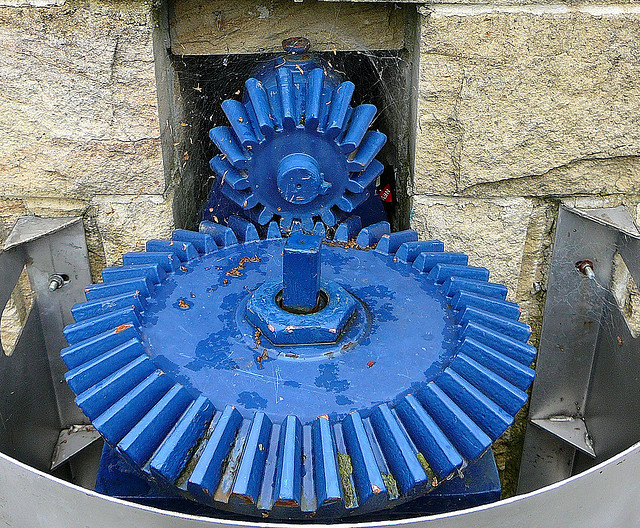

## The OpenStack Big Tent

---

## `whoami`

Rich Bowen -  rbowen@redhat.com

RDO Community Liaison, Red Hat

@rbowen

---

## Yes, my slides are online

http://boxofclue.com/presentations/big_tent/

---

## What Is OpenStack?

> The OpenStack Mission: to produce the ubiquitous Open Source Cloud Computing platform that will meet the needs of public and private clouds regardless of size, by being simple to implement and massively scalable.

---

## Yes, but ...

* What's in and what's out?
    * OpenStack developers: Who's in the tent?
    * Infrastructure deployers: What's in the release? What are the *necessary* pieces? What might I have to get elsewhere?
    * Application developers: What can I expect to have in a basic OpenStack cloud? Will I have to ask my provider for other bits?

---

## Incubation

* Modeled on the Apache Incubator
* Determines what's *good enough* to be part of OpenStack
* Ensures the customer that what they're getting is vetted
* Keeps the undesirables out

Note:

To solve this problem, we need to define what's in and what's out

---

## Integrated Release

* The one and only software artifact of the OpenStack foundation
* Released every 6 months
* Requires that, as a project, you abide by the schedule, and hit the
  various freeze dates, to get your stuff into the release

---

## Integrated everything

* Documentation
* Testing

---

## Worked really well, for a while

* Obvious what's in and what's out
* Keeps the bar sufficiently high
* Provides a place for the new projects to prove themselves
* New conditions were retroctive, so that the old projects still have to
  measure up

---

## What could go wrong?

* Discourages *competing* implementations of a concept
* Test infrastructure is only for official projects
* Developer summit is only for official projects
* Enforces a "second class citizen" reality on new projects
* Severely strains testing and documentation resources as the number of
  projects grew and grew

Note:

Competing projects are potentially bad. We want to encourage
collaboration. (Fuel vs TripleO, for example)

---

## Releases

* If you're not blessed, you're not in the release
* If your cadence isn't 6 months, you'll be out of sync
* If you're not in the release, nobody will use what you created

---

## Wrong size

* Too small to express the diversity of interesting problems people are
  solving in the cloud computing space
* Too big for any one person ever to install the whole thing. Also,
  totally overwhelming to beginners

---

## Packaging

* Q: Is it in RDO? A: Is it in the release?
* Q: But what if I want it anyway? A: ...

---

## Testing

* Q: Should we test it? A: Is it in the release?
* Q: But how can we know if it's ready to graduate if we haven't tested
  it? A: ...

Note: Thus, your first few months after integration are going to be
really rocky. How will anyone know if it's really mature enough to
deploy? This leads to distrusting the test infra.

---

## Innovation

* Slowed down innovation, both for new projects and old ones

Note:

Breaking a sensible release cadence - either slower or faster - ensures
that new features don't always get into the new release.

New project have to prove themselves before they really have a chance to
prove themselves.

---

## But if you let everyone in ...

* 'OpenStack' no longer means anything
* Users won't trust that they're getting reliable software
* Need some assurance of interop and quality

---

## Make the tent bigger

<small>Credit: 1000 Nights Camp, Oman -
http://newwaycom.com/1000nights5/</small>

Note:

Make the tent bigger, but still have a bouncer at the door

---

## Not a rewrite ...

* Recognizing some patterns that were already emerging

---

> OpenStack isn't software as much as it is projects and people. Ask
> them whether they are OpenStack. **Thierry Carez and Sean Dague**

<small>http://www.grimespartytents.com/</small>

---

## Are you OpenStack?

* Need to set some guidelines, so that this isn't just a free-for-all
* Most participants are good community citizens, but ...
* The Foundation must protect its brand

Note:

Important to have some guidelines, so that we don't end up with certain
companies dominating by virtue of spending more money and coopting the
OpenStack brand.

It's a brand issue.

---

## Align with the OpenStack mission

> The OpenStack Mission: to produce the ubiquitous Open Source Cloud Computing platform that will meet the needs of public and private clouds regardless of size, by being simple to implement and massively scalable.

Is this a project that helps promote that missions?

---

## Follow the OpenStack Way

* Open Source (Licensing)
* Open Community (Leadership chosen by the contributors)
* Open Development (Public review)
* Open Design (Discussion of direction at design summit or other public
  archived forums)

<small>https://wiki.openstack.org/wiki/Open</small>

Does this project do things in this way?

---

## Open

* The community controls the design process. You can help make this software meet your needs.

Note: Collaborative development, collaborative design. Open, *public*
design sessions.

---

## Open

* The technical governance of the project is a community meritocracy with contributors electing technical leads and members of the Technical Committee.

Note: Yes, meritocracy is a dirty word to some people. 

---

## Open

* This will always be truly free software. We will never purposefully limit the functionality or scalability of the software to try and sell you an "enterprise" version

Note: Not Open Core or free-ish, or Freemium

---

## Open

* All project meetings are held in public IRC channels and recorded.

Note: No secret cabals. No decisions inside companies that are then
dumped on the community. No "openwashing" of internal projects.

Also, makes it much easier for people in other time zones, languages,
etc, to keep up with what's happening.

---

## Interoperability

* Must be interoperable with other things that are OpenStack
* At a minumum, needs to have an API that Horizon can use, and use
  Keystone for authentication.

---

## Submit to the TC

* Must be willing to submit to the rulings of the Technical Committee

---

## Tags

* Help to navigate OpenStack projects
* Includes everyone, but gives guidance to downstream users
* Must answer a question that is useful to the consumer, rather than one
  single overarching question "is it in the release?"
* So we no longer need an integrated release

---

## Tags

* Doesn't change much in reality
* There were already vibrant, important projects that were "outside" of
  OpenStack. This just acknowledges them as first-class citizens

Note: Projects were already using all of the OpenStack resources, and
behaving "in the OpenStack Way"

---

## Diluting vision?

* Doesn't dilute our ability to focus on what's important
* There are a LOT of people in OpenStack
* Projects already had to support the entire Integrated Release. Now
  they can decide, by tagging, what subset they support.
* Frees up a lot of time to focus on vision, rather than policing
  people's creativity

---

## Horizontal teams

* Documentation: Each project responsible for their own docs. Docs team
  provides tools for projects to integrate with overall docs.
* Devstack provides tools for projects
* Testing provides tools for projects to plug in

---

## Testing

* Previously: Take everything and test it all at once.
* Now: More modular testing, and then test the interfaces. Allows each
  project to handle their own testing more than before.

---

## Release

* No more integrated release in Liberty
* Coordinated release time every six months. Opt-in by the projects
* Projects can make intermediate releases if they want
* Marketing - communication around "the release"
    * New features
    * Number of new projects
    * Number of commits
    * ...
    * These numbers no longer really make sense
* Still some things to see how they work out

---

## Who wins? (New projects)

* Magneto (Key/Value store)
* Magnum (Containers)
* Murano (App catalog)
* Congress (Enforcement)
* Mistral (Workflow)
* Rally (Benchmarking)

---

## cont'd

* Puppet modules community
* OpenStack Client
* Packaging
* Security

Note:

Puppet: Building and installing a cloud using puppet.

---

## Programs

* "Blessed" programs reduced competing projects
* ie Compute program, Storage program
* Locks on idea spaces ... just goes away
* Provision that new projects should not unnecessarily compete with or
  duplicate an existing project. This is a judgement call by the TC.

Note:

eg. Container work sort of stepped on compute, so was forced to jump
through a lot of hoops for no good reason

---

## Tags: The questions

* When do I expect updates?
* How long do I have support for a particular release?
* Where do I start? (What's the base kit?)
* What is the project's longevity?
* Will stuff break when I upgrade?
* Project diversity?
* Documentation?

Note:

Diversity: Is this run by a single vendor that might change their mind
tomorrow?

Can then cut a release based on a particular answer or set of answers.

---

## Tags

* Created by the community
* What are your questions?
* Dashboard to discover projects that answer your questions "correctly"

---

## What becomes of the Integrated release?

* tc-approved-release tag allows for the continued production of a
  release, if desired. This will happen at least in Liberty

---

## What if it doesn't work?

* Ready to quickly iterate on stuff that's not right
* Open to community review
* #openstack-community on Freenode

Note:

I was very impressed, at Summit, by the way that no question stumped
them. It was clear that a lot of thought went into this, and they
considered what the outcomes might be.

---

## FINIS

Email: rbowen@redhat.com

Twitter: @rbowen

Slides: http://boxofclue.com/

---

## Photo Credits

Photos are all Creative Commons licensed, and are the property of the
following artists.

* stevensnodgrass on Flickr
* 1000 Nights Camp, Oman - http://newwaycom.com/1000nights5/
* http://www.grimespartytents.com/
* ekkoflok on Flickr
* atoach on Flickr
* rbowen on Flickr

