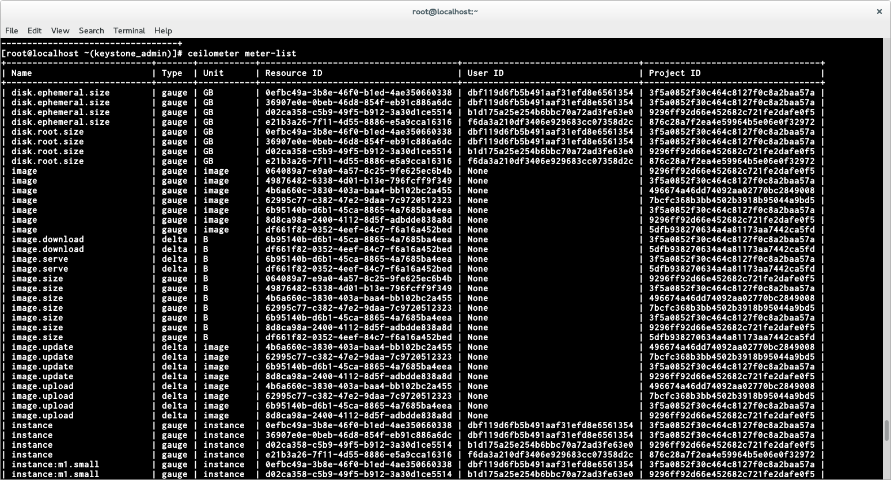
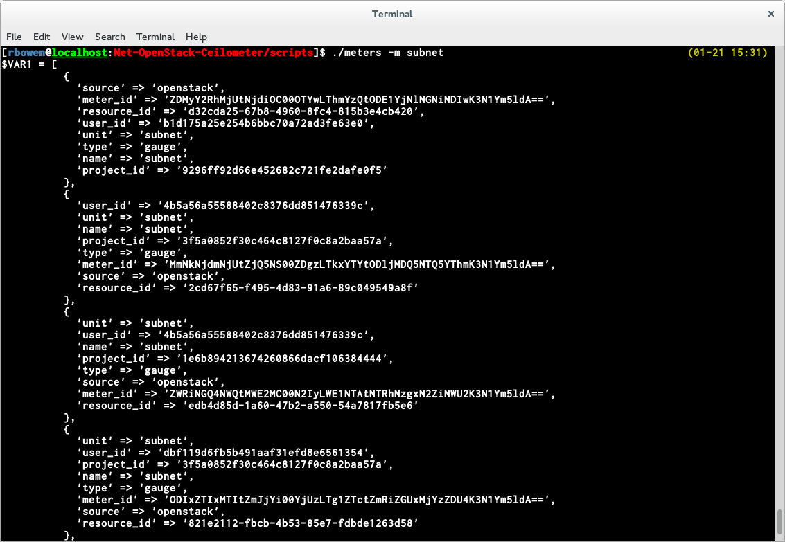

:title: If it's not metered, it's not cloud
:data-transition-duration: 500
:css: css/hovercraft.css

If it's not metered, it's not cloud

----

If it's not metered, it's not cloud
===================================

Introduction to OpenStack Ceilometer reporting

Rich Bowen - rbowen@redhat.com

@rbowen

@rdocommunity

http://openstack.redhat.com/

SLIDES ARE AT: http://tm3.org/ceilometer

----

Ceilometer
==========

Measures the height of the clouds.

.. image:: images/ceilometer.jpg

----

Ceilometer
==========

* https://wiki.openstack.org/wiki/Ceilometer
* Metrics/Metering of your OpenStack cloud

----

Why?
====

.. image:: images/dollar.jpg
    :height: 250px
    :width: 500px

* Billing
* Capacity planning
* Alarms

.. note:: Elastic is great, but if you don't know how far it's being
    stretched, you'll find out the hard way when it snaps.

    Infinite resources is a nice illusion, but an illusion all the same.

    Alarms trigger when a threshold is reached, and can take action
    based on that event.

----

Mission
=======

* Prior to Ceilometer, every component did its own metrics reporting (Or not)
* Ceilometer is a centralized metrics hub that everything can sent metrics to
* Not everything takes full advantage of it yet

----

The project aims to become the infrastructure to collect measurements
within OpenStack so that no two agents would need to be written to
collect the same data. Its primary targets are monitoring and metering,
but the framework should be easily expandable to collect for other
needs. To that effect, Ceilometer should be able to share collected data
with a variety of consumers.

----

Definitions
===========

Metering:
    Measure and record what's happening

Monitoring:
    Notify ("alarm") when one of the meters reaches a threshold

----

Monitoring
==========

* Ceilometer *meters* whether you ask it to or not
* You can query it (monitor) later when you realize you need it

----

Alarms
======

.. image:: images/alarm.jpg
    :height: 200px
    :width: 160px

* Notify when a given metric crosses a threshold
* Another relevant presentation at http://tm3.org/alarming
* Can send alarm to log, or can POST to a HTTP URL for actions

.. note::

    Capacity planning vs point in time monitoring

    You'll need to think ahead about what you want to be notified about,
    of course, since you only get notified about things that you set
    alarms for. ie, you don't know you need it
    until you need it that first time.

----

API
===

* "... Ceilometer should be able to share collected data with a variety of consumers."
* This is done via the HTTP API
* http://docs.openstack.org/developer/ceilometer/webapi/v2.html

----

Installation
============

* Ceilometer is part of what gets installed by RDO
* Devstack also installs and enables ceilometer
* http://docs.openstack.org/developer/ceilometer/install/manual.html

.. note::

    Don't really have time to go through manual installation. It's on
    the wiki.

----

RDO
===

.. image:: images/RDO_icon.jpg

* Easy deployment of OpenStack on Fedora/RHEL/CentOS
* http://openstack.redhat.com/Quickstart

::

    sudo yum install -y http://rdo.fedorapeople.org/rdo-release.rpm
    sudo yum install -y openstack-packstack
    packstack --allinone

.. note:: This is not a product pitch. RDO is a community project
    sponsored by Red Hat, but isn't a product.

----

Configuration
=============

* For demo/testing purposes, speed up collecting - default is every ten minutes.
* Since this is primarily geared to billing, every ten minutes is probably sufficient.
* Adjust according to your expectations
* In /etc/ceilometer/pipeline.yaml

::

    < interval: 600
    > interval: 60

----

Configuration
=============

* Full configuration options at
  http://docs.openstack.org/developer/ceilometer/configuration.html

----

Database
========

* http://docs.openstack.org/developer/ceilometer/install/dbreco.html

.. image:: images/ceilometer_database.png

* MongoDB default with RDO

----

Auth
====

* Before you can do anything, you need an auth token

::

    curl -i 'http://192.168.0.177:5000/v2.0/tokens'
    -X POST -H "Content-Type: application/json"
    -H "Accept: application/json"
    -d '{"auth": {"tenantName": "admin", 
         "passwordCredentials": {"username":
         "admin", "password": "885d4b669cc04a1b"}}}'

* Returns a token that you can then use for other API calls
* This is standard across all OpenStack components
* Auth token expires (by default) after 24 hours

----

API
===

* HTTP requests to port 8777
* Requires auth token you got from Keystone
* GET for read, POST for write

----

Meters
======

::

    curl -H 'X-Auth-Token: <inserttokenhere>' \
      "http://localhost:8777/v2/meters"

* Returns a list of all of the meters that have ever been tracked on this install
* Note: Sample expiry is not enabled by default, so you keep everything forever

----

::

  {
    'resource_id' => '06ac2e66591345e1a46f7a2193aeabf9',
    'user_id' => ${\$VAR1->[0]{'user_id'}},
    'type' => 'gauge',
    'meter_id' => 'MDZhYzJlNjY1OTEzNDVlMWE0NmY3YTIxOTNhZWFiZjkrc3RvcmFnZS5vYmplY3Rz',
    'name' => 'storage.objects',
    'project_id' => '06ac2e66591345e1a46f7a2193aeabf9',
    'source' => 'openstack',
    'unit' => 'object'
  },
  {
    'type' => 'gauge',
    'user_id' => ${\$VAR1->[0]{'user_id'}},
    'resource_id' => '06ac2e66591345e1a46f7a2193aeabf9',
    'name' => 'storage.objects.size',
    'meter_id' => 'MDZhYzJlNjY1OTEzNDVlMWE0NmY3YTIxOTNhZWFiZjkrc3RvcmFnZS5vYmplY3RzLnNpemU=',
    'project_id' => '06ac2e66591345e1a46f7a2193aeabf9',
    'source' => 'openstack',
    'unit' => 'B'
  },
    ...

----

Or, from the cli
================

----

Ceilometer CLI
==============

::

  <subcommand>
    alarm-combination-create
                        Create a new alarm based on state of other alarms.
    alarm-combination-update
                        Update an existing alarm based on state of other
                        alarms.
    alarm-create        Create a new alarm (Deprecated).
    alarm-delete        Delete an alarm.
    alarm-history       Display the change history of an alarm.
    alarm-list          List the user's alarms.
    alarm-show          Show an alarm.
    alarm-state-get     Get the state of an alarm.
    alarm-state-set     Set the state of an alarm.
    alarm-threshold-create
                        Create a new alarm based on computed statistics.

----

Ceilometer CLI, cont'd
======================

::

    alarm-threshold-update
                        Update an existing alarm based on computed statistics.
    alarm-update        Update an existing alarm.
    meter-list          List the user's meters.
    resource-list       List the resources.
    resource-show       Show the resource.
    sample-create       Create a sample.
    sample-list         List the samples for this meters.
    statistics          List the statistics for this meter.
    help                Display help about this program or one of its
                        subcommands.

----

Meter by name
=============

* Note that names aren't unique.
* The meter name and the resource ID are a unique pair

----

----

What can I measure?
===================

::

    # ceilometer meter-list | grep cpu

    +----------------------------+------------+-----------+
    | Name                       | Type       | Unit      |
    +----------------------------+------------+-----------+
    | cpu                        | cumulative | ns        |
    | cpu_util                   | gauge      | %         |
    | vcpus                      | gauge      | vcpu      |
    | vcpus                      | gauge      | vcpu      |
    | vcpus                      | gauge      | vcpu      |
    | vcpus                      | gauge      | vcpu      |

...

----

::

    ---------+----------------------------------------------+-----------
    nit      | Resource ID                                  | User ID   
    ---------+----------------------------------------------+-----------
    s        | a940742a-e5ea-4ca5-8b72-3d69a40bb90f         | dc65900640
             | a940742a-e5ea-4ca5-8b72-3d69a40bb90f         | dc65900640
    cpu      | 0efbc49a-3b8e-46f0-b1ed-4ae350660338         | dbf119d6fb
    cpu      | 36907e0e-0beb-46d8-854f-eb91c886a6dc         | dbf119d6fb
    cpu      | d02ca358-c5b9-49f5-b912-3a30d1ce5514         | b1d175a25e
    cpu      | e21b3a26-7f11-4d55-8886-e5a9cca16316         | f6da3a210d

...

----

::

    -----------+----------------------------------+----------------------------------+
               | User ID                          | Project ID                       |
    -----------+----------------------------------+----------------------------------+
    0f         | dc65900640f54c6fa79460e419b236b8 | 457eaeb167394dff9b436367d97d218f |
    0f         | dc65900640f54c6fa79460e419b236b8 | 457eaeb167394dff9b436367d97d218f |
    38         | dbf119d6fb5b491aaf31efd8e6561354 | 3f5a0852f30c464c8127f0c8a2baa57a |
    dc         | dbf119d6fb5b491aaf31efd8e6561354 | 3f5a0852f30c464c8127f0c8a2baa57a |
    14         | b1d175a25e254b6bbc70a72ad3fe63e0 | 9296ff92d66e452682c721fe2dafe0f5 |
    16         | f6da3a210df3406e929683cc07358d2c | 876c28a7f2ea4e59964b5e06e0f32972 |

----

Statistics
==========

* The statistics API lets you do all sorts of filtering

----

Any samples about tiny instances, in June.

::

    GET /v2/meters/instance:m1.tiny
    q: [{"field": "timestamp",
       "op": "ge",
       "value": "2013-06-01T00:00:00"},
       {"field": "timestamp",
       "op": "lt",
       "value": "2013-07-01T00:00:00"},
       {"field": "project_id",
       "op": "eq",
       "value": "8d6057bc-5b90-4296-afe0-84acaa2ef909"}]

----

Aggregated statistics for those samples

::

    GET /v2/meters/instance:m1.tiny/statistics
    q: [{"field": "timestamp",
       "op": "ge",
       "value": "2013-06-01T00:00:00"},
       {"field": "timestamp",
       "op": "lt",
       "value": "2013-07-01T00:00:00"},
       {"field": "project_id",
       "op": "eq",
       "value": "8d6057bc-5b90-4296-afe0-84acaa2ef909"}]

----

CPU utilization on this resource in June.

::

    GET /v2/meters/cpu_util/statistics
    q: [{"field": "timestamp",
        "op": "ge",
        "value": "2013-06-01T00:00:00"},
        {"field": "timestamp",
        "op": "lt",
        "value": "2013-07-01T00:00:00"},
        {"field": "resource_id",
        "op": "eq",
     "value": "64da755c-9120-4236-bee1-54acafe24980"}]

----

10 minute aggregates

::

    GET /v2/meters/cpu_util/statistics
    q: [{"field": "timestamp",
       "op": "ge",
       "value": "2013-06-01T00:00:00"},
       {"field": "timestamp",
       "op": "lt",
       "value": "2013-07-01T00:00:00"},
       {"field": "resource_id",
       "op": "eq",
       "value": "64da755c-9120-4236-bee1-54acafe24980"}]
    period: 600

----

Syntax
======

If you're not familiar with the syntax:

::

    GET /v2/meters/cpu_util/statistics
    q: [{"field": "timestamp",
       "op": "ge",
       "value": "2013-06-01T00:00:00"},
       {"field": "timestamp",
       "op": "lt",
       "value": "2013-07-01T00:00:00"},
       {"field": "resource_id",
       "op": "eq",
       "value": "64da755c-9120-4236-bee1-54acafe24980"}]
    period: 600

* 'q' vars passed as, eg, 'q.op' and 'q.value' in the query string
* 'period' is passed as 'period' in the qs.

----

So, a URL might look like:

::

    http://192.168.0.177:8777/v2/meters/memory/statistics
        ?q.field=resource_id&q.op=eq&q.value=
        36907e0e-0beb-46d8-854f-eb91c886a6dc
        &q.field=timestamp&q.op=ge
        &q.value=2011-06-01T00:00:00
        &q.field=timestamp&q.op=lt
        &q.value=2014-07-01T00:00:00
        &period=600

* This is the WSME (Web Services Made Easy) format, not unique to Ceilometer

----

Stats output
============

Output will vary depending on what you're querying:

::

    'duration_start' => '2013-11-19T20:43:50.013000',
    'duration_end' => '2013-11-25T17:10:40.135000'
    'duration' => '505610.122',
    'period_start' => '2013-11-19T20:43:50.013000',
    'period_end' => '2013-11-19T20:43:50.013000',
    'period' => 0,
    'groupby' => undef,
    'unit' => 'MB',
    'count' => 8,
    'sum' => '4096',
    'avg' => '512',
    'min' => '512',
    'max' => '512',

----

Stats
=====

* For example, let's track CPU usage on an instance

::

    # ceilometer sample-list -m cpu
    +--------------------------------------+------+------------+
    | Resource ID                          | Name | Type       |
    +--------------------------------------+------+------------+
    | a940742a-e5ea-4ca5-8b72-3d69a40bb90f | cpu  | cumulative |
    | a940742a-e5ea-4ca5-8b72-3d69a40bb90f | cpu  | cumulative |
    | a940742a-e5ea-4ca5-8b72-3d69a40bb90f | cpu  | cumulative |
    | a940742a-e5ea-4ca5-8b72-3d69a40bb90f | cpu  | cumulative |
    | a940742a-e5ea-4ca5-8b72-3d69a40bb90f | cpu  | cumulative |
    +--------------------------------------+------+------------+

...

::

    -+------------+---------------+------+---------------------+
     | Type       | Volume        | Unit | Timestamp           |
    -+------------+---------------+------+---------------------+
     | cumulative | 71250000000.0 | ns   | 2014-01-22T16:00:05 |
     | cumulative | 65300000000.0 | ns   | 2014-01-22T15:59:05 |
     | cumulative | 59390000000.0 | ns   | 2014-01-22T15:58:05 |
     | cumulative | 52990000000.0 | ns   | 2014-01-22T15:57:06 |
     | cumulative | 13430000000.0 | ns   | 2014-01-22T15:50:40 |
    -+------------+---------------+------+---------------------+

----

Or, from the API ...
====================

::

    $ ./statistics -m 
        YTk0MDc0MmEtZTVlYS00Y2E1LThiNzItM2Q2OWE0MGJiOTBmK2NwdQ==

    Fetching http://192.168.0.177:8777/v2/meters/cpu/statistics
    ?q.field=resource_id&q.op=eq
    &q.value=a940742a-e5ea-4ca5-8b72-3d69a40bb90f 

(That was just a shell script that made that curl request.)

----

        'unit' => 'ns',
        'period' => 0,
        'groupby' => undef,
        'period_start' => '2014-01-22T15:50:40',
        'period_end' => '2014-01-22T15:50:40',
        'duration_start' => '2014-01-22T15:50:40',
        'duration_end' => '2014-01-22T16:03:05',
        'duration' => '745',
        'count' => 8,
        'sum' => '512140000000',
        'min' => '13430000000',
        'max' => '89030000000',
        'avg' => '64017500000'

----

Billing
=======

* Ceilometer can give you stats grouped by project
* ... or by resource
* so that you can bill a particular customer by utilization

----

Units
=====

* Note that each meter has a unit
* You cannot modify this, so you'll need to do your own conversions

----

Type
====

Each meter also has a type:

Cumulative:
    Increasing over time (instance hours, cpu usage)
Gauge:
    Discrete items (floating IPs, image uploads) 
    and fluctuating values (disk I/O)
Delta:
    Changing over time (eg change in number of routers)

----

Range
=====

You can specify a range of time using the timestamp arguments in the query:

::

    # ceilometer statistics -m cpu -q \
    "timestamp>2014-01-22T16:05:00;timestamp<2014-01-22T17:05:00"

Output is intended to be human-readable rather than machine readable, so the API may be better suited to automated reporting.

----

::

    +--------+---------------------+---------------------+-------
    | Period | Period Start        | Period End          | Count 
    +--------+---------------------+---------------------+-------
    | 0      | 2014-01-22T17:04:05 | 2014-01-22T17:04:05 | 60    
    +--------+---------------------+---------------------+-------

...

::

    --------+-------+----------------+----------------+--------------+-
            | Count | Min            | Max            | Sum          | 
    --------+-------+----------------+----------------+--------------+-
    7:04:05 | 60    | 101730000000.0 | 467430000000.0 | 1.700835e+13 | 
    --------+-------+----------------+----------------+--------------+-

...

::

    -----+--------------+----------------+----------+
         | Sum          | Avg            | Duration |
    -----+--------------+----------------+----------+
    00.0 | 1.700835e+13 | 283472500000.0 | 3540.0   |
    -----+--------------+----------------+----------+

----

Alarms
======

* Alarms trigger when a metric passes a specified maximum/minimum
* Set alarms with the `ceilometer alarm-threshold-create` command

----

* For example:

::

   ceilometer alarm-threshold-create \
    --name high_cpu_alarm \
    --description 'instance running hot'  \
    --meter-name cpu_util  --threshold 75.00 \
    --comparison-operator gt  --statistic avg \
    --period 60 --evaluation-periods 1 \
    --alarm-action 'log://' \
    --query resource_id=$INSTANCE_ID

----

Trigger
=======

::

    --meter-name cpu_util  --threshold 75.00 \
    --comparison-operator gt  --statistic avg \
    --period 60 --evaluation-periods 1 \

* This is when you want to be notified
* operators are the usual (gt, lt, eq, and so on)
* --statistic is count, avg, max, min, or sum

----

::

    [root@localhost ~(keystone_admin)]# ceilometer alarm-list
    +--------------------------------------+----------------+-
    | Alarm ID                             | Name           | 
    +--------------------------------------+----------------+-
    | bea23f44-16e0-4faf-9d85-e04d8c3bc13d | high_cpu_alarm | 
    +--------------------------------------+----------------+-

...

::

    -+-------------------+---------+------------+-------
     | State             | Enabled | Continuous | Alarm 
    -+-------------------+---------+------------+-------
     | insufficient data | True    | False      | cpu_ut
    -+-------------------+---------+------------+-------

...

::

    ---------+-------------------------------+
    ntinuous | Alarm condition               |
    ---------+-------------------------------+
    lse      | cpu_util > 5.0 during 1 x 60s |
    ---------+-------------------------------+

----

Then
====

::

    # tail /var/log/ceilometer/alarm-notifier.log
    ...
    2014-01-22 13:29:15.989 16226 INFO 
    ceilometer.alarm.notifier.log
    [req-ecbc19b0-d9bb-4f6e-9a2a-5e3a519f112c None None] 
    Notifying alarm bea23f44-16e0-4faf-9d85-e04d8c3bc13d
    from insufficient data to alarm with action 
    SplitResult(scheme=u'log', netloc=u'', path=u'', 
    query='', fragment='') because Transition to alarm
    due to 1 samples outside threshold, most recent: 10.2

----

Actions
=======

* By default, just logs
* But you can invoke arbitrary other actions via http POST

::

    --alarm-action 'http://localhost/alarm'

----

Heat
====

* For example, an alarm might be sent to Heat, the orchestration engine
* Heat can create a new instance when load reaches a certain maximum ...
* and reap instances when it dips below a minimum

----

And so much more
================

* https://wiki.openstack.org/wiki/Ceilometer/Alerting
* http://www.youtube.com/watch?v=-U6cyeWkiSc 
* http://www.slideshare.net/NicolasBarcet/ceilometer-heatequalsalarming-icehousesummit

----

Would be nice ...
=================

* Monitoring of things *within* VMs
* At the moment, this is for monitoring the infrastruture, not the things using the infrastructure
* More canned actions to integrate with other things

.. note:: Ceilometer, Nagios, whatever

----

More Info
=========

* #openstack-ceilometer (freenode)
* #heat (freenode)
* openstack-dev@lists.openstack.org
* https://wiki.openstack.org/wiki/Ceilometer/Alerting

----

Finis
=====

Rich Bowen

rbowen@redhat.com

@rbowen

@rdocommunity

http://tm3.org/ceilometer

