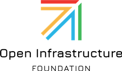
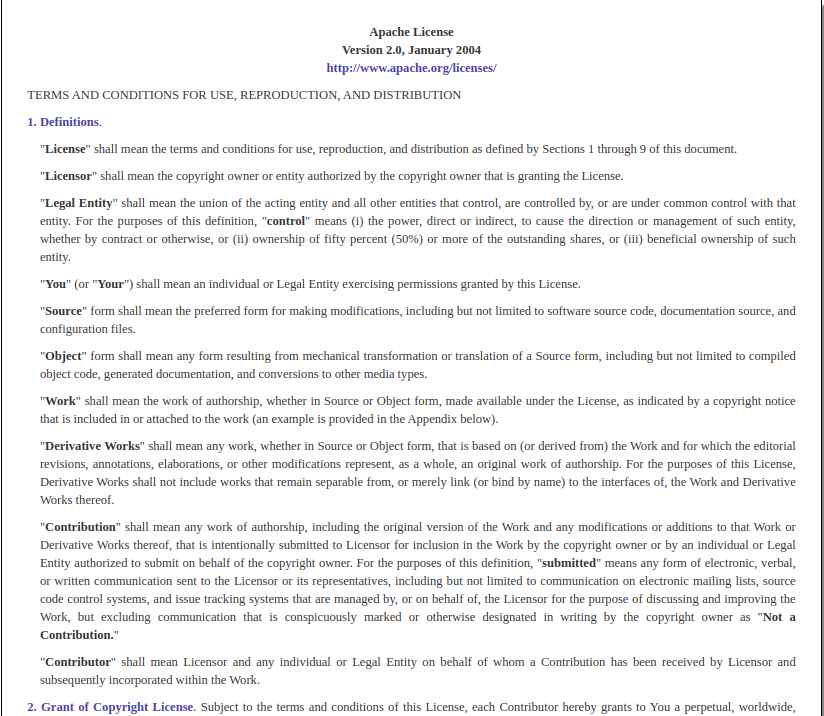

class: center, middle
## The Apache Way

#### *Doing Community like Apache*

Rich Bowen

Director, The Apache Software foundation

---
## The Apache Way

???
I'm here to talk about the Apache Way of software development, and why I
believe it's (one of?) the best way to develop software.
---
## What is the Apache way?
* Community of Peers (Level playing field)
* Earned Authority (Merit)
* Transparency
* Consensus
* Self-governed projects, with oversight

???
The Apache Way is notoriously hard to define, because it's more culture
than a rule book. But these are some of the most important components
that are consistent across most interpretations.
---
## A Brief History

* 1994 - NCSA httpd development stalled
    * Brian Behlendorf and The Apache Group
    * First release of Apache httpd in December 1994
* 1998 - The Apache Software Foundation established, to provide a legal framework
* Today: 300+ projects

???
From the very beginning, vendor neutrality was a big motivation,
because of NCSA httpd disappearing once people had already built their
businesses around it. Brian wanted to ensure that he would never again
have his business held hostage to the shifting plans of another
organization in which he had no input.
---

???
I started in open source the way that many of us do - to solve a
problem. RCBowen Kenya Site, circa 1993
---
## Community of Peers
* Vendor neutrality
* Individuals, not organizations
* Every voice is equal

???
Of course, reality and philosophy seldom match up exactly. And that's
why projects have foundation-level oversight.
---
## Earned Authority
* Project leadership is granted to people who do the work
* Each project defines this a little differently

???
This is sometimes called Meritocracy, although that word has other 
connotations and is falling out of favor.
---
## Transparency
* The "Open" in "Open Source" is not just about the source being visible
* Public communication ensures that anyone can participate

???
* Public/Archived mailing lists ensures that we can discover past decisions, and the reasons for them, forever
* Surprise is the opposite of engagement: public communication about the road map ensures that the community is never surprised
* Can slow the speed of development, but ensures that participants in all time zones, all languages, can participate as equals.
* Shift to synchronous communication mediums - eg Slack - threaten this openness.
---
## Consensus
* Decisions are made by the entire community
* Votes are only necessary when we cannot achieve consensus
---
## Self-governed projects
* Board oversight ...
* But each project determines their own local culture and rules
---
## Governance
* Board
* Membership
* PMC (Project Management Committee, with a Chair who reports to the Board)
* Committers
* Community

???
* The membership selectes the board, and any new members, each year.
* PMC selects new committers, and new PMC members
* Each PMC determines what the criteria are for selecting new project members
---
## The Four Opens
* Open Source
* Open Design
* Open Development
* Open Community

<small>openinfra.dev/four-opens/</small>

???
A bit of a sidebar ... but ... 

* Open Source is a legal definition - an OSI-approved license
* Open Design means planning in public, with public input
* Open Development means all code changes happen in public
* Open Community refers to governance models that clearly document a path to leadership, regardless of what organization you're part of, based on your demonstrated leadership
---
## Apache Software License v2

???
* The Apache License is a so-called "permissive" license, because it allows you to do (almost) anything with the code, as long as you give credit for where you got it.
---
## Four Freedoms

A program is “free software” if the program’s users have the four essential freedoms:

0. The freedom to run the program as you wish, for any purpose.
1. The freedom to study how the program works
2. The freedom to redistribute copies
3. The freedom to distribute copies of your modified versions to others

<small>Richard Stallman - gnu.org/philosophy</small>

???
Richard Stallman
---
## Running your project the Apache Way
* Radical transparency - Default to open
* Document the path to leadership
* Evaluate contributions based on the contributions, not based on the contributor
* Delegate everything to the people willing to do the work, and then TRUST them to do it.
---
* Q&A

    rbowen@apache.org

    @rbowen

    <small>github.com/rbowen/presentations/droidcon_keynote</small>

