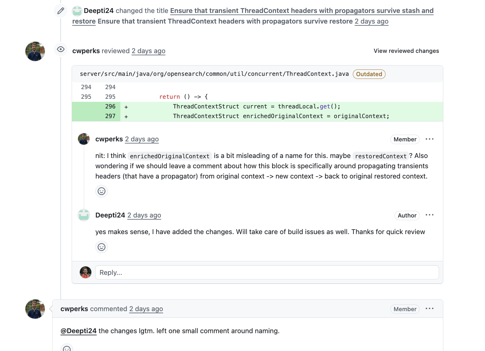
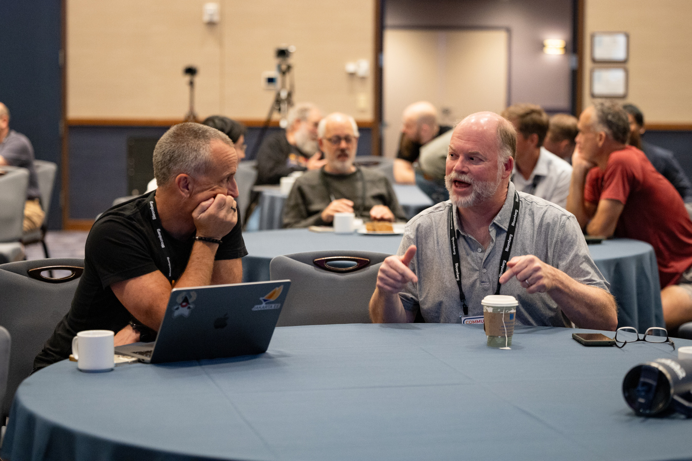

class: center, middle
# Open source And the Leadership Principles

Rich Bowen, Open Source Strategist

---

# Customer Obsession

Open source puts users first. It is about listening to their problems,
and fixing them in software. It recognizes that users are the leading
experts on their own problems. It is the most customer obsessed way to
build software.

---

# Ownership

<small>"Sold", CC by Paul Sableman on Flickr</small>

???

We should take ownership in the projects that underlie our services.
Failure to do so is a *decision* to let our competitors make decisions
for our customers.

We don't merely consume open source outputs. We take *ownership* of
those communities.

---
# Are right a lot

???

Participating in code reviews, and design decisions, demands good
judgement and the ability to make sound technical arguments around
decisions that will affect thousands of downstream users.

Amazonians dive in and assert their opinions in the PRs and issues that
affect our customers.

---
# Earn Trust

<small>"Trust", CC by KatherineDavis on Flickr</small>

???

Earning trust is by far the most important skill in open source
communities. You earn it by transparency, consistent participation, and
honest communication.

---

# Disagree and commit

???

We should show up in open source commnities and advocate strenuously for
our customers' priorities. But we should also recognize that
collaboration with our peers is often going to arrive at decisions that
reflect the needs of a wider group of users, who are also (potential?)
customers.

---

# Success and Scale bring broad responsibility

<small>"Roots", CC by Peter Corbett on Flickr</small>

???

We must participate in the long-term maintenance of the projects we
consume. This isn't just about goodwill, and it's not charity. It's
investing in the sustainability of projects we rely on.

---

# Invent and Simplify

<small>"gears", CC by Ricardinyo on Flickr</small>

???

Open source is inherently about innovation. The best projects find
elegant, simple solutions and share them freely so others don't reinvent
the wheel.

---

# Learn and Be Curious

<small>"San Diego City College Learning Resources Center -- retrieve a
book -- featuring kali", CC by Joe Crawford on Flickr</small>

???

Open source is one of the greatest learning environments that exists.
Contributors constantly explore unfamiliar codebases, languages, and
domains.

---

# Hire and Develop the Best

Healthy open source communities mentor new contributors, turning
newcomers into maintainers. The community grows by investing in people.

---

# Insist on the Highest Standards

CI/CD pipelines, linting, code review, test coverage — open source
projects often set the bar for engineering rigor because the code is
public.

---

# Think Big

Projects like Linux, Kubernetes, and Apache started with ambitious
visions. Open source enables thinking at a scale no single company could
achieve alone.

---

# Bias for Action

The open source mantra: submit the PR. Don't wait for permission — fork
it, fix it, propose it.

---

# Frugality

Open source is the ultimate expression of doing more with less. Shared
infrastructure, shared libraries, shared knowledge — no duplicated
effort.

---

# Dive Deep

Debugging someone else's code in a massive open source project forces
deep technical understanding. Surface-level knowledge doesn't cut it.

---

# Deliver Results

Shipping matters. Open source projects that don't release, don't
survive. Users need working software, not promises.

---

# Strive to be Earth's Best Employer

Open source communities that are welcoming, inclusive, and respectful
attract and retain the best contributors. Codes of conduct reflect this.

---

class: center, middle
## finis

---
