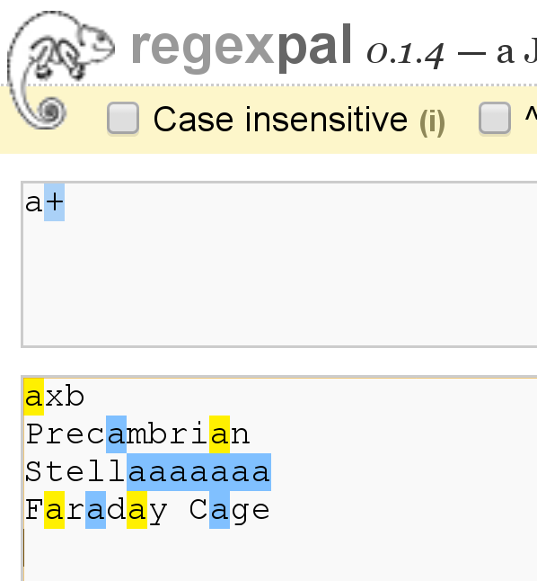

:title: Demystifying mod_rewrite
:data-transition-duration: 500
:css: css/hovercraft.css

Demystifying mod_rewrite

----

Demystifying mod_rewrite
========================

Less magic, more science

Rich Bowen - rbowen@apache.org

@rbowen

http://rcbowen.com/

SLIDES ARE AT: http://tm3.org/rewritescale

----

.. image:: images/voodoo.jpg

Despite the tons of examples and docs, mod_rewrite is voodoo. Damned
cool voodoo, but still voodoo.

-- Brian Moore

----

And numerous websites offer mod_rewrite advice that is much more akin to
magic than science.

----

.. image:: images/algebra.gif

I'd like to show you that mod_rewrite is a clear, concise,
algebraic notation, not a magical incantation.

----

Regular Expressions
===================

.. image:: images/mre.jpg

* Atomic description of text patterns
* Start with a small vocabulary and work up
* Essential building block of mod_rewrite syntax
* PCRE

.. note:: Mastering Regular Expressions, Jeffrey Friedl

----

.
===

* Wildcard character
* Matches one "atom"
* In mod_rewrite syntax, it matches a 'character'
* Use \. if you want to match a literal "."

----

Tangent
=======

* 'Character' vs 'Byte'

----

.. image:: images/axb.png

----

+/\*/?
======

* Repetition characters
* Turns an atom into a molecule

----

\+ - One or more
================

----

\* - Zero or more
=================

* a* matches zero or more 'a' characters
* a
* aaaaa
* Also matches "Fish", which contains zero 'a' characters

----

\?
=====

* Makes a match optional
* That is, matches zero or one

----

.. image:: images/colour.png

----

^ and $
=======

* Anchors
* Starts with
* Ends with

----

.. image:: images/anchora.png

----

.. image:: images/anchora2.png

----

^$ and ^
=========

* ^$ is a special case - matches empty string
* starts with ends with (nothing between)
* ^ (all by itself) matches every string (including empty string)

----

( )
====

* Turns several atoms into a molecule (grouping)
* Can apply repetition characters to this molecule
* (ab)+ matches "abababab"

----

( )
=====

* Also "captures"
* The matched set of parentheses becomes $1
* The next one $2, and so on
* Examples in just a moment

----

[ ]
=====

* Character class
* Match one of these things

----

.. image:: images/coat.png

----

Not
===

* Any regex can be negated in a RewriteRule or RewriteCond by putting a ! in front of it
* A character class is negated with a ^

::

    [^abc]

Matches anything EXCEPT a, b, c

----

mod_rewrite
===========

* mod_rewrite uses regular expressions to match requests, and modify them in some way
* (And a lot of other things)

----

RewriteRule
===========

RewriteRule PATTERN TARGET

----

RewriteRule
===========

RewriteRule *PATTERN* TARGET

If it matches *this*

----

RewriteRule
===========

RewriteRule PATTERN *TARGET*

Do *this* instead

----

RewriteRule
===========

RewriteRule PATTERN TARGET \\
*[flags]*

With some optional *tweaks*

----

.. image:: images/syntax_rewriterule.png

----

Syntax
======

RewriteRule *PATTERN* TARGET

* *PATTERN* is a regular expression (usually)
* Applied to the REQUEST_URI
* That's everything after http://hostname
* May be modified by context (eg, .htaccess files) or by earlier rewrite rules

----

Syntax
======

RewriteRule *PATTERN* TARGET

* *TARGET* is where you want it to go instead
* File path, or URI, or something else, depending on context and flags

----

Examples
========

::

    RewriteRule ^/images/(.*)\.jpg /pics/$1.gif [R=301]

----

Flags
=====

* Modify behavior of a RewriteRule
* Default is to treat it as a file path relative to current location

----

[R]
====

* Forces an external redirect, optionally with the specified HTTP status code. 
* Issues a redirect header to the client - URL in browser changes

::

    RewriteRule ^/images/(.*)\.jpg /pics/$1.gif [R=302]

    RewriteRule products http://products.example.org/ [R=301]

.. note:: 302=temp, 301=permanent

----

[PT]
=====

* Forces the resulting URI to be passed back to the URL mapping engine for processing of other URI-to-filename translators, such as Alias or Redirect.
* Treat the target as a URI, processing it for URI-type things

::

    RewriteRule ^/products/(.+?)/ /prod.php?$1 [PT,L]

----

[B]
=====

* Escape non-alphanumeric characters *before* applying the transformation.
* Preserves special characters in the URI through the rewriting process

----

[C]
====

* Rule is chained to the following rule. If the rule fails, the rule(s) chained to it will be skipped. 
* Use this when you need to do several transformations in a row as part of a single logical operation.

----

[CO]
=====

* Sets a cookie in the client browser. 

::

    RewriteRule ^/index.html - CO=fontdoor:1:example.com

* Full syntax is: CO=NAME:VAL:domain[:lifetime[:path[:secure[:httponly]]]] 
* *-* as the target means "don't rewrite"

----

[DPI]
=====

* Causes the PATH_INFO portion of the rewritten URI to be discarded. 

----

[ENV]
======

* Causes an environment variable VAR to be set (to the value VAL if provided). 
* The form !VAR causes the environment variable VAR to be unset.

::

    RewriteRule \.(png|gif|jpg)$ - [E=image:1]
    CustomLog logs/access_log combined env=!image

* Example: Don't log images

----

[F]
====

* Returns a 403 FORBIDDEN response to the client browser.

::

    RewriteRule \.exe - [F]

----

[G]
====

* Returns a 410 GONE response to the client browser. 
* I've never actually used this flag.

----

[H]
====

* Causes the resulting URI to be sent to the specified Content-handler for processing. 

::

    RewriteRule ^(/source/.+\.php)s$ $1 [H=application/x-httpd-php-source]

* Example causes .phps requests to be processed by PHP's syntax-highlighter

----

[L]
====

* Stop the rewriting process immediately and don't apply any more rules.
* Probably doesn't do what you expect in per-directory and .htaccess context
* (see also the END flag).

::

    RewriteBase /
    RewriteCond %{REQUEST_URI} !=/index.php
    RewriteRule ^(.*) /index.php?req=$1 [L,PT]

----

[END]
======

* Stop the rewriting process immediately and don't apply any more rules.
* Also prevents further execution of rewrite rules in per-directory and .htaccess context. 
* (Available in 2.3.9 and later)
* Note that a rule issuing a REDIRECT to itself will still result in rules being re-run

----

[N]
=====

* Re-run the rewriting process, starting again with the first rule, using the result of the ruleset so far as a starting point. 

::

    RewriteRule (.*)A(.*) $1B$2 [N]

* Example - global search and replace of A with B, looping until there's no more As
* Use [N=100] to limit to 100 iterations (2.4.8 and later)

----

[NC]
=====

* Makes the pattern comparison case-insensitive.

::

    RewriteRule (.*\.(jpg|gif|png))$ http://images.example.com$1 [P,NC]

----

[NE]
=======

* Prevent mod_rewrite from applying hexcode escaping of special characters in the result of the rewrite. * Not to be confused with [B]

----

[NS]
=====

* Causes a rule to be skipped if the current request is an internal sub-request. 

----

[P]
======

* Force the substitution URL to be internally sent as a proxy request. 

::

    RewriteRule (.*\.(jpg|gif|png))$ http://images.example.com$1 [P,NC]

* Proxy to back-end image server

----

[QSA]
======

* Appends any query string from the original request URL to any query string created in the rewrite target.
* That is, it preserves the user-submitted query string, in addition to the one you created

::

    RewriteRule /pages/(.+) /page.php?page=$1 [QSA]

----

[QSD]
=======

* Discard any query string attached to the incoming URI. 

----

[S]
=====

* Tells the rewriting engine to skip the next num rules if the current rule matches.
* Like a GoTo statement for rewrite rules
* Consider using <If> and <Else> instead

::

    # Is the request for a non-existent file?
    RewriteCond %{REQUEST_FILENAME} !-f
    RewriteCond %{REQUEST_FILENAME} !-d
    # If so, skip these two RewriteRules
    RewriteRule .? - [S=2]

    RewriteRule (.*\.gif) images.php?$1
    RewriteRule (.*\.html) docs.php?$1

----

[T]
======

* Force the MIME-type of the target file to be the specified type. 

::

    # Serve .pl files as plain text
    RewriteRule \.pl$ - [T=text/plain]

----

.htaccess files
===============

* .htaccess files are for local (per-directory) configuration
* mod_rewrite assumes you only care about the current directory
* Leading directory path is stripped off of everything

----

::

    # In httpd.conf
    RewriteRule ^/images/(.+)\.jpg /images/$1.png

    # In .htaccess in root dir
    RewriteBase /
    RewriteRule ^images/(.+)\.jpg images/$1.png

    # In .htaccess in images/
    RewriteBase /images/
    RewriteRule ^(.+)\.jpg $1.png

----

RewriteCond
===========

* Additional condition on a rewrite
* Can consult any variable, not just REQUEST_URI
* Can evaluate arbitrary expressions

----

.. image:: images/syntax_rewritecond.png

----

::

    RewriteCond %{REMOTE_ADDR} ^10\.2\.
    RewriteRule (.*) http://intranet.example.com$1

----

Backreferences
==============

::

    RewriteCond %{HTTP_HOST} (.*)
    RewriteRule ^/(.*) /sites/%1/$1

----

Flow
====

.. image:: images/rewrite_backreferences.png

----

-f and -d
=========

* -f - Is it a file?
* -d - Is it a directory?

::

    # If it doesn't map to a on-disk resource ...
    RewriteRule /var/www%{REQUEST_URI} !-f
    RewriteRule /var/www%{REQUEST_URI} !-d

    RewriteRule ^ /index.php [PT,L]
    # index.php can examine $_SERVER['REQUEST_URI']
    # for the original request

----

Others
======

* -s - is a file with non-zero size
* -U - resolves to a valid URL - This is SLOW
* -x - is an executable file

----

LA-U
====

* Look-ahead for a variable that hasn't been set yet
* For example, use this for auth user, which is set *after* rewrite phase

::

    RewriteCond %{LA-U:REMOTE_USER} (.+)
    RewriteRule (.*) http://people.example.org/%1/$1   [R,L]

----

Expresions
==========

* Evaluate arbitrary logical expressions

::

    RewriteCond expr "! %{HTTP_REFERER} -strmatch '*://%{HTTP_HOST}/*'"
    RewriteRule ^/images - [F]

----

RewriteMap
==========

* External map which can be used in a RewriteRule
* 1-1 mapping
* DB lookup
* Some kind of programmatic thingy

----

RewriteMap
==========

::

    RewriteMap MapName MapType:MapSource

eg.

::

    RewriteMap examplemap txt:/path/to/file/map.txt
    RewriteRule ^/ex/(.*) ${examplemap:$1}

----

::

    RewriteMap product2id \
        txt:/etc/apache2/productmap.txt
    RewriteRule ^/product/(.*) \
         /prods.php?id=${product2id:$1|NOTFOUND} [PT]

where productmap.txt looks like

::

    ##
    ## productmap.txt - Product to ID map file
    ##
        
    television 993
    stereo 198
    fishingrod 043
    basketball 418
    telephone 328

----

Other map types
===============

txt
    Plain text maps
rnd
    Randomized Plain Text
dbm
    DBM Hash File

::

    httxt2dbm -i rewritemap.txt -o rewritemap.dbm

----

int
    Internal Function
prg
    External Rewriting Program
dbd or fastdbd
    SQL Query

*examples in bonus slides at the end*

----

Logging - 2.2 and earlier

::

    RewriteLog /var/log/httpd/rewrite.log
    RewriteLogLevel 9

Then ...

::

    tail -f /var/log/httpd/rewrite.log

----

Logging - 2.4 and later

::

    ErrorLog /var/log/httpd/error.log
    LogLevel warn rewrite:trace6

Then ...

::

    tail -f /var/log/httpd/error.log | grep rewrite

----

Finis

Email: rbowen@apache.org

Twitter: @rbowen

Slides: http://tm3.org/rewritescale and at https://github.com/rbowen/presentations

----

Bonus Slides
============

* RewriteMap examples
* Rewrite recipes
* If, ElseIf, Else syntax

----

rnd
===

::

    ##
    ## map.txt -- rewriting map
    ##
    
    static www1|www2|www3|www4
    dynamic www5|www6

----

rnd
===

::

    RewriteMap servers rnd:/path/to/file/map.txt

    RewriteRule ^/(.*\.(png|gif|jpg)) http://${servers:static}/$1 [NC,P,L]
    RewriteRule ^/(.*) http://${servers:dynamic}/$1 [P,L]

----

int
===

::

    RewriteMap lc int:tolower
    RewriteRule (.*?[A-Z]+.*) ${lc:$1} [R]

----

prg
===

::

    RewriteMap d2u prg:/www/bin/dash2under.pl
    RewriteRule - ${d2u:%{REQUEST_URI}}

::

    #!/usr/bin/perl
    $| = 1; # Turn off I/O buffering
    while (<STDIN>) {
        s/-/_/g; # Replace dashes with underscores
        print $_;
    }

----

dbd
===

::

    RewriteMap myquery \
        "fastdbd:SELECT destination FROM rewrite WHERE source = %s"

----

Rewrite Recipes
===============

----

::

    RewriteEngine on
    
    #   first try to find it in dir1/...
    #   ...and if found stop and be happy:
    RewriteCond         %{DOCUMENT_ROOT}/dir1/%{REQUEST_URI}  -f
    RewriteRule  ^(.+)  %{DOCUMENT_ROOT}/dir1/$1  [L]
    
    #   second try to find it in dir2/...
    #   ...and if found stop and be happy:
    RewriteCond         %{DOCUMENT_ROOT}/dir2/%{REQUEST_URI}  -f
    RewriteRule  ^(.+)  %{DOCUMENT_ROOT}/dir2/$1  [L]
    
    #   else go on for other Alias or ScriptAlias directives,
    #   etc.
    RewriteRule   ^  -  [PT]

----

::

    <Directory /var/www/my_blog>
      RewriteBase /my_blog

      RewriteCond /var/www/my_blog/%{REQUEST_FILENAME} !-f
      RewriteCond /var/www/my_blog/%{REQUEST_FILENAME} !-d
      RewriteRule ^ index.php [PT]
    </Directory>

Or ...

::

    <Directory /var/www/my_blog>
      FallbackResource index.php
    </Directory>

----

::

    RewriteEngine on
    RewriteCond %{HTTP_REFERER} !^$
    RewriteCond %{HTTP_REFERER} !example.com [NC]
    RewriteRule \.(gif|jpg|png)$ - [F]

or ...

::

    RewriteEngine on
    RewriteCond %{HTTP_REFERER} !^$
    RewriteCond %{HTTP_REFERER} !example.com [NC]
    RewriteRule \.(gif|jpg|png)$ /images/goaway.gif [R,L]

----

If/Else syntax
==============

::

    <If "$req{Host} != 'www.wooga.com'">
        RedirectMatch (.*) http://www.wooga.com$1
    </If>

----

::

    # Images should be from local pages
    # (Prevent image "hotlinking")
    <FilesMatch \.(jpg|png|gif)$>
        <If "%{HTTP_HOST} !~ 'example.com'>
            Require all denied
        </If>
    </FilesMatch>

----

See also:
=========

* mod_macro
* mod_substitute

----

Finis
