# An Introduction to OpenStack

 

Rich Bowen - rbowen@redhat.com - LinuxCon North America 2016

???
A Foundation, a community, and a software project.

---

## $> whoami

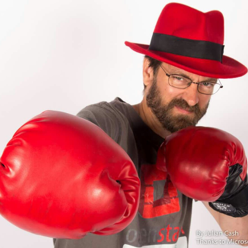
* Long-time Open Source enthusiast
* OpenStack Community Liaison at Red Hat

Also, yes, the slides available at http://boxofclue.com

---

## OpenStack Is ...

* A software project
* A Community
* A non-profit Foundation

---

## 6 years ago ...

A traditional "scratch your own itch" Open Source project, created to
solve real-world problems.

???
6 years ago this summer, Rackspace and NASA saw a space in which they
could collaborate to both of their benefits, and created OpenStack.

Rackspace and NASA solving similar problems, deciding to pool their
resources. Now, a coalition of over 350 companies working together to 
develop the OpenStack software.

Origins: NASA trying to upload multi-terabyte photos for data
processing. Rackspace trying to manage thousands of VMs.

---

---

## The software, too, has grown

???
Six years ago, it looked like this, and this is the diagram you'll see
in every OpenStack presentation ever.

---

## And now ...

<pre>
astara            barbican            Chef      cinder
cloudkitty        App_Catalog         congress  designate
Documentation     dragonflow          ec2-api   freezer
fuel              glance              heat      Horizon
I18n              Infrastructure      ironic    keystone
kolla             kuryr               magnum    manila
mistral           monasca             murano    neutron
nova              Charms              client    UX
OpenStackAnsible  OpenStackSalt       oslo      Packaging-deb
Packaging-rpm     Puppet              QA        rally
RefStack          Release_Management  sahara    searchlight
Security          senlin              smaug     solum
Stable            branch_maintenance  swift     tacker
Telemetry         tripleo             trove     vitrage
watcher           winstackers         zaqar
</pre>

???
57 of 'em. Not to mention numerous downstreams

---

## The Foundation

* Vendor-neutral governance
* Infrastructure support (especially for testing)
* Community manager services
* User Group and Meetup assistance
* Events (OpenStack Summit)

600+ companies cooperating (and competing) around a common stack.

???
Coopetition

---

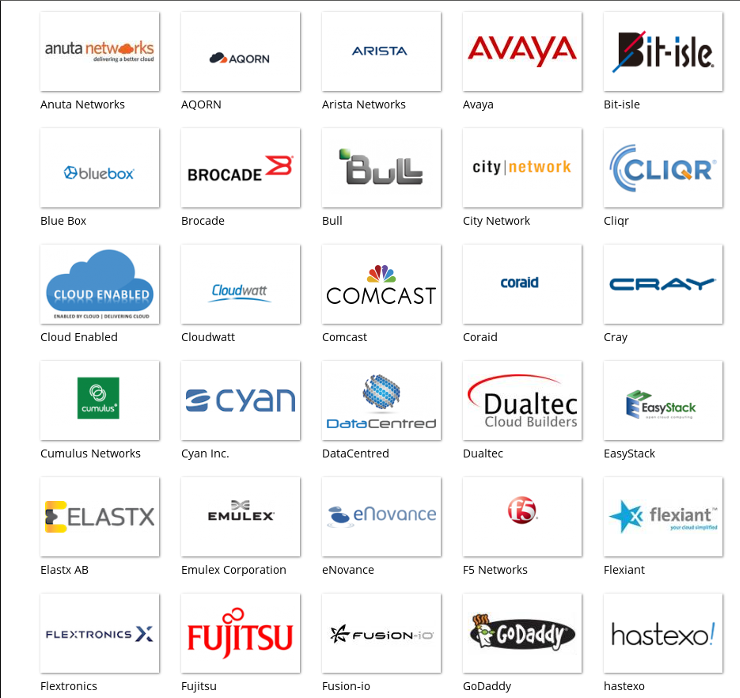

???
Companies can sponsor at a variety of levels, to get a variety of
privileges.

---

## Sponsorship

* $25k through $500k (per year) sponsorship levels, with varying levels of benefits
* 8 Platinum level sponsors
* 19 Gold level sponsors
* openstack.org/join

---

## Membership

* Individual membership is free
* Get to vote in board elections and for other Foundation decisions
* Membership is the source of authentication for everything, so you have
  to join the Foundation to do anything at the Foundation.

???
Including code contributions

---

## Vendor-neutral governance

* Ensures level playing field - everyone's voice is equal

--

* Ensures project sustainability - you aren't at the mercy of a single
  organization losing interest

--

* Ensures project independence - Decisions aren't tied to a particular
  vendor

--

* Weirdly, this actually works in real life, because the community is
  awesome

---

## Project technical oversight

* Projects make their own technical decisions

--

* ... but must be subject to the judgment of the Technical Committee
  (TC)
* This ensures the necessary level of interoperation between projects
* The TC is elected by the membership

---

## OpenStack, The Community

* Open governance of projects
* Each project is indendent (sort of)
* Each project elects a PTL - Project Technical Lead - but in most
  projects leaderhip is completely collaborative
* 50+ projects

---

## The Big Tent

* Projects that contribute to the OpenStack Mission are part of the "Big
  Tent"
* Projects must be **OPEN**

        The OpenStack Mission: to produce the ubiquitous
        Open Source Cloud Computing platform that will meet
        the needs of public and private clouds regardless of size,
        by being simple to implement and massively scalable.

???
If you've actually used it, you'll note that 'simple to implement'
continues to be a Todo item.

---

class: center, middle
# Open has a number of definitions.

---

class: center, middle

## Open Code

The community controls the decision process.
You can help make this
software meet your needs.

---

class: center, middle

## Open Governance

The technical governance of the project is a community meritocracy with
contributors electing technical leads and members of the Technical
Committee.

???
Your voice is just as loud as the voice of someone from Red Hat or
Canonical.

---

class: center, middle

## Open License

This will always be truly free software. We will never purposefully
limit the functionality or scalability of the software to try and sell
you an "enterprise" version.

(Apache License V2)

---

class: center, middle

## Open Discussion

All project meetings are held in public IRC channels and recorded.
Meetings that happen in person **must** be taken back to the mailing
list.

???
Ensures participation across time zones, language, and ability to travel
to events. This ensures a level playing field, and further ensures that
one player/company cannot overwhelm discussion and push their agenda
through

---

class: center, middle

## Open API

Must be interoprable with other things that are OpenStack.

???
At a minimum, needs to have an API that Horizon can use, and use
Keystone for authentication.

---

## Community > Code

* Collaborative software development is the key to making OpenStack
  successful
* An equal voice, whether you're Red Hat, HP, Mirantis, or a 2-person
  consultancy company

---

## OpenStack, the Software

OpenStack software controls large pools of compute, storage, and
networking resources throughout a datacenter, managed through a
dashboard or via the OpenStack API.

---

## OpenStack Mission Statement

> To produce the ubiquitous Open Source Cloud Computing platform that will meet the needs of public and private clouds regardless of size, by being simple to implement and massively scalable.

---

## Kinda like ...

* AWS
* VMWare
* CloudStack
* OpenNebula
* ... etc

---

## Required components

* Horizon (web dashboard)
* Keystone (Authentication)
* Nova (Compute)
* Neutron (Networking)
* Swift (Storage)

---

## Optional components

Everything frm DBaaS (Database as a Service) to DNSaaS to Containers to
Orchestration

And growing every year

---

## Python

* Most code is in Python

---

## Contributors

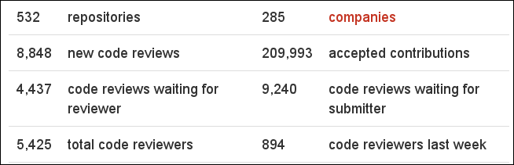

 
*Source: activity.openstack.org*

---

## Community Support

* Numerous IRC channels
    * \#openstack-*project* on Freenode
    * \#openstack
    * \#openstack-meeting
* ask.openstack.org
* Mailing lists
    * openstack@lists.openstack.org
    * openstack-dev@lists.openstack.org

???
Rather than splitting discussion, messages are tagged with [PROJECT] so
that someone could theoretically follow all of the discussion in one
place, or filter just what they care about.

Also, things like marketing and community lists.

---

## Events

* OpenStack Summit - openstack.org/summit
* OpenStack Days - openstack.org/events/openstackdays
* Meetup Groups - groups.openstack.org (as well as meetup.com)

---

class: middle center
# The projects

???
No, I'm not going to talk about all of them

---

## Keystone

* Identity Services
* Pluggable back-end (whatever you're already using)
* Everything relies on this

???
Design principles: has to Just Work

Lots of software problems get reported as Keystone problems, because
it’s called by everything

The Keystone team are awesome, and one of the most widely-knowledgeable
teams, as a result.

Plugable back-end is a design principle on most projects, where
applicable
---

## Glance

* Disk and server images.
* Administrators can create base templates from which their users can start new compute instances
* Users can choose from available images, or create their own from existing servers
* Snapshots can also be stored in the Image Service so that virtual machines can be backed up quickly

---

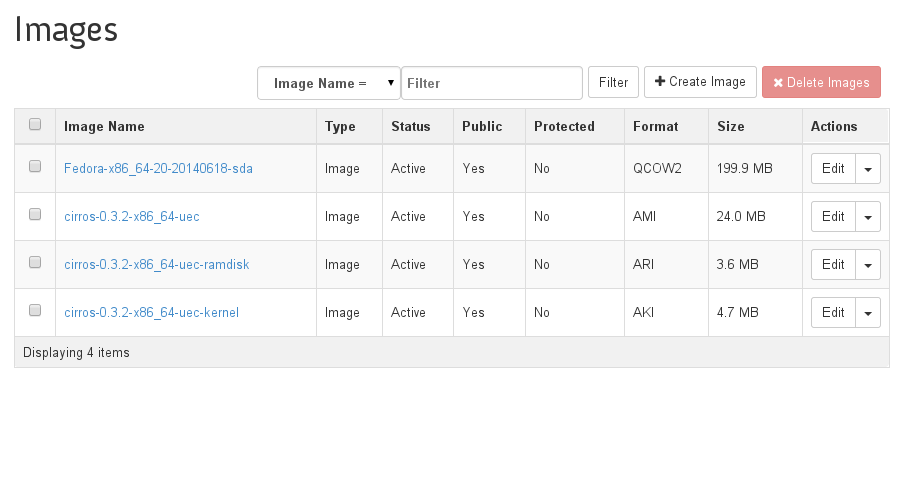

---

## Nova

* Compute
* Manages VM lifecycle
* Oldest part of OpenStack and more code, and development activity, than
  any other project

---

## Software Defined Networking

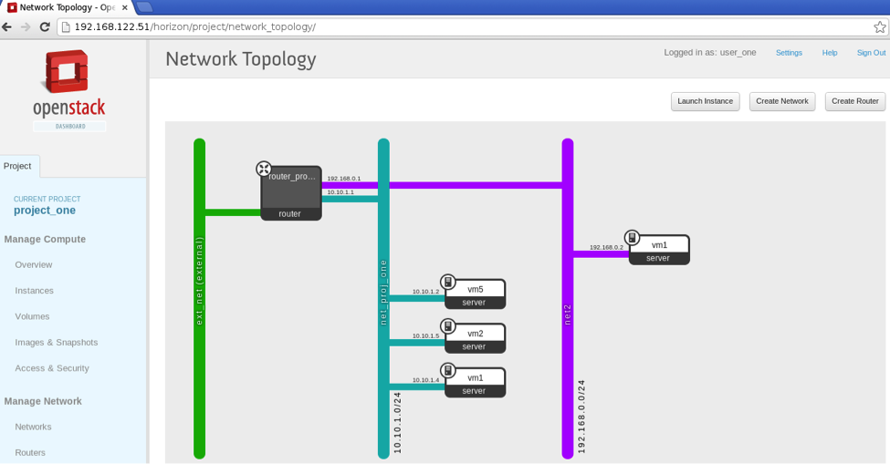

---

## And security

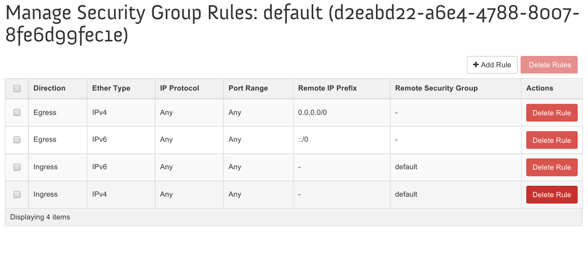

---

## Storage

* Cinder (block storage)
* Swift (object storage)
* Manilla (shared filesystems)

---

## Horizon

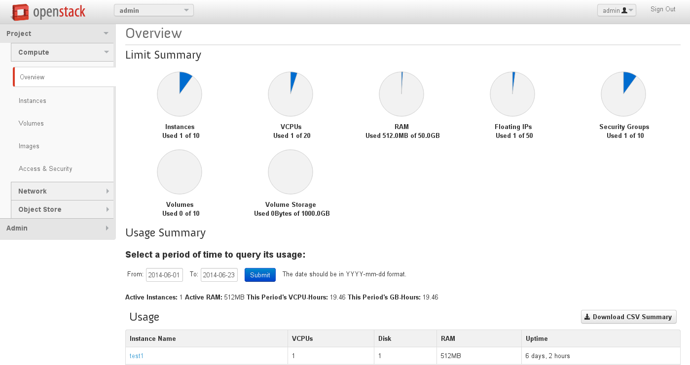

---

## Deployment

* Install/Deploy is hard, because there's many moving parts
* Every install is different
* Most people deploy with an orchestration tool like Puppet/Chef/Ansible
* Or some tool built on top of one of these

---

## Devstack

* Primarily geared to developers
* By default, deploys upstream trunk

        git clone https://git.openstack.org/openstack-dev/devstack
        cd devstack
        ./stack.sh

---

## RDO

* http://rdoproject.org
* For RPM-based Linuxes
* Disclosure - This is my day job

        sudo yum install -y https://rdoproject.org/repos/rdo-release.rpm
        sudo yum install -y openstack-packstack
        packstack --allinone

---

## Fuel

* Download an ISO that gives you a starter cloud and a management
  utility
* Manages cloud lifecycle, not just deployment

---

## Ubuntu Cloud Archive

* wiki.ubuntu.com/OpenStack/CloudArchive
* For Ubuntu (obviously)

---

## TripleO

* OpenStack on OpenStack
* A minimal "undercloud" manages the production "overcloud"

---

## Commercial

* Various proprietary and/or commercial offerings that (usually) build
  on the above
* Often offer more integration with a particular vendor's other products

---

## Deplyoment

* Deployment is hard
* We're working on it

---

## Testing

* Every code commit is automatically tested and visually inspected
* Must pass tempest: The test suite
* Managed by Zuul - The upstream testing infrastructure

    http://status.openstack.org/zuul/

???
Must be approved by two other contributors

Social constraint - shouldn't both be from your company

---

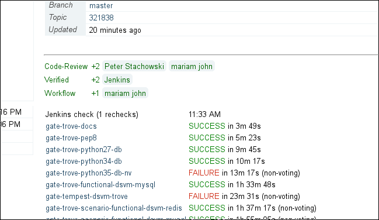

---

## Tempest

* Automated test suite run on each pull request
* Includes the ability to upgrade from version N-1 with this patch in
  place
* Spins up thousands of VMs a day to test everything

---

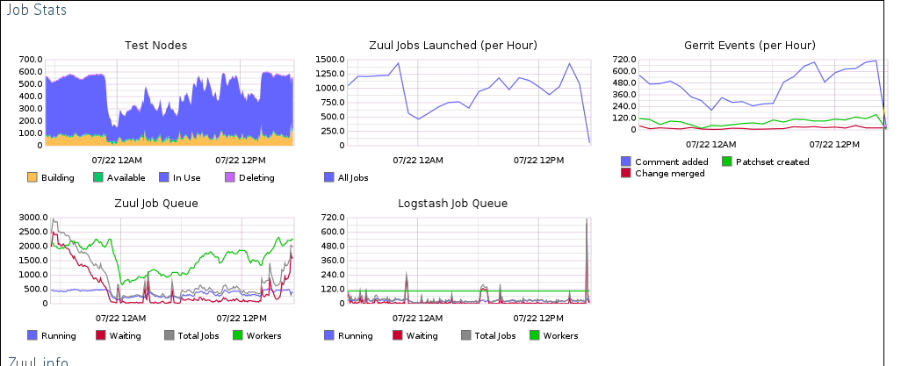

---

## Get involved!

* https://github.com/openstack
* http://ask.openstack.org/
* https://groups.openstack.org/
* http://docs.openstack.org/

---

## Why?

* Fix it for everyone
* Showcase the cool things you're working on
* It's better to share

---

## Why companies are involved

* Customers want a solid cloud platform
* None of us are big enough to develop what they want in a reasonable time.

---

## Red Hat

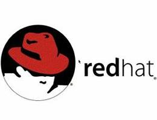

* Why does Red Hat (or, by extension, any company) care?
    * Promote our customer's requirements
    * Build expertise, so that we provide better support
    * Strong upstream helps everyone
    * Working on features that won't be in the product long-term is
      actively harmful to customers

???
Rising tide, and all that

Companies that simply consume the upstream don't end up with the
expertise that we have.

Maintaining out-of-tree patches sucks. A lot.

---

## Join us in Barcelona!

Barcelona, Spain, October 24-28

Boston, Mass, USA, May 8th, 2017

Sydney, Australia, November 6th, 2017

http://openstack.org/summit

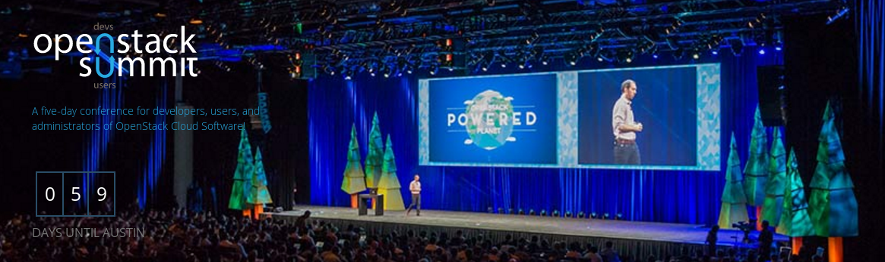

???
* Half trade show, half developer summit
* Celebrate the recent release, plan the next one

---

## Try it out

http://trystack.org/

---

# FIN

* Rich Bowen
* RBowen@RedHat.com
* @rbowen
* @RDOCommunity
* **boxofclue.com**/presentations/openstack

