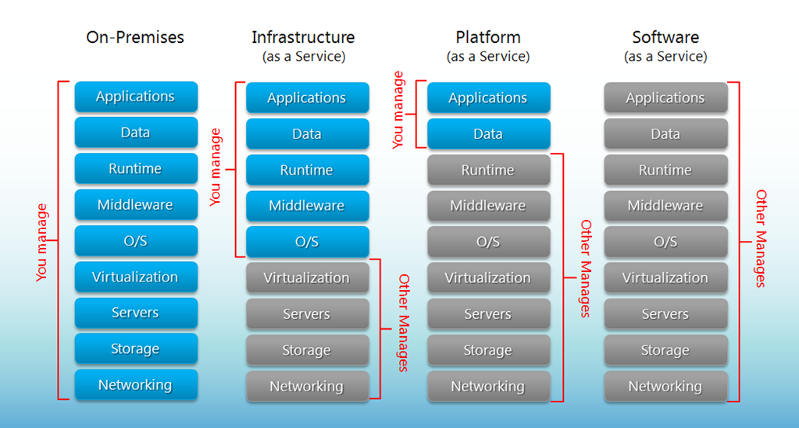
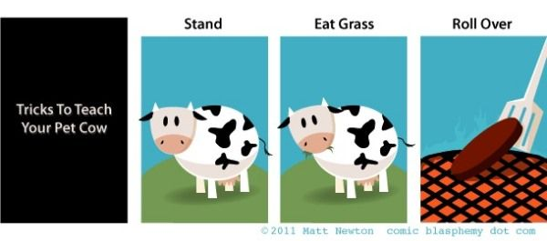
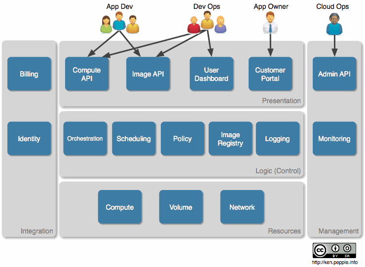

---

## What is it - Simplest description

* VM management

---

## More complicated description

* Elasticity
* On demand, self service
* Measured
* Network access

---

---

## Pets

* Names like 'fluffy', 'spots', and 'fido'
* When they get sick, you stay up all night recompiling their kernel
* Each one is a unique snowflake

---

## Cattle

* Names like DC01M049.cloud.ibm.com
* When they get sick you shoot it and spin up a new one
* Each one is identical, or based off of a limited number of templates
* Moo

---

---

---

---

---

## Shared services

* Communicate via REST API amongst themselves
* Optional components
* Pluggable (ie, choose your own back-end)

---

## Identity

* 'Keystone'
* Various PAM identity backends

---

## Keystone

* Configure centralized policies across users and systems
* Create users and tenants and define permissions for compute, storage and networking resources using role-based access control (RBAC) features
* Integrate with an existing directory like LDAP, allowing for a single source of identity authentication across the enterprise
* User: Get a list of the services that you can access
* Make API requests or log into the web dashboard to create resources owned by your account

---

## Image Service

* 'Glance'

* Disk and server images.
* Store disk and server images in a variety of back-ends, including OpenStack Object Storage.
* Administrators can create base templates from which their users can start new compute instances
* Users can choose from available images, or create their own from existing servers
* Snapshots can also be stored in the Image Service so that virtual machines can be backed up quickly

---

## Image formats

* Raw
* Machine (kernel/ramdisk outside of image, a.k.a. AMI)
* VHD (Hyper-V)
* VDI (VirtualBox)
* qcow2 (Qemu/KVM)
* VMDK (VMWare)
* OVF (VMWare, others)

---

## Telemetry Service

* 'Ceilometer'
* Aggregates usage and performance data across the services deployed in an OpenStack cloud.
* Reporting (billing)
* Alarming (monitoring and notification)

---

## Orchestration Service

* 'Heat'
* Template-driven engine 
* Describe and automate the deployment of infrastructure.

---

## Database Service

* 'Trove'
* Provision and manage multiple database instances as needed.

---

## Compute

* Nova
* This is where your VM runs

---

## Network

* Neutron
* Manages SDN - Software Defined Networking

---

## Storage (block storage)

* Cinder
* Traditional disk-based service

---

## Storage (object storage)

* Swift
* API to put/get files or objects, without caring where they actually get stored

---

## Horizon

* The "control panel"

---

---

## Other ...

* Data processing (Sahara)
* Bare metal (Ironic)
* Queue service (Marconi)
* Key management (Barbican)
* DNS Services (Designate)
* Common Libraries (Oslo)
* Deployment (TripleO)
* Devstack (DevStack)

---

## Deployment

* Install/Deploy is a nightmare
* Every install is different
* There's no "best" way to do things
* Lots of moving parts

---

## Deployment schemes

* 'All-in-one' - great for testing, impractical in the real world
* Any service can share a machine with others, or run on one, or several machines
* Typical is multiple compute nodes, multiple storage nodes, one "control" note containing Horizon, Neutron, Ceilometer, and so on

---

## RDO

* http://openstack.redhat.com

        sudo yum install -y http://rdo.fedorapeople.org/rdo-release.rpm
        sudo yum install -y openstack-packstack
        packstack --allinone

---

## RDO

* OpenStack packaged for CentOS, RHEL, and Fedora (and derivatives)
* Red Hat engineers working in the upstream
* Community of developers and users sharing their experience

---

## Alternatives

* Crowbar (Dell)
* Fuel (Mirantis)
* Helion (HP)
* Devstack (Upstream, for development)
* TripleO (Still in infancy, perhaps core in Juno)

---

## Why so many?

* This is the place where, for the moment, companies are competing
* Hopefully soon TripleO will be the defacto solution
* Local variants (Debian vs RHEL, for example) will still exist, based
  on TripleO
* We'll start competing on something else, like management
* Speaking of which, http://manageiq.org/

---

## REF

* http://openstack.org/
* http://openstack.redhat.com/
* http://stackalytics.com/
* http://openstack.org/summit/

---

## Demo goes here

* ...
