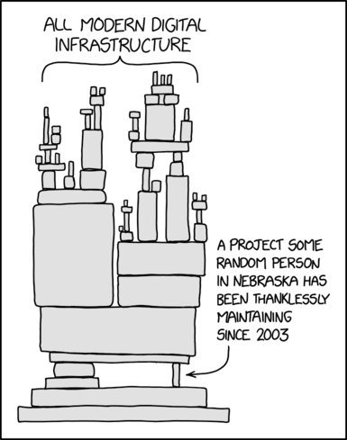
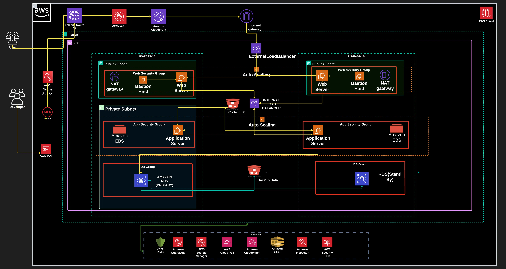
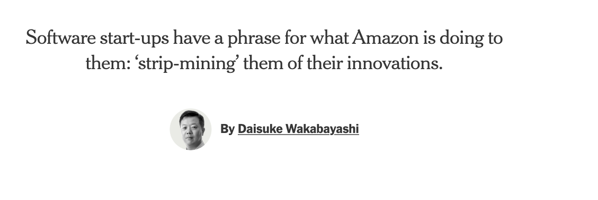
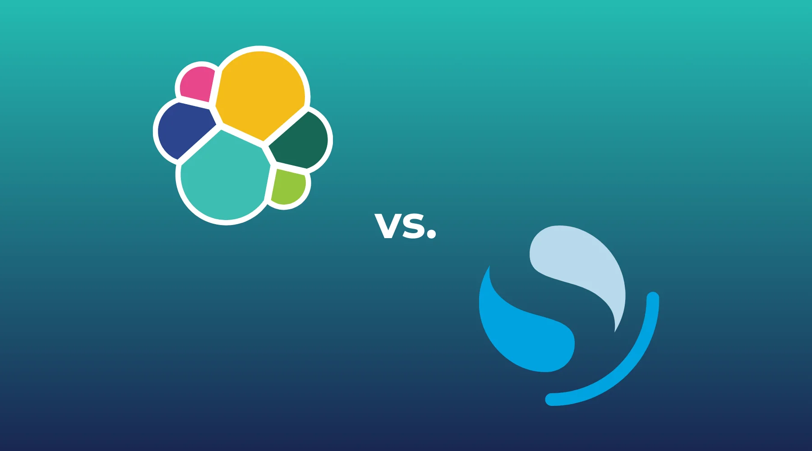

class: center, middle
# Why your team should participate in the open source projects it depends on

Rich Bowen, Open Source Strategist

---

???

If you have been to a talk about open source in the last 10 years,
you've probably seen this image.

It's about how completely the entire planet depends on open source, in
ways that we're not even aware of.

---

???

Understanding each component of a running system ensures that there are
no surprises.

Every AWS service depends, to some extent, on open source software.

But our participation in open source varies greatly from one team to
another.

Let's talk about why your team should contribute to open source.

---

<small>"Roots", CC by Peter Corbett on Flickr</small>

???
# Sustainability

* Ensure that a project is still viable once our customers have built
  their business on top of it.
* You can only be sure of that if we are paying attention
* Pay attention to participation metrics around a project so that you
  are aware of upcoming risks

---

<small>
"Aerobic Exercise"
CC by
Linda in Fortuna, on Flickr
</small>

???

# Ensuring Sustainability

* Chop wood, carry water
* Ensure that bugs are addressed and PRs reviewed. This also helps you
  understand what our customers struggle with.
* Fastest way to earn trust in a project

---

<small>"Listen", CC by Alper T on Filckr</small>

???

# Listen, and participate in the discussions

* Participating in user discussions (Slack, issue tracker, mailing
  lists) opens your eyes to problems that our customers are having
* Advocating for customer priorities ensures that the next version
  addresses them.
* Participating in decision-making is the only way that our customer
  priorities will be heard. Failure to do so ensures that decisions are
  made by our competitors.

---

<small>Sisyphys, CC by Simon Middleton on Flickr</small>

???

# Technical debt

* Carrying a patch set is very expensive.
* Makes deploying new versions much more time consuming
* Risks the project going a different direction, making your innovations
  useless.

---

<small>"Security", CC by Henri Bergius on Flickr</small>

???

# Security

* Being involved in project community gives greater visibility into
  security concerns, and the ability to address them more quickly
* You don't want to find out about a security breach on the news; you
  want to prevent it ever happening.

---

# Collaboration

    No matter who you are, most of the smartest people work for someone
    else.

    -- Bill Joy

???

Working with our peers gives 
you the insights into problem solving that would not have occurred
to you working alone. 

Diversity of opinion, and diversity of innovation, comes from
working with people outside of your little bubble.

---

???

# Expertise

Working directly in the project is by far the best way to gain expertise
in the software.

---

<small>December 2019, New York Times</small>

???

Can lead to ...

# Resistance to AWS priorities
# Change in licenses
# Lots of negative press
# The need to fork

---

???

* Forking is very, very expensive
* LF says it's 4.5 x as expensive as working with the existing project
* Rather than participating in a shared infrastructure, you have to do
  it ALL yourself.

---

* Ensure the long-term sustainability of projects that we (and our
  customers) rely on
* Ensure that our customers' voices are heard in decisions
* Ensure security, and high quality of technical product
* Collaborate with our peers to innovate faster
* Develop deeper expertise in the project by participating directly
  rather than just consuming
* Consuming, without participating, builds resentment and hostility
* Technical debt is expensive. Forking is even more expensive.

---

class: center, middle
## finis

    #open-source
    @rcbowen
    @open-source-ber21-2026

