class: center, middle
# The Path To Maintainer

Rich Bowen, (Apache|AWS)

Slides: github.com/rbowen/presentations

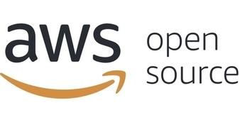

???

* Introduce yourself. 
    * Apache, 20+ years in FLOSS
    * Open Source Strategist at AWS
* Why I care about this topic

---

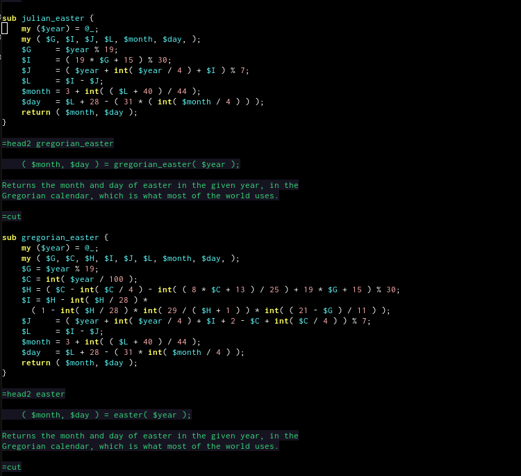

???

Motivations: Job or Passion?

30 years ago, I got involved in open source because my hobby was
calendar calculations. This resulted in very different ways of engaging
with projects than if I was doing this as part of my job.

Understand your own reasons, and how it
benefits you (personally) and your team. Be honest with your
motivations.

You should know why you want to become a maintainer. Hopefully it
includes "because I care about the project" at some level.

---

# Why I care about this topic

## (and why you should care)

???

Increasingly, over the years, I am seeing people content to Consume and
Complain, rather than taking any kind of ownership of open source. This
is deeply concerning, because it means that:

1) You are blindly trusting that someone else will do the right thing on
a project you rely on.

2) You are taking the role of consumer, and expecting the world to
revolve around you. This is not how open source works, and you *will* be
disappointed. If you do not participate, then you have no voice. (And
your customers have no voice.)

3) You will be completely unprepared if the project takes an unexpected
direction, changes license, or ceases to operate. Becoming a maintainer
gives you more control of your destiny.

---

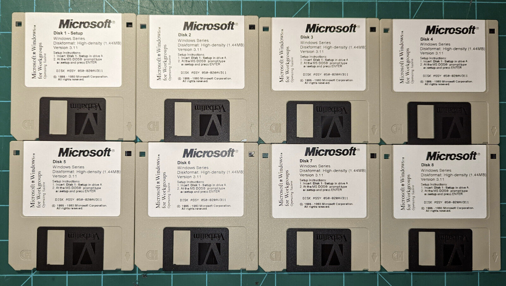

???

You are, in short, treating the project as a proprietary shrink-wrap
product, rather than an open source project, and are thus missing out on
the majority of the benefits of open source. And you are treating the
(volunteer!) maintainers as your employees, which they are not. This
disrespects the project, your customers, and yourself.

---

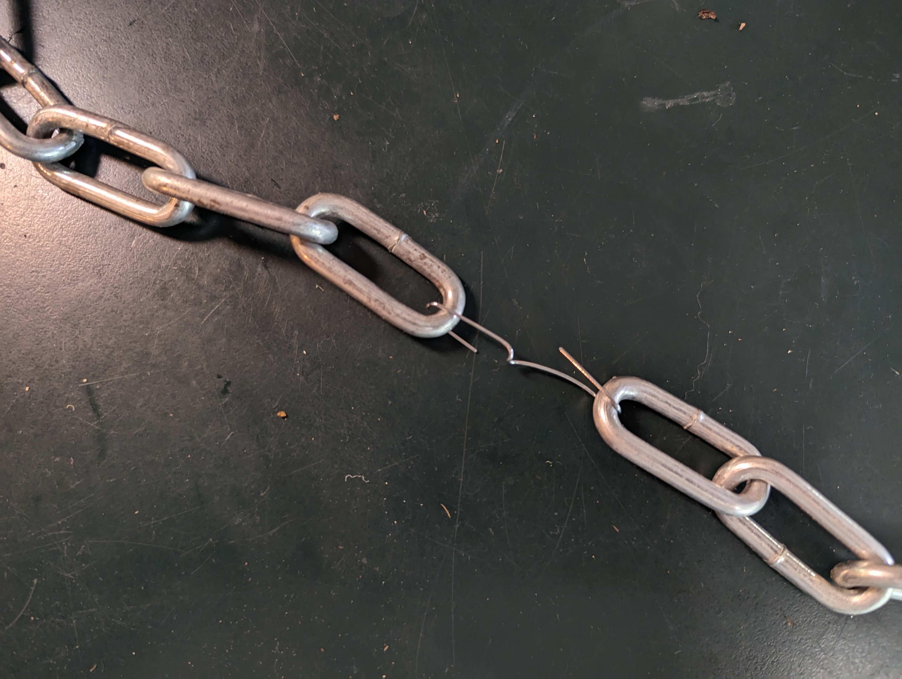

???

If you're participating as part of a company, then you MUST view open
source as a critical part of your supply chain. Any project where you do
not have a voice is a weak link in that chain, and a risk to your
business.

---

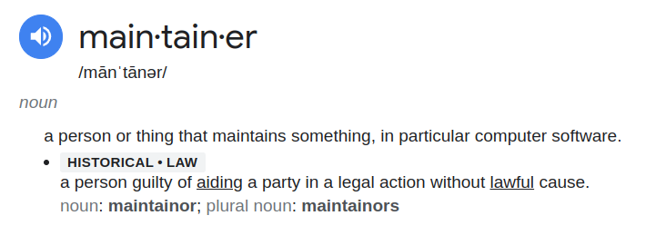

???

Definition: There is no consistent, standard definition.

At the ASF, we divide it into Committer and PMC Member. Committers can
make changes to the source code. PMC members are the gatekeepers on
releases, and determine who will become a committer or PMC member.

In general, it refers to someone who makes decisions about a project.

---

# How?

[Practical Advice Goes Here]

???

The rest of this talk is practical advice of how to become a
committer/maintainer

---

<small>CC by "scapeGOATofPIE" on Flickr</small>

???

Patience.

Earning trust takes time. If you are impatient, or pushy, you will be
unsuccessful.

---

<small>CC by "elycefeliz" on Flickr</small>

???

Listen more than you speak. Especially at first. Learn the community norms.

Find out who the cast of characters is. Projects are like a TV show, and
often revolve around one or two strong characters. Get to know the main
actors and what role they are playing.

Figure out where the community pain points are -
what's not getting done? Who is getting burned out? How can you help
with that?

Offering solutions that don't solve any real problems isn't going to get
you closer to your goal.

---

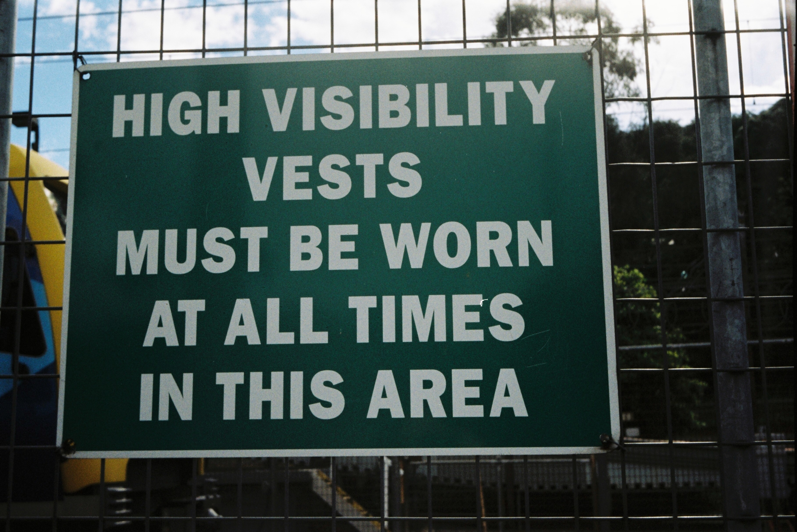
<small>CC by "Matthew Paul Argall" on Flickr</small>

???

* You will never become a maintainer if nobody knows you're there.
* Where does the community chat? You should be a regular there.
  * Answer questions
  * Vote when a decision is being made. (Make it clear that you're
    opinionated, but not authoritative. In Apache we call this
    "non-binding")

---

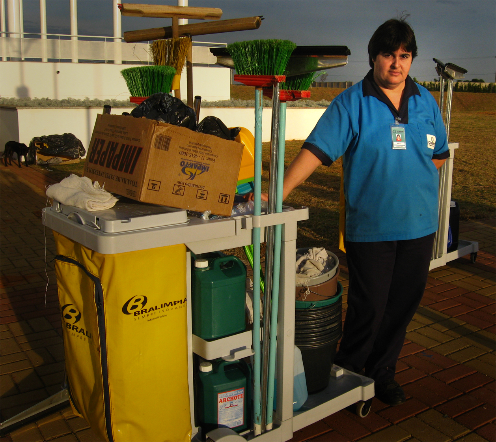
<small>CC by "Carlos Ebert" on Flickr</small>

???

Be useful

A good maintainer is a janitor. They clean up messes. They make the
place beautiful and welcoming for others. They work hard and bring real
value, and are only noticed when they miss things.

---

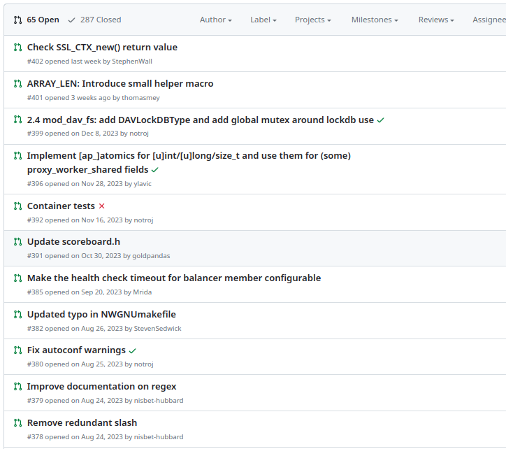

???

Review PRs, Issues

Reviewing PRs teaches you about the code. It makes you visible. It
improves the code for everyone. It teaches you what people care about,
and what's broken, and how you can be useful.

It also improves the project as a whole, because it is part of welcoming
new contributors.

---

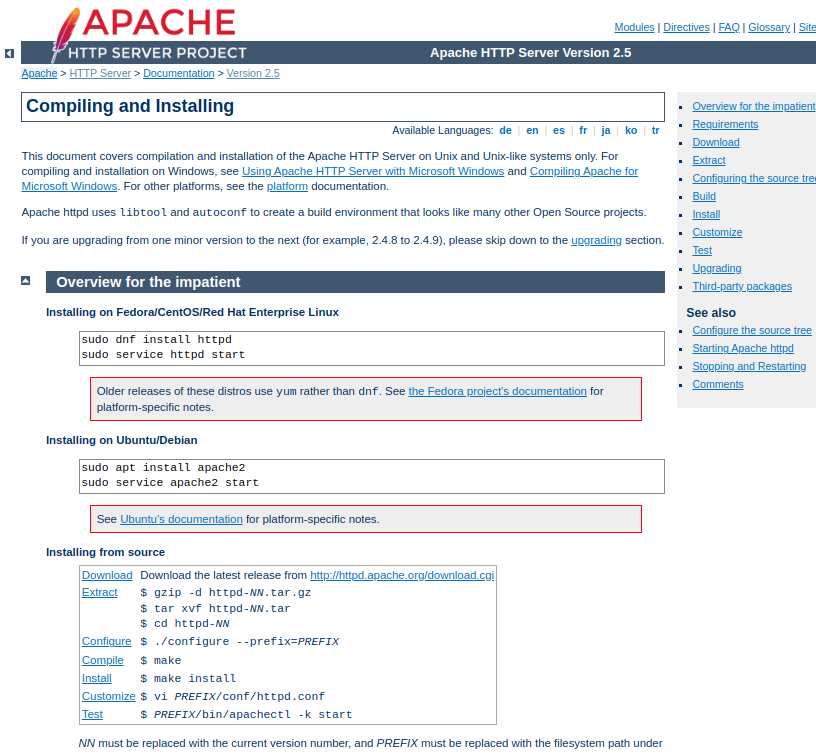

???

Documentation can *always* be improved. And doc improvements are almost
always appreciated.

Working on the docs is also one of the very best ways to learn more
about the project.

Turn on spell check in your editor, and fix spelling and grammar errors.
It's not much, but it shows an attention to detail that will be
appreciated. (Usually.)

Translations are almost always out of date on any active project.

Summarize discussions: Another useful think you can do is summarize
discussions that have gone on for longer than people are likely to read.
Summarize the main points, and any decisions that have been made, in a
clearly marked [SUMMARY] post.

---

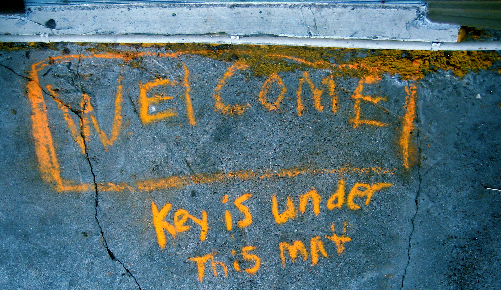
<small>CC by "alborzshawn" on Flickr</small>

???

* Be welcoming

What do you wish someone had done for you when you started contributing?
Do that.

Acknowledge and thank new contributors

Improve the onboarding documentation (if there even is any!) What did
you find hard when you started contributing? Document that, or, better
yet, improve it.

---

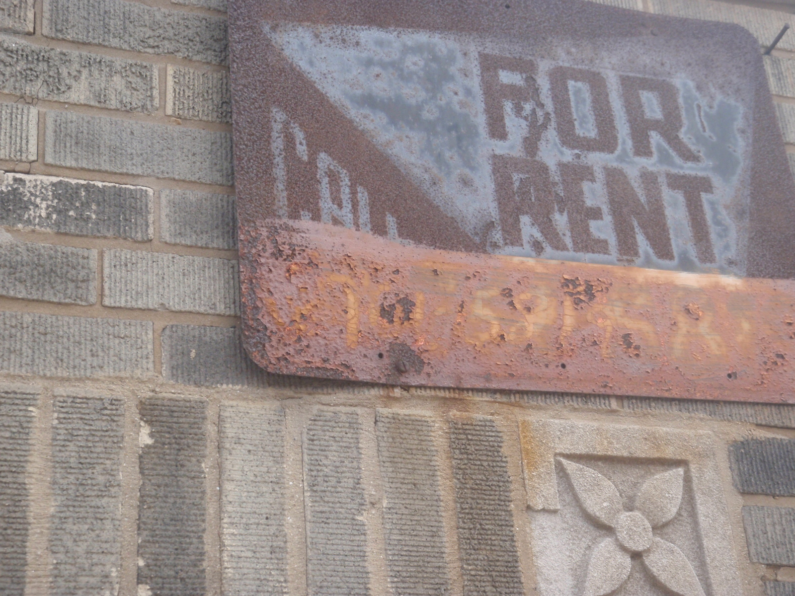
<small>CC by "Anthony Easton" on Flickr</small>

???

If you think of a place as your own, you will treat it very differently.
And you will treat "visitors" very differently.

Don't act like an outsider trying to break in. Act like you're at
home and just haven't been given your own keys yet.

---
class: center,middle
## finis

rbowen@apache.org

@rbowen

@AWSOpen

Slides: github.com/rbowen/presentations

