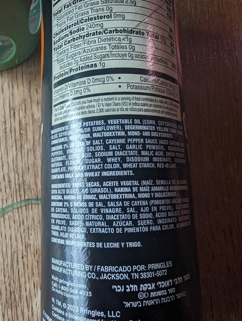
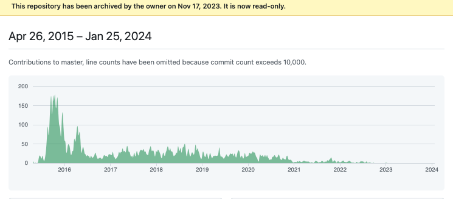
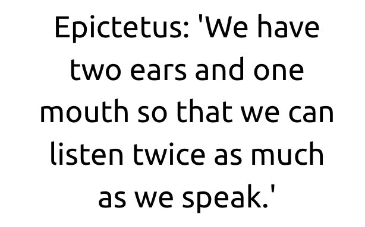
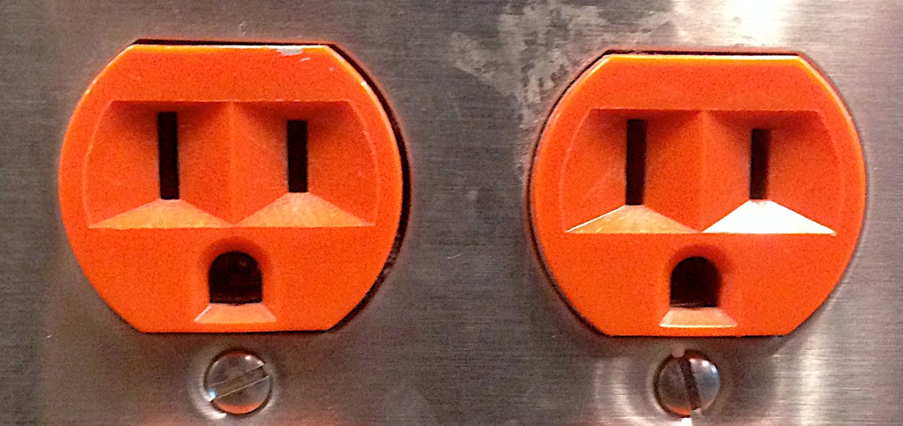
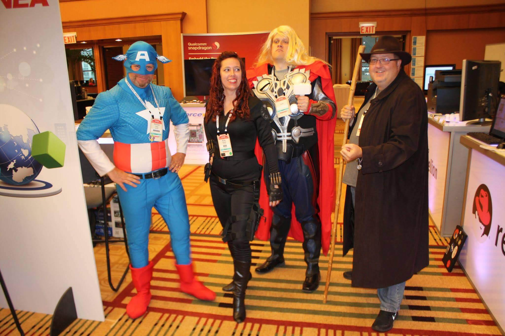

class: center, middle
# The Path To Maintainer

Rich Bowen, (Apache|AWS)

Slides: github.com/rbowen/presentations

???

* Introduce yourself. 
    * Apache, 20+ years in FLOSS
    * Open Source Strategist at AWS
* Why I care about this topic

* How many of you are maintainers?
    * This is for you, too, because part of your job is to mentor the
      next generation of maintainers

* How many of you contribute in non-code ways?
    * This is for you, too, because what you do is absolutely as
      important as the code. Don't let anyone tell you differently.

---

???

Motivations: Job or Passion?

30 years ago, I got involved in open source because my hobby was
calendar calculations. This resulted in very different ways of engaging
with projects than if I was doing this as part of my job.

Understand your own reasons, and how it benefits you (personally) and
(if relevalnt) your team. Be honest with your motivations.

You should know why you want to become a maintainer. Hopefully it
includes "because I care about the project" at some level. Becoming a
maintainer purely for ego, or for your resume, will undermine your
efforts, because your ownership of the project will be dishonest.

This talk is slanted towards companies which rely on open source as part
of their supply chain, but it also has lessons for passion-only
involvement.

---

# Why I care about this topic

## (and why you should care)

???

Increasingly, over the years, I am seeing people (and, more alarmingly,
companies) content to Consume and Complain, rather than taking any kind
of ownership of open source. This is deeply concerning, because it means
that:

---

<small>CC by "byronv2" on Flickr</small>

???

1) You are blindly trusting a stranger to set the road map, and
generally do the right thing, on a project you rely on.

---

???

2) You are taking the role of consumer, without having any idea what's
in it, and and expecting that "the community" will fix all problems that
arise. This is not how open source works, and you *will* be
disappointed. If you do not participate, then you have no voice. (And
your customers have no voice.)

---

???

3) You will be completely unprepared if the project takes an unexpected
direction, changes license, or ceases to operate. Becoming a maintainer
gives you more control of your destiny, and an ability to steer the
ship, or at least be aware when it's approaching the edge of the world.

---

???

You are, in short, treating the project as a proprietary shrink-wrap
product, rather than an open source project, and are thus missing out on
the majority of the benefits of open source. And you are treating the
(volunteer!) maintainers as your employees, which they are not. This
disrespects the project, your customers, and yourself.

---

???

If you're participating as part of a company, then you MUST view open
source as a critical part of your supply chain. Any project where you do
not have a voice is a weak link in that chain, and a risk to your
business.

---

???

Let's start with definitions:

Definition: There is no consistent, standard definition.

At the ASF, we divide it into Committer and PMC Member. Committers can
make changes to the source code. PMC members are the gatekeepers on
releases, and determine who will become a committer or PMC member.

In general, it refers to someone who makes decisions about a project.

---

<small>Photo CC by James Mann on Flickr</small>

???

Disclaimer: Every project is different and unique in ways that no
presentation can prepare you for, because projects are made of people,
and people have inscrutable motives and egos.

Some projects will literally make you a maintainer the first day, while
others never will, no matter how much you contribute.

Hopefully the advice I'm giving will be applicable for most healthy
projects.

---

# How?

[Practical Advice Goes Here]

???

The rest of this talk is practical advice of how to become a
committer/maintainer

---

<small>CC by "scapeGOATofPIE" on Flickr</small>

???

1 Patience.

Earning trust takes time. If you are impatient, or pushy, you will be
unsuccessful.

---

???

The best time to plant a tree is 20 years ago. The next best time is
now.

Anecdote: A junior developer once asked me how he could gain the same
stature as me in open source. I said, well, you start contributing, and you
keep at it, consistently, for 20 years. He said, no, I mean now.

---

### "We opened a PR 2 weeks ago, and it hasn't been reviewed yet. Is it ok to go ahead and fork now?

???

Open source projects are mostly composed of volunteers, with limited
time. You cannot expect that simply opening a ticket or a PR is going to
be the sole interaction that will put you in view of the project.

Becoming a maintainer - or even just getting one change in - involves
conversation and earning trust. This may be annoying if this is your
*job* rather than your *passion*. But it's how it works.

---

<small>CC by "elycefeliz" on Flickr</small>

???

2 Listen more than you speak. Especially at first. Learn the community norms.

Find out who the cast of characters is. Projects are like a TV show, and
often revolve around one or two strong characters. Get to know the main
actors and what role they are playing.

Figure out where the community pain points are -
what's not getting done? Who is getting burned out? How can you help
with that?

Offering solutions that don't solve any real problems isn't going to get
you closer to your goal.

---

---

<small>CC by "Matthew Paul Argall" on Flickr</small>

???

3 Be visible

You will never become a maintainer if nobody knows you're there.

Where does the community chat? You should be a regular there.

 Answer questions

 Vote when a decision is being made. (Make it clear that you're
    opinionated, but not authoritative. In Apache we call this
    "non-binding")

---

<small>CC by "Alan Levine" on Flickr</small>

???

Important note:

You will not win every argument. That's ok, because you're not always
right. And even when you are, you are part of a community, and trust is,
long term, more important than being right all the time.

---

<small>CC by "Carlos Ebert" on Flickr</small>

???

4 Be useful

A good maintainer is a janitor, not a CEO.

They clean up messes. They make the
place beautiful and welcoming for others. They work hard and bring real
value, and are only noticed when they miss things.

---

???

Review PRs, Issues

Reviewing PRs teaches you about the code. It makes you visible. It
improves the code for everyone. It teaches you what people care about,
and what's broken, and how you can be useful.

It also improves the project as a whole, because it is part of welcoming
new contributors.

---

???

Documentation can *always* be improved. And doc improvements are almost
always appreciated.

Working on the docs is also one of the very best ways to learn more
about the project.

Turn on spell check in your editor, and fix spelling and grammar errors.
It's not much, but it shows an attention to detail that will be
appreciated. (Usually.) And it's a great way to learn the contribution
process.

Translations are almost always out of date on any active project.

Summarize discussions: Another useful think you can do is summarize
discussions that have gone on for longer than people are likely to read.
Summarize the main points, and any decisions that have been made, in a
clearly marked [SUMMARY] post.

---

<small>CC by "alborzshawn" on Flickr</small>

???

5 Be welcoming

What do you wish someone had done for you when you started contributing?
Do that.

Acknowledge and thank new contributors

Improve the onboarding documentation (if there even is any!) What did
you find hard when you started contributing? Document that, or, better
yet, improve it.

---

<small>CC by "Anthony Easton" on Flickr</small>

???

6 Think of yourself as an owner, not a renter.

If you think of a place as your own, you will treat it very differently.
And you will treat "visitors" very differently.

Don't act like an outsider trying to break in. Act like you're at
home and just haven't been given your own keys yet.

---

???

Dress for the job you want, not the one you have.

---

???

Where I live, there's a law that says that if you occupy a piece of land
for 10 years, and nobody challenges you on it, that's yours now. Open
source is the same way. Sort of.

---

## 1. Be patient
## 2. Be attentive
## 3. Be visible
## 4. Be useful
## 5. Be welcoming
## 6. Be a maintainer

---

# Bonus Slide

## Maintainers: What's the thing you wish contributors would do?

---

class: center,middle
## finis

rbowen@apache.org

@rbowen

@AWSOpen

Slides: github.com/rbowen/presentations

