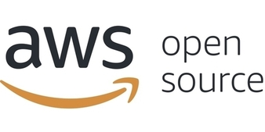
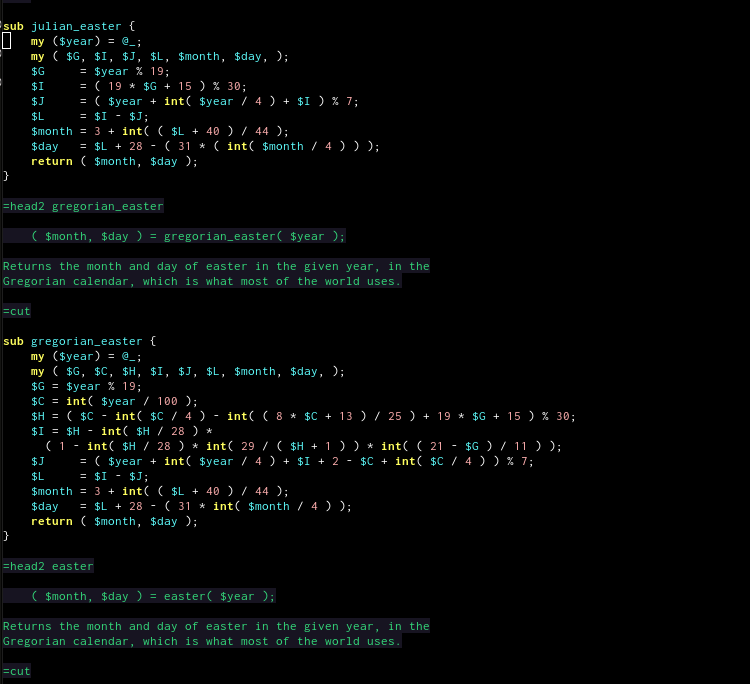
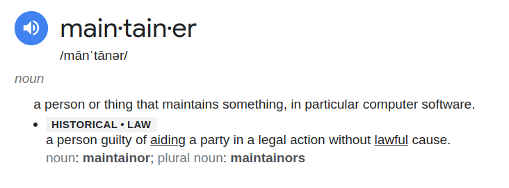
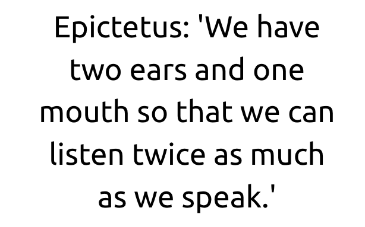
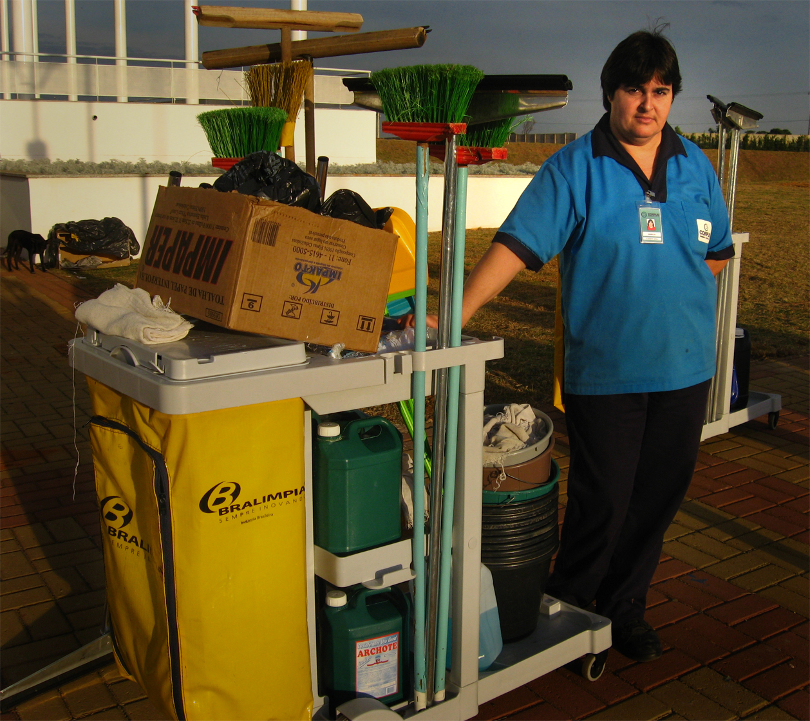
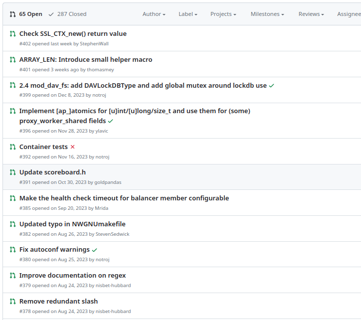
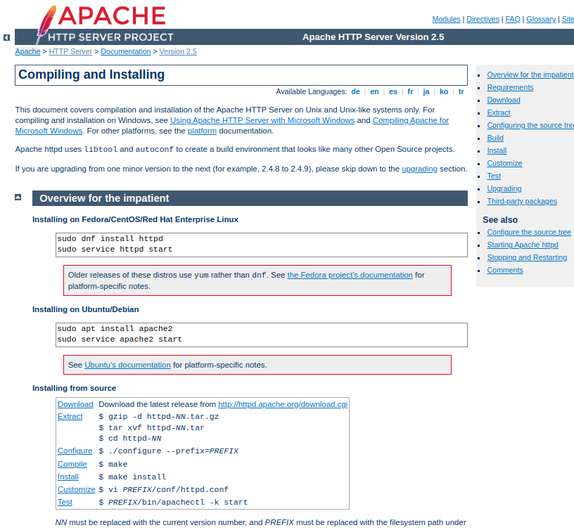
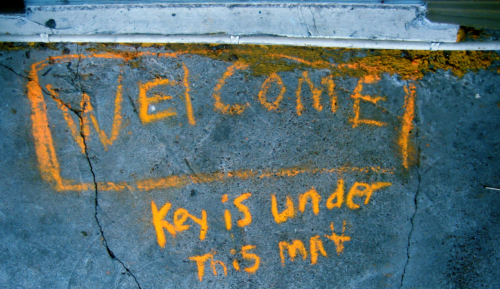
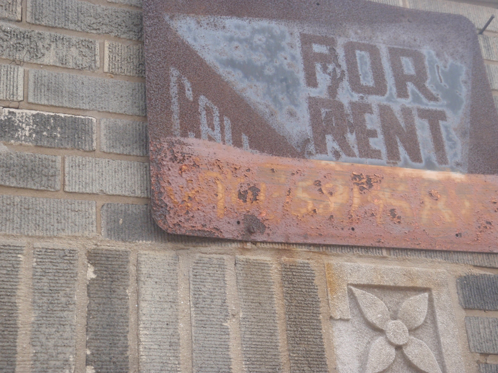
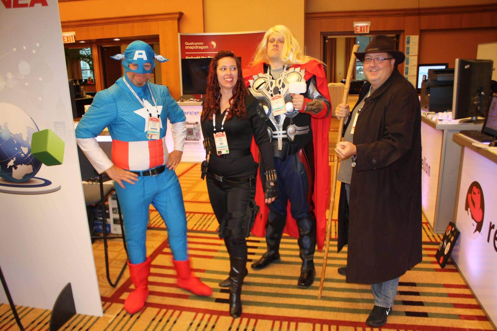

class: center, middle
# The Path To Maintainer
## Building Your Career in Open Source

Rich Bowen, (Apache|AWS)

Slides: github.com/rbowen/presentations

???

* Introduce yourself. 
    * Apache, 30+ years in FLOSS
    * Open Source Strategist at AWS
    * Board member and VP at the Apache Software Foundation
* This talk is for people who are curious about open source — maybe
  you've used it, maybe you've thought about contributing, maybe you're
  wondering whether there's actually a career here. There is, and I want
  to show you the path.

* How many of you have ever contributed to an open source project?
    * Great. This talk is for you.
* How many of you haven't, but are curious?
    * Even better. This talk is especially for you.

---

???

Motivations: Why are you here?

30 years ago, I got involved in open source because my hobby was
calendar calculations. I wasn't trying to build a career. I was trying
to figure out when Easter falls in the year 4000. That hobby turned
into a career that has taken me around the world.

Understand your own reasons for getting involved. Passion? Curiosity?
Career growth? All of those are valid. The important thing is to be
honest about it — with yourself and with the community.

Here's a secret: "because it's good for my career" is a perfectly fine
motivation, as long as it's not the *only* one. The people who stick
around are the ones who genuinely care about the project they're working
on. The career benefits follow from that.

---

# Why this matters for your career

???

Open source participation is one of the most powerful career
accelerators available to you, and it's completely free to start. Here's
why:

---

# Skills you can't learn in a classroom

* Code review across a large, distributed codebase
* Communicating technical ideas in writing, to strangers
* Navigating disagreements and building consensus
* Project management without authority
* Working across time zones, cultures, and organizations

???

These are not just "open source skills." These are the skills that
distinguish a senior engineer from a junior one, and a leader from
someone who just writes code. The open source contribution process
forces you to develop these faster than almost any other environment.

---

# Your work speaks for itself

???

Every contribution you make is public. Your code, your reviews, your
discussions — they form a portfolio that any employer can see. Unlike a
resume, it can't be exaggerated. It shows how you think, how you
communicate, and how you handle feedback. This is enormously valuable
when you're looking for a job, and it's something that no amount of
interview prep can replicate.

---

# A network you didn't have to "network" for

???

The people you collaborate with in open source become your professional
network. Not through awkward mixers or LinkedIn requests, but through
actually working together on something real. Some of the most important
professional relationships of my life came from open source — people
who recommended me for jobs, invited me to speak at conferences, and
taught me things I couldn't have learned any other way.

I got every single job I've had in the last 20 years because of
relationships that started in open source.

---

# Where open source careers go

* Software engineering (with a deep upstream specialty)
* Developer advocacy and relations
* Community management
* Open source program offices (OSPOs)
* Foundation leadership and governance
* Technical writing and documentation
* Security research and auditing

???

"Open source" is not a job title, but it's a lens on many different
careers. Companies of all sizes are actively hiring people with open
source experience because they need people who know how to work in the
open, collaborate across organizations, and engage with communities
their products depend on.

And beyond traditional employment — open source experience qualifies
you for foundation board positions, conference speaking, book writing,
consulting, and other things that broaden your career in ways a single
employer never could.

---

???

Let's start with definitions:

Definition: There is no consistent, standard definition of "maintainer."

At the ASF, we divide it into Committer and PMC Member. Committers can
make changes to the source code. PMC members are the gatekeepers on
releases, and determine who will become a committer or PMC member.

In general, it refers to someone who makes decisions about a project.

This varies enormously from one project to another. Some projects give
a lot of voice to non-code contributors. Others have a high bar.
Understanding a project's specific governance is your first research
task.

---

<small>Photo CC by James Mann on Flickr</small>

???

Disclaimer: Every project is different and unique in ways that no
presentation can prepare you for, because projects are made of people,
and people have inscrutable motives and egos.

Some projects will literally make you a maintainer the first day, while
others never will, no matter how much you contribute.

Hopefully the advice I'm giving will be applicable for most healthy
projects.

---

# How?

[Practical Advice Goes Here]

???

The rest of this talk is practical advice of how to become a
committer/maintainer — and how the skills you build along the way
become the foundation of your career.

---

<small>CC by "scapeGOATofPIE" on Flickr</small>

???

1 Patience.

Earning trust takes time. If you are impatient, or pushy, you will be
unsuccessful.

This is true in open source and it's true in careers generally. The
people who build lasting reputations are the ones who show up
consistently, not the ones who make a big splash and disappear.

---

???

The best time to plant a tree is 20 years ago. The next best time is
now.

Anecdote: A junior developer once asked me how he could gain the same
stature as me in open source. I said, well, you start contributing, and you
keep at it, consistently, for 20 years. He said, no, I mean now.

There is no shortcut. But the good news is that every step along the
way is valuable — you don't have to wait 20 years to start benefiting.
Your first PR review teaches you something. Your first docs fix makes
you visible. It compounds.

---

### "We opened a PR 2 weeks ago, and it hasn't been reviewed yet. Is it ok to go ahead and fork now?

???

Open source projects are mostly composed of volunteers, with limited
time. You cannot expect that simply opening a ticket or a PR is going to
be the sole interaction that will put you in view of the project.

Becoming a maintainer - or even just getting one change in - involves
conversation and earning trust. This may be annoying if this is your
*job* rather than your *passion*. But it's how it works.

---

<small>CC by "elycefeliz" on Flickr</small>

???

2 Listen more than you speak. Especially at first. Learn the community norms.

Find out who the cast of characters is. Projects are like a TV show, and
often revolve around one or two strong characters. Get to know the main
actors and what role they are playing.

Figure out where the community pain points are -
what's not getting done? Who is getting burned out? How can you help
with that?

Offering solutions that don't solve any real problems isn't going to get
you closer to your goal.

Career note: This is also the single most important skill in any new
job. The people who listen first and act second are the ones who earn
trust fastest.

---

---

<small>CC by "Matthew Paul Argall" on Flickr</small>

???

3 Be visible

You will never become a maintainer if nobody knows you're there.

Where does the community chat? You should be a regular there.

 Answer questions

 Vote when a decision is being made. (Make it clear that you're
    opinionated, but not authoritative. In Apache we call this
    "non-binding")

Visibility in open source is also visibility to potential employers,
collaborators, and mentors. The people who notice your good work in a
project may be the same people who recommend you for a job three years
from now.

---

<small>CC by "Alan Levine" on Flickr</small>

???

Important note:

You will not win every argument. That's ok, because you're not always
right. And even when you are, you are part of a community, and trust is,
long term, more important than being right all the time.

Learning to disagree gracefully and commit to group decisions is one of
the most valuable professional skills there is — and open source gives
you more practice at it than any other environment I know.

---

<small>CC by "Carlos Ebert" on Flickr</small>

???

4 Be useful

A good maintainer is a janitor, not a CEO.

They clean up messes. They make the
place beautiful and welcoming for others. They work hard and bring real
value, and are only noticed when they miss things.

This is also true of the best leaders I've worked with in any context.
The people who do the unglamorous work are the ones everyone trusts.

---

???

Review PRs, Issues

Reviewing PRs teaches you about the code. It makes you visible. It
improves the code for everyone. It teaches you what people care about,
and what's broken, and how you can be useful.

It also improves the project as a whole, because it is part of welcoming
new contributors.

From a career standpoint, code review is one of the most in-demand
skills in software engineering. Being able to say "I review PRs on
Apache $project" is a remarkable thing to have in an interview.

---

???

Documentation can *always* be improved. And doc improvements are almost
always appreciated.

Working on the docs is also one of the very best ways to learn more
about the project.

Turn on spell check in your editor, and fix spelling and grammar errors.
It's not much, but it shows an attention to detail that will be
appreciated. (Usually.) And it's a great way to learn the contribution
process.

Translations are almost always out of date on any active project.

Summarize discussions: Another useful thing you can do is summarize
discussions that have gone on for longer than people are likely to read.
Summarize the main points, and any decisions that have been made, in a
clearly marked [SUMMARY] post.

Don't underestimate documentation work. Some of the most respected
people in open source are known primarily for docs, not code.

---

<small>CC by "alborzshawn" on Flickr</small>

???

5 Be welcoming

What do you wish someone had done for you when you started contributing?
Do that.

Acknowledge and thank new contributors

Improve the onboarding documentation (if there even is any!) What did
you find hard when you started contributing? Document that, or, better
yet, improve it.

This is where open source starts to teach you leadership. When you
welcome someone new, you are mentoring. When you improve onboarding
docs, you are making the project more sustainable. These are leadership
skills, and they matter far beyond open source.

---

<small>CC by "Anthony Easton" on Flickr</small>

???

6 Think of yourself as an owner, not a renter.

If you think of a place as your own, you will treat it very differently.
And you will treat "visitors" very differently.

Don't act like an outsider trying to break in. Act like you're at
home and just haven't been given your own keys yet.

---

???

Dress for the job you want, not the one you have.

In open source, this means: act like a maintainer before you are one.
Review PRs like a maintainer would. Respond to questions like a
maintainer would. Take ownership like a maintainer would. The title
will catch up to the behavior.

This works in your career too. The promotion usually follows the
behavior, not the other way around.

---

???

Where I live, there's a law that says that if you occupy a piece of land
for 10 years, and nobody challenges you on it, that's yours now. Open
source is the same way. Sort of.

---

# Mentoring: The multiplier

???

Once you've started building trust in a project, the most powerful
thing you can do — for the project and for your own career — is to
mentor others.

---

# Why mentor?

* The project's future depends on new maintainers
* Teaching deepens your own understanding
* It builds your reputation as a leader, not just a contributor
* The people you mentor become your professional network for life

???

I got involved in open source because someone asked me to. Ken Coar
encouraged me to submit a paper to a conference when I was sure I had
nothing to say. Jim Jagielski told me to go fix the docs myself rather
than waiting for someone else. Sally Khudairi encouraged me to get
involved in ASF governance.

Each of those nudges changed the trajectory of my career. You have the
same power to change someone else's.

---

# How to mentor in open source

* **Ask people to do things.** Directly. Specifically. "Can you look at
  this bug?" is more effective than "come help."
* **Give them permission.** They think they need to be someone special
  to contribute. Tell them they already are.
* **Trust them.** That's why you have revision control.
* **Set expectations.** Standards show you take them seriously.
* **Let them fail.** Then help them turn failure into success.

???

"Micromentoring" — asking people to do one specific task instead of
doing it yourself — takes 2 minutes but conveys trust, permission, and
belonging. It's one of the most effective things you can do.

---

# Sustainability: yours and the project's

???

Let's talk about sustainability, because it matters for your career
as much as it matters for the project.

---

# Open source is not a renewable resource

* Maintainers burn out
* Companies take without giving back
* Single-maintainer projects are fragile
* If the project you depend on dies, what happens to your career?

???

If you're building your career on open source — which I'm encouraging
you to do — then you should care deeply about the sustainability of
the projects you're involved in. That means contributing to their
health, mentoring new contributors, and helping ensure that the project
outlasts any single person.

This is also the argument to make to your employer: the open source
project your company depends on is part of the supply chain. Investing
in its health is not charity — it's business.

---

# Talking to your employer about open source

* Don't lead with philosophy. Lead with business value.
* "This project is critical to our product. We should have a voice in it."
* "Contributing upstream saves us the cost of maintaining patches."
* "Our engineers learn faster by participating in public code review."
* Speak their language: supply chain, risk, cost, talent retention.

???

At some point in your career, you will need to persuade a manager that
open source contribution is worth your company's time. This is an
essential skill, and it gets easier with practice. The key is to frame
it in terms they care about — costs, risks, recruiting, and customer
trust — not in terms of philosophy or ideology.

---

# Start today

???

I know I said patience. And I meant it — building trust takes time. But
starting takes no time at all. Here are things you can do this week.

---

# This week:

1. **Pick a project you use.** Something you care about.
2. **Read the contributor guide.** Every project has one (or should).
3. **Join the community channel.** Mailing list, Slack, Discord — wherever
   they talk. Lurk for a week.
4. **Find one thing to improve.** A typo in the docs. A question you can
   answer. A bug you can reproduce and report well.
5. **Do it.** Then do it again next week.

???

That's it. It's not complicated. It just takes consistency. And the
career you build from it will be unlike anything you could build by
just showing up to a job.

---

## 1. Be patient
## 2. Be attentive
## 3. Be visible
## 4. Be useful
## 5. Be welcoming
## 6. Be a maintainer
## 7. Be a mentor

---

class: center,middle
## finis

rbowen@apache.org

@rbowen

@AWSOpen

Slides: github.com/rbowen/presentations
