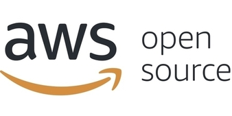

class: center, middle
# Plan to fork
## (So you don't have to fork)

Rich Bowen, (Apache|AWS)

Slides: github.com/rbowen/presentations

???

Hi, I'm Rich Bowen

I work with teams at AWS to teach them about open source. Sometimes,
they get frustrated with how slow and frustrating it is to earn trust in
open source projects, and get their changes merged. I'm sure you've
experienced that too. Sometimes they ask me, wouldn't it be easier if we
just forked that project so we can move at our own speed?

I used to say, "No, don't do that, it would be terrible, and you should
feel bad for asking it!" and they would go ahead and fork anyway, and
then complain when it went terribly.

Now, I say, "Yes, let's talk about what would be involved in forking,
and what the risks are." It turns out, this is *much* more effective.

---

???

### Who are you?

This talk is aimed at engineering teams, at companies who depend on open source projects for their
products and services, but have encountered some of the frustrations
that come along with collaborative development. And, yes, collaborative
development can be *very* frustrating. If you haven't encountered that
frustration, then I'd like to hear about the projects you work with,
because they must be amazing.

Today we're going to talk about the strategic, technical, and cultural aspects of preparing to fork an open source project—not because we want to that, but because we need to be ready. Planning to fork is about protecting your project and your customers, and, most importantly, helping ensure it never comes to that.

---

<small>CC by Jacqui Brown on Flickr.com</small>

???

### Definitions:

A *contributing fork* or *social fork* is a normal part of the software development
process, and is when you're making changes with the intent to contribut
them back.

A *diverging fork* or *competitive fork* is what we're talking about in
this presentation, and is a fork where you intend to continue operating
as a separate project indefinitely. This is sometimes also called a
*hostile fork*.

---

<small>"Fire Disaster" - CC by kc ma</small>

???

Think of a fork plan as a disaster recovery plan, rather than as
something that you want to do. That is, you're getting prepared
for a worst-case scenario that you hope will never happen. Why do this?

Planning ahead is a sign of maturity and responsibility. It gives your team and your customers confidence that you're prepared no matter what.

Writing a forking plan is less about the fork and more about assessing community health and sustainability, and what *you* are doing about it. It helps you identify weaknesses and shore them up now. It also clarifies what internal teams need to be ready, and makes conversations around staffing and ownership easier.

- Planning now prevents future crises, and ensures continuity should
  that crisis occur
- Demonstrates leadership, reliability
- Encourages proactive community engagement

---

???

### Triggers

First you should thing carefully about what would constitute, for you, a
good reason to fork. The answer here will vary from one project to
another, and from one organization to another, but it's important that
you conduct this thought experiment for yourself.

---

### Common answers include ...

| Trigger              | Examples              |
| -------------------- | --------------------- |
| Governance imbalance | Single vendor control (ie, we don't have enough control) |
| License changes      | Move to SSPL, BSL (ie, license that would harm our business model) |
| Slow acceptance of our contributions   | PRs not merged fast enough (ie, project doesn't care about our priorities and deadlines) |
| Maintainer silence, project inactivity   | PRs/tickets ignored, or project is dormant |

???

Some justifications are legal or structural, like licensing changes. Others are around community dynamics or responsiveness.

What I hear most frequently from teams is that the project isn't keeping up with their team priorities. It's this latter case that is most interesting to me because that's the one you are most able to address by deeper upstream engagement. And it usually stems from a lack of understanding of how open source works.

---

<small>"Balance" CC by kedleson on Flickr</small>

???

You should know who the prominent and dominant corporate players are, if
any, in the projects that you participate in. And you should have a good
relationship with those players, both personally and corporately.

Actively recruit and mentor maintainers from non-dominant companies.
(This also raises your own profile in the project!)

Actively oppose and contradict any messaging that the project is "owned" by one vendor, even if it's about your company!

Advocate for more transparent governance and decision making. For
example, suggest that every decision be ratified in public, by people
from at least 3 different employers.

---

<small>"license" CC by waterlilysage on Flickr</small>

???

A change of license is *never* done just because someone likes one
license better than another. It's *always* done to solve a (perceived)
problem, and that probably is usually that someone else is benefiting
more from the project than I am.

Watch the financials of a dominant/controlling vendor. Do they look like
they are considering a buyout or acquisition?

Do they have a major competitor who is not contributing much back? Do
you have any influence with them, to persuade them that this is going to
lead to disaster?

License changes are almost always in response to a vendor feeling that
they are not getting good return on their investment in the project.
That, in turn, is almost always a result of some participant taking more
than they are contributing. Identifying who that is, and attempting to
mitigate that somehow, should happen as soon as possible to avoid
disaster.

---

???

Possible mitigation is to proactively encourage the project to move to a
foundation. This is super challenging for single-vendor projects, but
the benefits are enormous, and accrue to all parties.

* Vendor-neutral governance
* Sustained funding
* Brand protection
* License immutability

---

<small>"Knob", CC by jvk on Flickr</small>

???

### Not enough "control"

* We don't have enough influence in the direction of the project
* Open source is about *doing*. Step up and do the work
* The "not enough control" argument tends to be about poor
  story-telling, which isn't going to get any better when you're the
  only one telling them
* Tell better stories about why your vision for the software is the
  right one. Stories are about people, not about cool technology

---

???

### Slow Contributions

Having your work be ignored can be very demoralizing.

- Encourage your team to review and triage others’ PRs. Recommend
  setting aside a specific time each day or week to review open issues
  or PRs.
- Thank people, publicly, when they review something. 
    (This can usually be automated, but a human touch is important.)

---

<small>"Typing 2" CC by dirkstoop on Flickr</small>

???

Particularly concerning is when a project is primarily maintained by one
person, as they can, and eventually will, be less active.

Mitigate by getting involved, and showing ownership in the decisions and
changes in the project. Show up, do the work, and ask for permission to
do more.

Or, better yet, don't tie yourself to a single-developer project in the
first place.

---

<small>"factory workers" CC by mrlomo on Flickr</small>

???

Now we get into the actual costs of forking ...

- How many engineers would it take to maintain the current pace?
- What skills are required? (e.g., Erlang, Go, Rust, Java)

When you fork, you are responsible for every aspect of development. You
must assume that (at least at first) there is not going to be any help.
What would that take?

- Start building that capacity now. Perhaps just one at a time.

---

<small>"Paperback Writer" CC by scousesmurf on Flickr</small>

???

Non-technical staffing ...

Yeah, but what other skills are needed to run a software project?

* Project manager
* Marketing/Promotion
* Event coordination
* Recruiting/Mentoring
* Documentation
* Legal/Branding/Copyright
* Design/UI
* Testing

Look around the community. What are you just assuming will magically
happen? That's on you now.

Start now contributing to a couple of these roles. Aggressively recruit
for people to shadow the folks doing these roles.

As will all of these tips, not only do they address real problems in the
community, they also build credibility and trust for yourself and your
organization.

---

<small>"Customer Support Center" CC by truckpr on Flickr</small>

???

### Support & Documentation

- Once you fork, you're the support team
- Engage in support forums now
- Build documentation habits and infrastructure
- Always include documentation with your code changes
- Become the recognized leader in end-user support for your particular
  use-case, product or service.

This not only builds internal knowledge but also trust in your team

---

???

### Marketing

Marketing in open source is often a community-driven effort. And it's
often led, silently, but a prominent corporate participant who sees the
importance of building the "top of the funnel" of users.

If you fork, you'll not only lose that, but it will likely now be
working actively against you.

Join or form the messaging committee. Volunteer for booths, write
blog posts, and build visibility now. That groundwork is critical if a
fork happens.

---

<small>"cash register buttons", CC by skippy on Flickr</small>

???

### Customer messaging

When you fork, you will have created a competitor for yourself that you
didn't have before. It is established and trusted. How will you persuade
customers that your new thing is now the better option?

- Why they should trust your fork *MORE* than the thing they already
  know?
- How do you justify the cost of switching (which will non-trivial,
  non-requested, work, that *YOU* have made it necessary to do)
- You MUST have migration tips or tools
- Making criticism of the old thing a central point of your messaging is
  never well received

Customers will be skeptical of a fork unless they already associate
you with the project. Start telling the story now: how much you
contribute, how much you care. Make sure customers see you as a 
co-owner of the project before they need to make a trust decision.

---

???

### User/Community messaging

A fork is never just a fork of code. It's always also a fork of the
community.

Users - even ones that don't pay you - are critical to the success of
open source. Without opinionated users complaining about the software,
you will have no idea of the pain your customers are enduring.

- Community splits in a fork
- Why your fork is the better option
- Migration guides are crucial

You cannot simply abandon the users - they are the top of the funnel for
your customers.

Community is not just a fan club or random strangers consuming your work for free.

The community is a different audience than customers. They care about the code, 
community, and the mission. A fork is disruptive. You must explain 
clearly why the fork exists, how it stays true to the original goals and
is the legitimate successor to the original project.

Failure to do so will result in a failure to build the support necessary
to sustain the project, and make it stand out from alternatives through
unpaid press and promotion.

---

???

### Recruiting Contributors

- Plan how to attract and retain devs
- Start today: mentor, sponsor newcomers
- More contributors = more resilience

The fork will only succeed if people contribute to it. You can’t count 
on volunteers showing up. Start mentoring new contributors today. Build
a reputation as community-minded. This work builds the loyalty that
you’ll need later.

---

<small>Supreme court, CC by skippy on Flickr</small>

???

- Define: who decides and how?
- Should be *at least as open* as original project, because that is an
  implied promise that the community will expect you to uphold

Governance decisions will determine who sticks with your fork. Be transparent and inclusive. Forked projects should be more open, not less. Consider joining a foundation to provide legitimacy and guard against repeating past mistakes.

What can you do today:

* Get involved in project governance *today* by engaging with decision
  conversations. You don't have to be on the governing board to give
  your input.
* Recommend changes to governance to make the project more transparent,
  more collaborative
* *DOCUMENT* what governance is already in place. Seek clarification
  where there are blind spots.

---

**Milestones:**

- Day 1: PR, domain, comms plan
- Day 7: Understand infrastructure needs, and start setting those up
- Day 14: Github repo, website, partner outreach
- Day 30: Docs, client verification, build
- Day 60: Full launch + migration tooling

???

This is a sample from a real-world planning document. It lays out clear steps across four major checkpoints. Every milestone has both pre-work and post-event work. Planning like this ensures rapid, confident response when time matters most.

What would it actually take to get here? Are the parts of the project
that would be hard to reproduce? Document those, and set about
simplification and more transparency. Because, in a worst case where you
have to fork, you will now be responsible for that.

Do you understand the infrastructure needs of the project? Is it all on
Github, or is there shadow infra somewhere?

---

### Budget and Headcount

**Sample Plan Needs:**

- *xyz* headcount (engineering, community)
- $xxM program budget
- Legal, marketing, events, foundation onboarding
- Make sure management understands the cost
- How will you measure success?

???

Forking isn’t free. You'll need engineers, community managers, legal
help, and event presence. The upfront and ongoing costs should be
weighed against the risks of project unavailability. And this cost
should be budgeted *before* any crisis.

Note that it's not sufficient to staff the project with warm bodies.
They need to be people who are respected by the community, and who the
community will follow. Start *today* earning trust in the project so
that you have those people, and that you identify your company as a
place where people like that might want to work.

Remember that this is a one-way door, since it is a promise to your
customers and the community.

---

### Final Thoughts

- Forking is a leadership moment
- Plan early, communicate clearly
- Build strength through community engagement
- Working *now* to mitigate the risk of a fork will almost certainly
  remove the need to fork

???

The best time to plan for a fork is when everything is going well. That’s when you can afford to think clearly and strategically. And that’s when you have the best chance to shape the project’s future without ever needing to fork.

---

### Questions / Discussion

- What signs have *you* seen that a fork might be needed?
- What actions are you taking today to prevent that?
- What can you do tomorrow to ensure that a fork won't be necessary?

???

---

class: center,middle
## finis

rbowen@apache.org

mastodon.social/@rbowen

@AWSOpen

Slides: github.com/rbowen/presentations

<small>All images by me unless specified in the slide</small>

