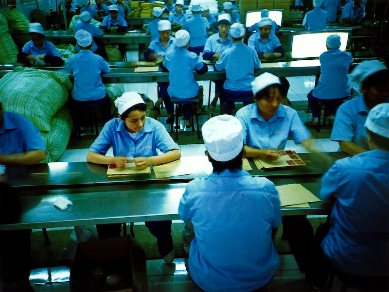

class: center, middle
# Plan to fork
## (So you don't have to fork)

Rich Bowen, (Apache|AWS)

Slides: github.com/rbowen/presentations

???

Hi, I'm Rich Bowen

Open source strategist at AWS, who occasionally gets asked "what would
it take to fork that project?" and have discovered that taking the
question seriously is much more effective than saying "No! Don't do
that!"

---

<small>CC by Kristopher Traquair from photos.apachecon.com</small>

???

Who are you?

This talk is aimed at companies who depend on open source projects for their
products and services, but have encountered some of the frustrations
that come along with collaborative development.

Today we're going to talk about the strategic, technical, and cultural aspects of preparing to fork an open source project—not because we want to that, but because we need to be ready. Planning to fork is about protecting your project and your customers, and, most importantly, helping ensure it never comes to that.

---

<small>"Fire Disaster" - CC by kc ma</small>

???

Think of a fork plan as a disaster recovery plan, rather than as
something that you want to do. That is, you're getting prepared
for a worst-case scenario that you hope will never happen. Why do this?

Planning ahead is a sign of maturity and responsibility. It gives your team and your customers confidence that you're prepared no matter what.

Writing a forking plan is less about the fork and more about assessing community health and sustainability, and what *you* are doing about it. It helps you identify weaknesses and shore them up now. It also clarifies what internal teams need to be ready, and makes conversations around staffing and ownership easier.

- Planning now prevents future crises, and ensures continuity should
  that crisis occur
- Demonstrates leadership, reliability
- Encourages proactive community engagement

---

<small>CC by Jacqui Brown on Flickr.com</small>

???

### Definitions:

A *contributing fork* is a normal part of the software development
process, and is when you're making changes with the intent to contribut
them back.

A *diverging fork* or *competitive fork* is what we're talking about in
this presentation, and is a fork where you intend to continue operating
as a separate project indefinitely.

---

???

First you should thing carefully about what would constitute, for you, a
good reason to fork. The answer here will vary from one project to
another, and from one organization to another, but it's important that
you conduct this thought experiment for yourself.

---

### Common answers include ...

| Trigger              | Examples              |
| -------------------- | --------------------- |
| Governance imbalance | Single vendor control |
| License changes      | Move to SSPL, BSL     |
| Slow acceptance of our contributions   | PRs not merged fast enough        |
| Maintainer silence, project inactivity   | PRs/tickets ignored   |

???

Some justifications are legal or structural, like licensing changes. Others are around community dynamics or responsiveness.

What I hear most frequently from teams is that the project isn't keeping up with their team priorities. It's this latter case that is most interesting to me because that's the one you are most able to address by deeper upstream engagement. And it usually stems from a lack of understanding of how open source works.

---

<small>"Balance" CC by kedleson on Flickr</small>

???

You should know who the prominent and dominant corporate players are, if
any, in the projects that you participate in. And you should have a good
relationship with those players, both personally and corporately.

Actively recruit and mentor maintainers from non-dominant companies.
(This also raises your own profile in the project!)

Actively oppose and contradict any messaging that the project is "owned" by one vendor, even if it's about your company!

Advocate for more transparent governance and decision making. For
example, suggest that every decision be ratified in public, by people
from at least 3 different employers.

---

<small>"license" CC by waterlilysage on Flickr</small>

???

A change of license is *never* done just because someone likes one
license better than another. It's *always* done to solve a (perceived)
problem, and that probably is usually that someone else is benefiting
more from the project than I am.

Watch the financials of a dominant/controlling vendor. Do they look like
they are considering a buyout or acquisition?

Do they have a major competitor who is not contributing much back? Do
you have any influence with them, to persuade them that this is going to
lead to disaster?

License changes are almost always in response to a vendor feeling that
they are not getting good return on their investment in the project.
That, in turn, is almost always a result of some participant taking more
than they are contributing. Identifying who that is, and attempting to
mitigate that somehow, should happen as soon as possible to avoid
disaster.

---

* Vendor-neutral governance
* Sustained funding
* Brand protection
* License immutability

???

Possible mitigation is to proactively encourage the project to move to a
foundation. This is super challenging for single-vendor projects, but
the benefits are enormous, and accrue to all parties.

---

<small>"Knob", CC by jvk on Flickr</small>

???

### Not enough "control"

* We don't have enough influence in the direction of the project
* Open source is about *doing*. Step up and do the work
* The "not enough control" argument tends to be about poor
  story-telling, which isn't going to get any better when you're the
  only one telling them
* Tell better stories about why your vision for the software is the
  right one. Stories are about people, not about cool technology

---

### Preventing a Fork: Slow Contributions

Having your work be ignored can be very demoralizing.

- Encourage your team to review and triage others’ PRs. Recommend
  setting aside a specific time each day or week to review open issues
  or PRs.
- Champion a culture of fast, thoughtful review. Thank people, publicly,
  when they review something. (This can usually be automated, but a
  human touch is important.)

---

<small>"Typing 2" CC by dirkstoop on Flickr</small>

???

Particularly concerning is when a project is primarily maintained by one
person, as they can, and eventually will, be less active.

Mitigate by getting involved, and showing ownership in the decisions and
changes in the project. Show up, do the work, and ask for permission to
do more.

Or, better yet, don't tie yourself to a single-developer project in the
first place.

---

<small>"factory workers" CC by mrlomo on Flickr</small>

???

Now we get into the actual costs of forking ...

- How many engineers would it take to maintain the current pace?
- What skills are required? (e.g., Erlang, Go, Rust, Java)

When you fork, you are responsible for every aspect of development. You
must assume that (at least at first) there is not going to be any help.
What would that take?

- Start building that capacity now. Perhaps just one at a time.

---

<small>"Paperback Writer" CC by scousesmurf on Flickr</small>

???

Non-technical staffing ...

Yeah, but what other skills are needed to run a software project?

* Project manager
* Marketing/Promotion
* Event coordination
* Recruiting/Mentoring
* Documentation
* Legal/Branding/Copyright
* Design/UI
* Testing

Look around the community. What are you just assuming will magically
happen? That's on you now.

Start now contributing to a couple of these roles. Aggressively recruit
for people to shadow the folks doing these roles.

As will all of these tips, not only do they address real problems in the
community, they also build credibility and trust for yourself and your
organization.

---

### Support & Documentation

- Once you fork, you're the support team
- Engage in support forums now
- Build documentation habits and infrastructure

???

Most projects rely heavily on the community for support. Once you fork, you own that. Begin participating in forums and answering user questions today. This not only builds internal knowledge but also trust in your team. Invest early in good docs.

---

### Marketing Considerations

- No more riding coattails of parent project
- Define your own messaging, presence
- Contribute to project blog, events, social media

???

Marketing in open source is often a community-driven effort. If you fork, you'll need to lead that. Join or form a messaging committee. Volunteer for booths, write blog posts, and build visibility now. That groundwork is critical if a fork happens.

---

### Messaging to Customers

- Why they should trust your fork
- Normalize your presence and investment now
- Cost of losing credibility if you don't prepare

???

Customers will be skeptical of a fork unless they already associate you with the project. Start telling the story now: how much you contribute, how much you care. Make sure customers see you as a co-owner of the project before they need to make a trust decision.

---

### Messaging to Users

- Community splits in a fork
- PRFAQ: Why your fork is the real mission
- Migration guides are crucial

???

Users are a different audience than customers. They care about the code, the community, and the mission. A fork is disruptive. You must explain clearly, in PRFAQ form, why the fork exists and how it stays true to the original goals. Include migration help.

---

### Recruiting Contributors

- Plan how to attract and retain devs
- Start today: mentor, sponsor newcomers
- More contributors = more resilience

???

The fork will only succeed if people contribute to it. You can’t count on volunteers showing up. Start mentoring new contributors today. Build a reputation as community-minded. This work builds the loyalty that you’ll need later.

---

### Governance & Foundations

- Define: who decides and how?
- Should be at least as open as original project
- Foundation can help ensure long-term neutrality

???

Governance decisions will determine who sticks with your fork. Be transparent and inclusive. Forked projects should be more open, not less. Consider joining a foundation to provide legitimacy and guard against repeating past mistakes.

---

### Execution Timeline Example (OpenCoolThing)

**Milestones:**

- Day 1: PR, domain, comms plan
- Day 14: Github repo, website, partner outreach
- Day 30: Docs, client verification, build
- Day 60: Full launch + migration tooling

???

This is a sample from a real-world planning document. It lays out clear steps across four major checkpoints. Every milestone has both pre-work and post-event work. Planning like this ensures rapid, confident response when time matters most.

---

### Budget and Headcount

**Sample Plan Needs:**

- 11 headcount (engineering, community)
- $1.7M program budget
- Legal, marketing, events, foundation onboarding

???

Forking isn’t free. You'll need engineers, community managers, legal help, and event presence. The upfront and ongoing costs should be weighed against the risks of project unavailability. And this cost should be budgeted *before* any crisis.

---

### Share your plan

* Consider sharing your plan with the community
* Be careful about how you phrase it, so that it does not sound like a
  threat
* On second thought, probably better not to

---

### Final Thoughts

- Forking is a leadership moment
- Plan early, communicate clearly
- Build strength through community engagement

???

The best time to plan for a fork is when everything is going well. That’s when you can afford to think clearly and strategically. And that’s when you have the best chance to shape the project’s future without ever needing to fork.

---

### Questions / Discussion

- What signs have *you* seen that a fork might be needed?
- What actions are you taking today to prevent that?

???

Invite discussion. Listen for signs that others are facing the same risks. Consider making this a collaborative session where you gather ideas from others on planning for forks, governance, or community engagement.

---

class: center,middle
## finis

rbowen@apache.org

@rbowen

@AWSOpen

Slides: github.com/rbowen/presentations

All images by me unless specified in the slide

