class: center, middle
# Raising the Bar on your Presentations

Rich Bowen, (Apache|AWS)

Slides: github.com/rbowen/presentations

???

* Introduce yourself. 
    * Open Source Strategist at AWS
    * I have been attending technical conference presentations since
      1996. Most of them have been awful
* I want to talk to you about making your conference presentations
  better.

---

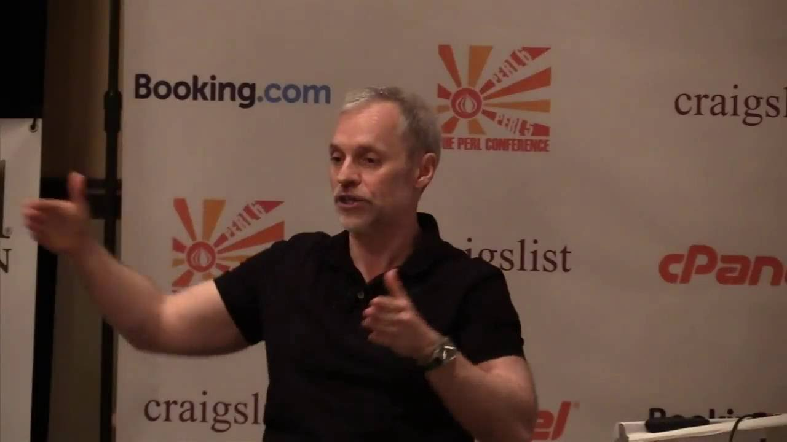

???

This is Damian Conway, who is probably the best presenter I've ever 
attended. It has probably been 20 years since I last saw him on stage, 
and I still remember his presentations. The first time I saw him speak,
I determined that I wanted to be as good as him. Still not there yet.

---

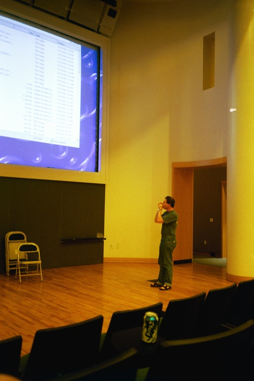
<small>CC by "brevity" on Flickr</small>

???

This is Mark Jason Dominus, or mjd, who, I think, is playing a harmonica
on stage in this picture.

He gave a talk called Presentation Aikido back in 1998 that still greatly
influences how I give talks.

He was the first person to point
out to me what was terrible about my presentations, and give
constructive advice about how to fix it. He is a big reason why I have
confidence that you're listening and will laugh at at least some of my
jokes.

---

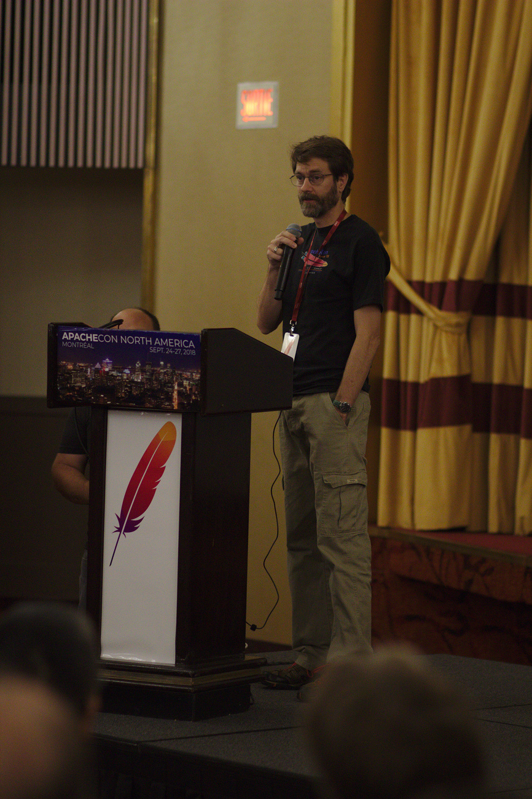
<small>CC by Kristopher Traquair, photos.apachecon.com</small>

???

That's me, before my beard turned white.

Why I care about this topic (and why you should care)

1 I give, and attend, a LOT of conference presentations.
I end up having my time wasted by a lot of presenters, because they
break all the rules that I'm about to give you. I want attending
presentations at the events I care about to be a better experience 
for everyone in the seats.

2 You have a very short time in which to persuade your audience that what
you have to say is worth listening to. Unfortunately, most conference
speakers waste that opportunity in ways that are easy to avoid. I want
you to succeed, because the topics that you are taliking about - open
source - are super important to me, and I want you to communicate
without your presentation getting in the way.

8 practical tips that you can implement immediately, that will make your
presentations 10 times better.

---

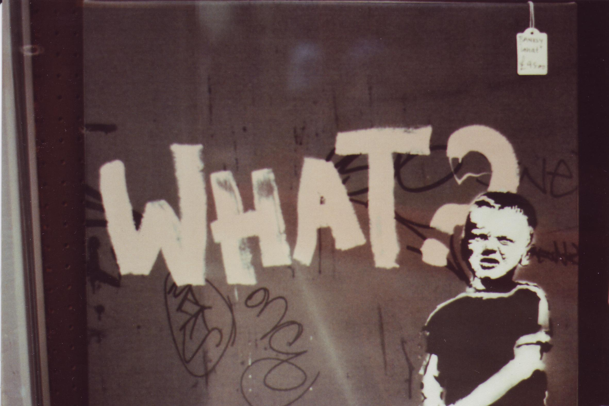
<small>CC by "Walt Jabsco" on Flickr</small>

???

1 Know what your talk is about

Yes, that sounds obvious, but most presentations leave you wondering
what they were trying to communication.

If someone missed your talk, what would you tell them it's about? Does
that take more than 3 sentences? If you cannot explain it, then maybe
you need to spend some time focusing your story.

---

<small>CC by "Julia Sergina" on Flickr</small>

???

Call to action

I should leave your talk wanting to do something. Everyone in your talk
should know what that thing is. You should know what that thing is. You
should mention it constantly. This is called the "call to action". It
might be to download and try something. It might be to quit their job
and become a llama farmer.

You should always ask yourself, before writing your first slide, what do
I want my audience to do when I'm done talking?

I, for example, want you to give better talks.

Anything that you say that doesn't contribute to this point, detracts
from the point.

---

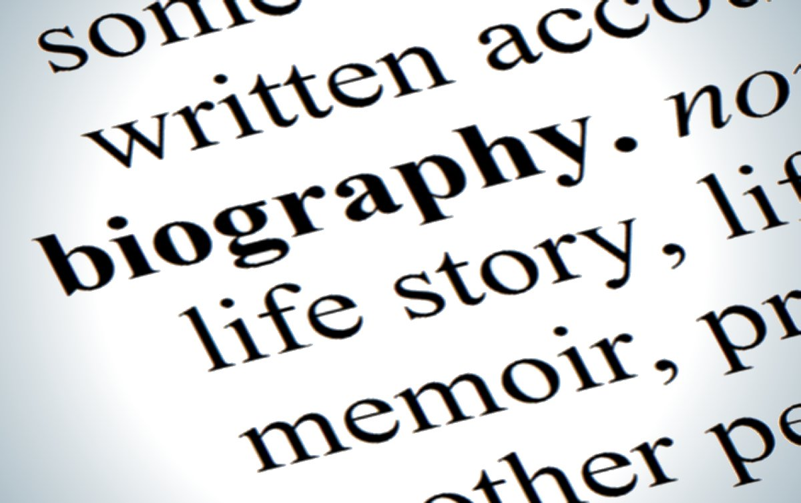

???

2 Don't tell me your life story

Introduce yourself, but ...

Don't tell me your life story, unless that's literally the topic of the
talk. I am not here to learn about *you* but about your topic. Only tell
as much about yourself as is actually relevant to the topic you are
covering. This is *not* time to read me your resume.

For example, I told you only four things:

* My name
* My job title (because my employer is paying for me to be here)
* That I have a lot of experience in the specific topic I will be
  speaking about
* What I will be speaking about.

That's all. Because that's all that's relevant. ie, the stuff that
establishes your authority on this topic.

I'll be here all week. If you want to get to know more about me, let's
chat at the party tonight. That's not what my talk is about.

Caveat: If you are part of an underrepresented group, you may,
unfortunately, need to establish your credibility, and that may require
saying a few things about your accomplishments. Just try really hard to
hold it down to less than a minute, because people are there for the
content, not for your resume.

---

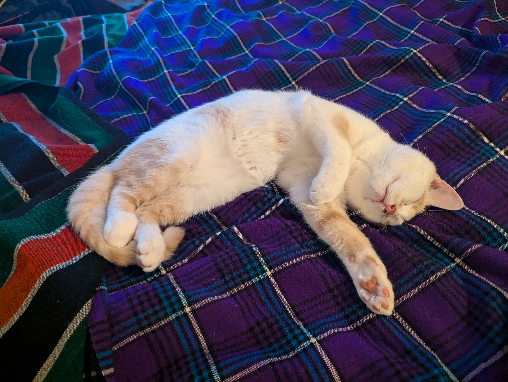

???

3 Your slides are not your presentation. YOU are your presentation.

Giving a presentation is a *performance*, not a document.

Slides are cuecards, not your entire presentation. They are there to
remind *you* of the point you wanted to make. They are also there to
make the audience look at YOU, rather than your slides, or their phone.

Here, have a picture of my cat.

Maybe provide a doc or blogpost that goes along with it, if you wanted
to write everything down.

Now, let's be fair here - I'm cheating. This isn't a technical talk. For
a technical talk, you will often want to have more on the screen than
your cat. But be sure that everything that you have on the slide is 

* Relevant
* Important
* Legible

---

<small>CC by Robby Van Arsdale, on Flickr</small>

???

If you are not excited about your topic, I won't be either. Convince me
this is the most exciting thing I'm going to see this week.

---

<!-- {{{ !-->

Amazon Managed Streaming for Apache Kafka (MSK) offers fully managed Apache Kafka. This means Amazon MSK provisions your servers, configures your Apache Kafka clusters, replaces servers when they fail, orchestrates server patches and upgrades, architects clusters for high availability, ensures data is durably stored and secured, sets up monitoring and alarms, and runs scaling to support load changes. With a managed service, you can spend your time developing and running streaming event applications.

Amazon MSK provides open-source, highly secure Apache Kafka clusters distributed across multiple Availability Zones (AZs), giving you resilient, highly available streaming storage. Amazon MSK is highly configurable, observable, and scalable, allowing for the flexibility and control needed for various use cases.

Application development is simpler with Amazon MSK because of tight integrations with other AWS services. Amazon MSK integrates with AWS Identity and Access Management (IAM) and AWS Certificate Manager for security, AWS Glue Schema Registry for schema governance, Amazon Managed Service for Apache Flink and AWS Lambda for stream processing, and more. Amazon MSK provides the integration backbone for modern messaging and event-driven applications at the center of data ingest and processing services, as well as microservice application architectures.

<li>No servers to manage</li>
<li>Fully managed</li>

With a few clicks in the console, you can create a fully managed Apache Kafka cluster that follows Apache Kafka’s deployment best practices, or create your own cluster using a custom configuration. Once you create your desired configuration, Amazon MSK automatically provisions, configures, and manages your Apache Kafka cluster operations and Apache ZooKeeper nodes.

Apache ZooKeeper included -- Apache ZooKeeper is required to run Apache Kafka, coordinate cluster tasks, and maintain state for resources interacting with the cluster. Amazon MSK manages the Apache ZooKeeper nodes for you. Each Amazon MSK cluster includes the appropriate number of Apache ZooKeeper nodes for your Apache Kafka cluster at no additional cost.

Amazon MSK Serverless -  MSK Serverless is a cluster type for Amazon MSK that makes it easy for you to run Apache Kafka clusters without having to manage compute and storage capacity. MSK Serverless automatically provisions and scales resources while also managing Apache Kafka partitions, so you can stream data without having to worry about right-sizing or scaling clusters.

All clusters are distributed across multiple AZs (three is the default), are supported by Amazon MSK’s service-level agreement, and are supported by automated systems that detect and respond to issues within cluster infrastructure and Apache Kafka software. If a component fails, Amazon MSK automatically replaces it without downtime to your applications. Amazon MSK manages the availability of your Apache ZooKeeper nodes so you don’t need to start, stop, or directly access the nodes yourself. It also automatically deploys software patches as needed pto keep your cluster up to date and running smoothly.

<!-- }}} !-->

???

DO NOT make me read your slides. Not only is that boring, and hard on my
eyes, it also makes it impossible for me to focus on what you are saying.

DO NOT read your slides to me. I have attended talks where the speaker
*literally* stood with their back to me and read their slides to me.
Don't be that guy, EVER.

If your slides are the presentation, then what are you here for? (This
is not a rhetorical question. Think explicitly about what value you add,
by being here, that I do not get directly from your slides.)

Most of your content should NOT be on the screen. If I wanted to read a
blog post, I would not be in your talk. (But, yes, write the blog post
too.)

---

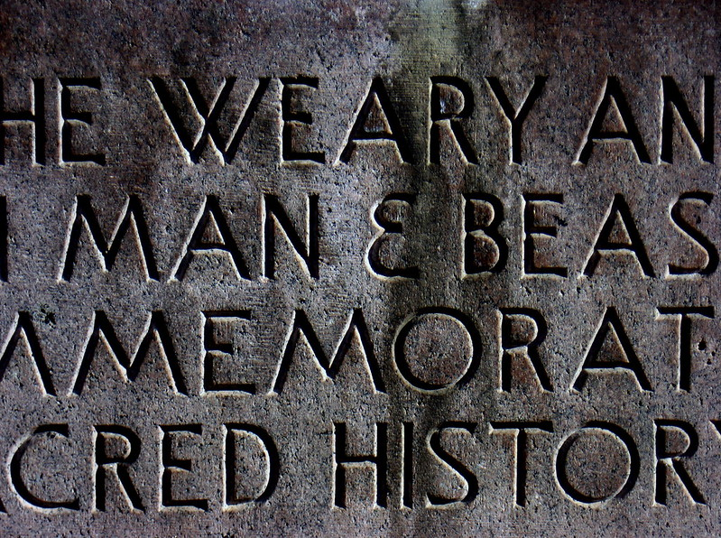
<small>CC by "Eric Dillalogue" on Flickr</small>

???

I would even go so far as to say you should never have words on the
screen except

When you are giving contact information

When you are trying to make a dramatic point - in which case, fewer
words are better

When they are the words that you want people to literally walk away with
in their heads.

In a technical talk: Content that directly illustrates the point you're
making.

---

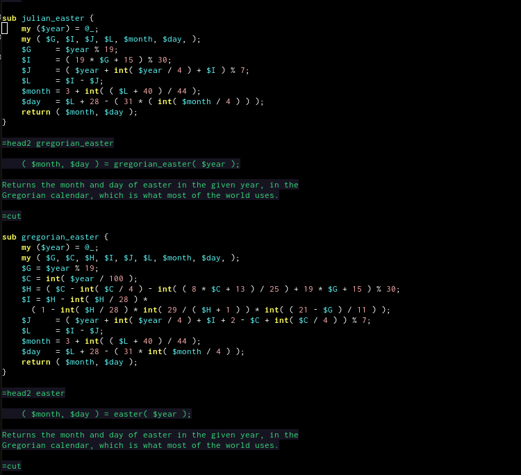

???

When you must show code, show only exactly the tiniest portion of the
code that you need to show to make your point. Think of the people in
the back.

---

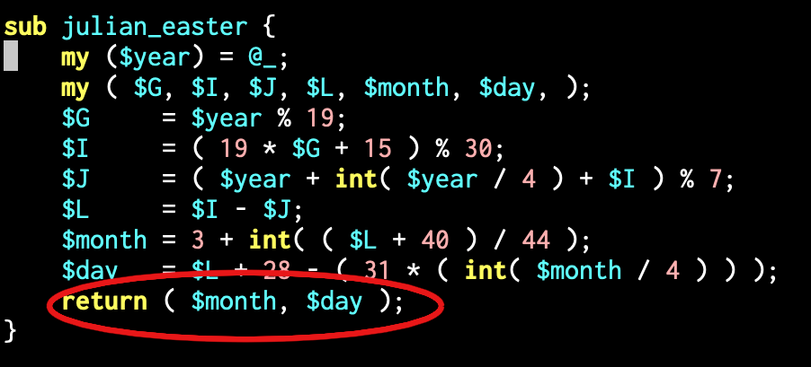

---

<small>CC by Kristopher Traquair, photos.apachecon.com</small>

???

4 A presentation is a conversation. Listen to, and watch, your audience,
so that you know whether they're getting it.

Talk with me, not at me. (ie, listen, too)

However awkward it is, make eye contact with everyone in the audience at
some point during the talk. This is a cheap psychological trick and
makes that person then feel awkward about looking back at their phone.

Pro tip: don't let anyone hijack your talk. This can be very challenging
if you have someone that won't shut up. Practice saying "Let's take that
question out to the hallway afterwards, since I have a lot of material
to get through."

If you are giving your talk online and cannot see your audience,
practice for someone that is similar to your audience, and ask them to
be harsh, because that will make you better.

---

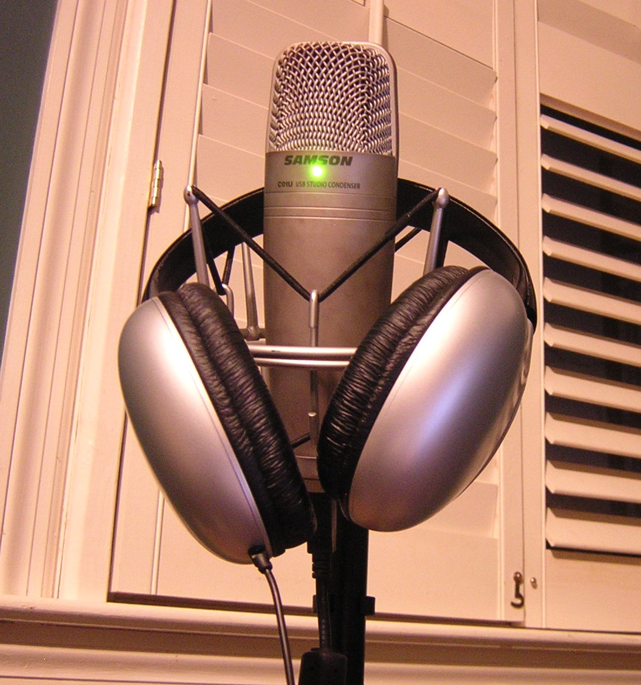

???

5 Use the mic.

No, you are not loud enough.

No, they cannot hear you in the back. They're just being polite.

No, you do not know how to project your voice.

Use. The. Mic.

It's for me (I'm very hard of hearing, and without the mic, I simply
cannot hear you) and it's for the videographer.

(Demonstrate how to use a mic.)

---

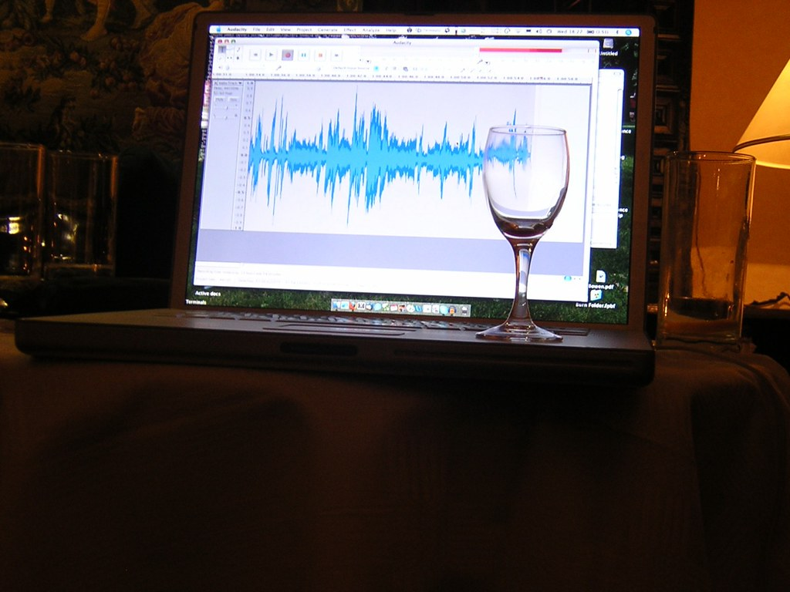

???

6 Record yourself.

You have a recording device in your pocket.

Listen to yourself. Watch yourself

You say "um" a lot more than you think you do. Or whatever your
particular annoying speech pattern is. And your audience notices. Most
people find their own voice annoying. Get over that.

Practice not saying that.

You touch your face a lot, or put your hands in your pockets, or pull on
your ear, or look down at the floor, or ... something.

Practice not doing that. Notice when you do it and consciously avoid
doing it.

I play with stuff in my pockets, so I empty my pockets before I start.
And I slouch, so I consciously tell myself to stand up straighter.

---

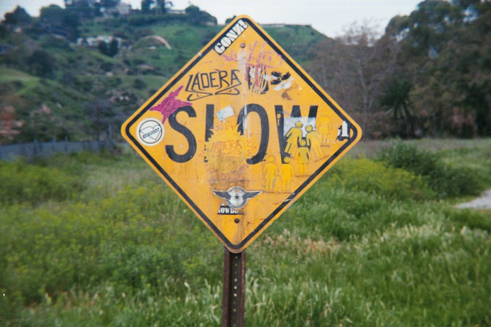
<small>CC by "cloclo109" on Flickr</small>

???

Slow down. 

"Um", and "er", and "like", and "sort of", and so on, are called "filler
words" or "vocalized pauses". They make you sound like you don't know
what you're saying.

Dramatic pauses, on the other hand, make you sound intelligent, and like
you are considering just the right word choice.

This is nonsense, of course, but it's surprising how much it affects how
an audience listens to you.

---

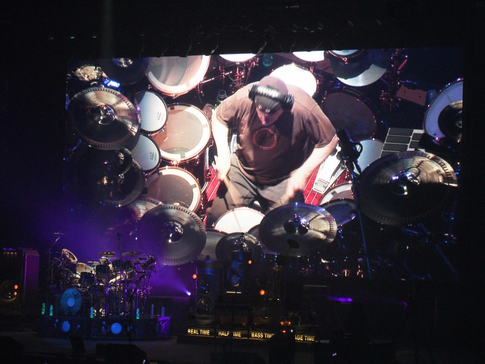
<small>CC by "Sean Hackbarth" on Flickr</small>

???

7 Lots of short slides, or beats

That's the professor, Neal Peart, of the band Rush, making a beat.

In a presentation, switching the view, intentionally, is called a
"Beat", and it regains the audience's attention for a moment. Thus the
more beats you have, the more time your audience's attention is on you,
not on their phone.

---

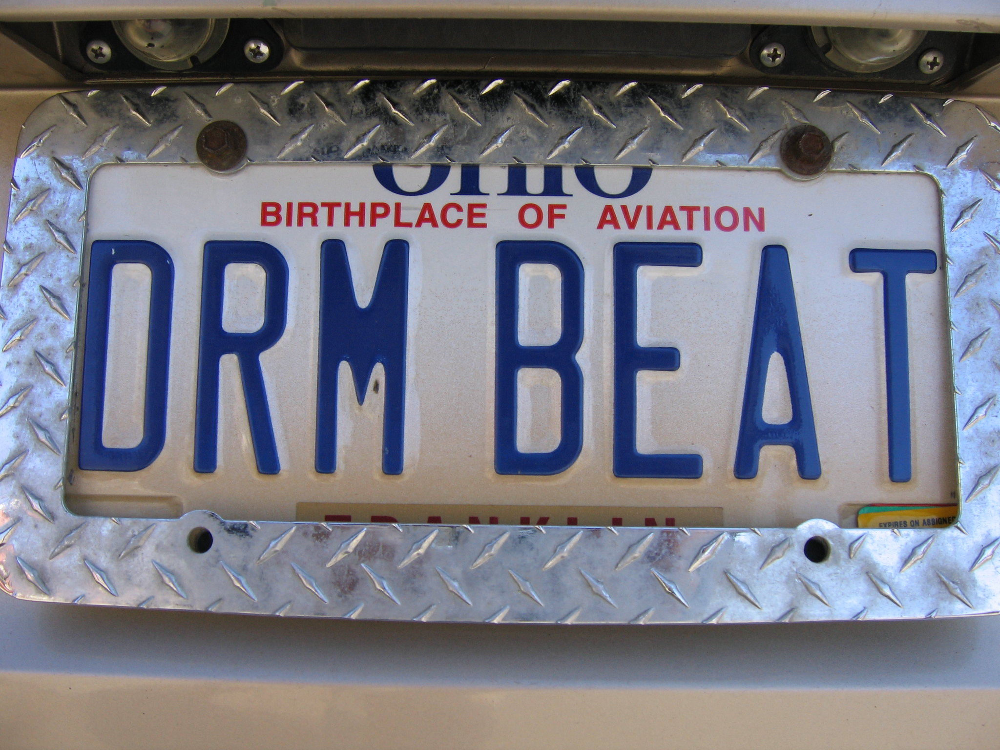
<small>CC by "skippy" on Flickr</small>

???

I try to have one slide per minute. Find your own cadence, but don't 
give the audience a chance to look at their phone, for fear they'll 
miss something. If you have the same slide up for more than 2 minutes,
you're going to start losing eyes. Don't let this happen.

A beat is not *just* a slide, it's also intentionally changing something
else. Ask a question. Tell a joke. Do a dance. I do it with slides. You
are not me.

---

<small>CC by Kristopher Traquair, photos.apachecon.com</small>

???

8 A picture is worth 1000 words

What do you think is happening in this picture? I love this picture
because I remember the conversation, even though it was back in 2018,
and it makes me laugh.

Slides should evoke images, not list your point. Make them work a little
to make the connection, so that they'll remember it. Throw in the
occasional random non-sequitur.

---
Summary (And Q&A)

1. Know what your talk is about (so that I know, too)
2. I'm not here for your life story
3. Your slides are not your presentation. YOU are your presentation.
4. A presentation is a conversation
5. Use the mic
6. Record yourself
7. Lots of short beats
8. A picture is worth 1000 words

---
class: center,middle
## finis

rbowen@apache.org

@rbowen

@AWSOpen

Slides: github.com/rbowen/presentations

<small>Photos are mine where not noted. All others are Creative 
Commons from Flickr. Except the one of Damian, which I stole from YouTube</small>

