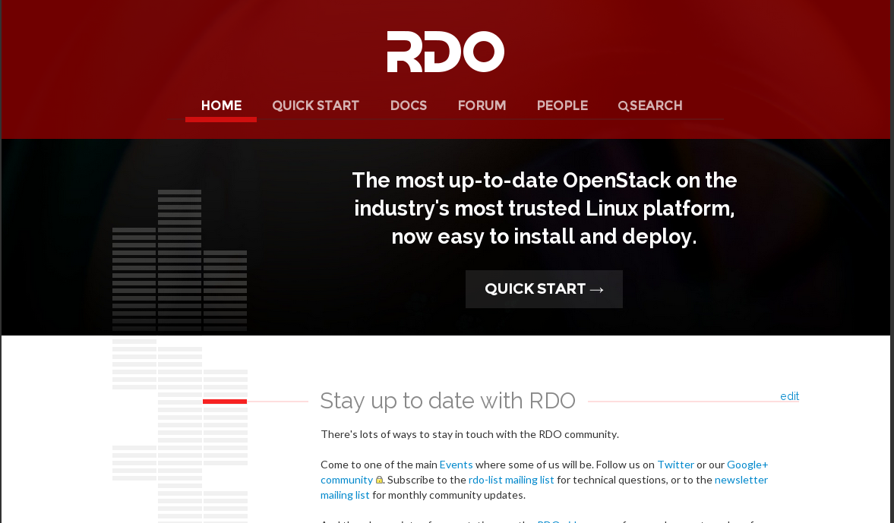
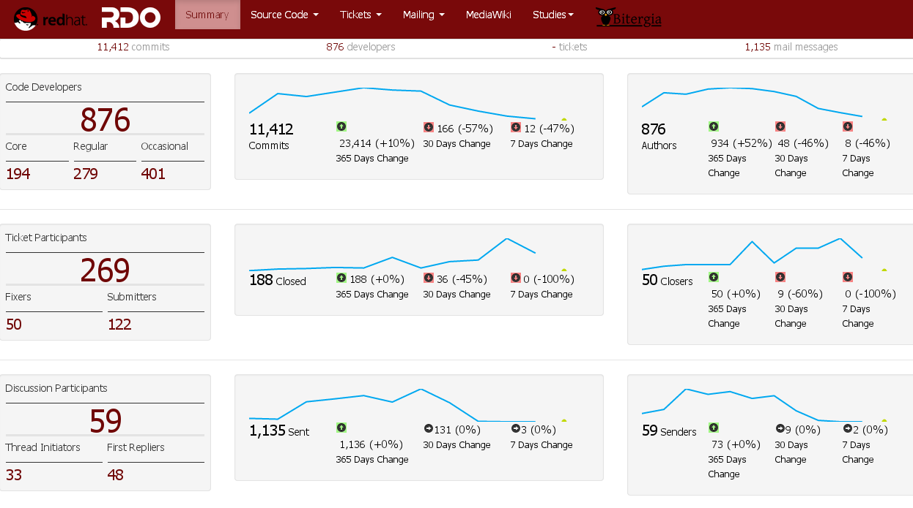
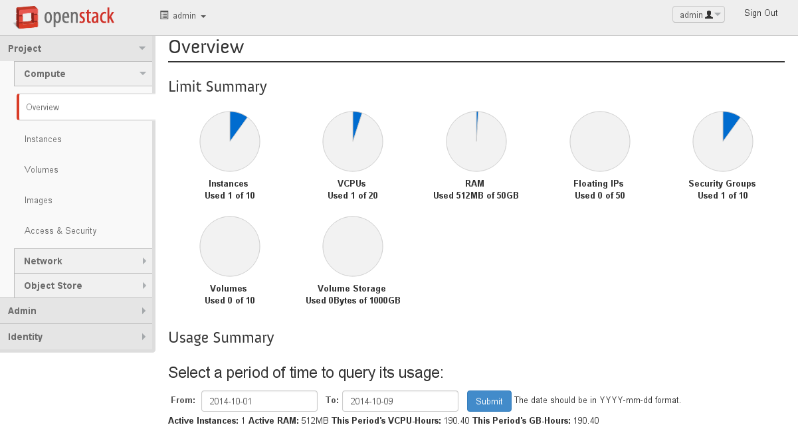
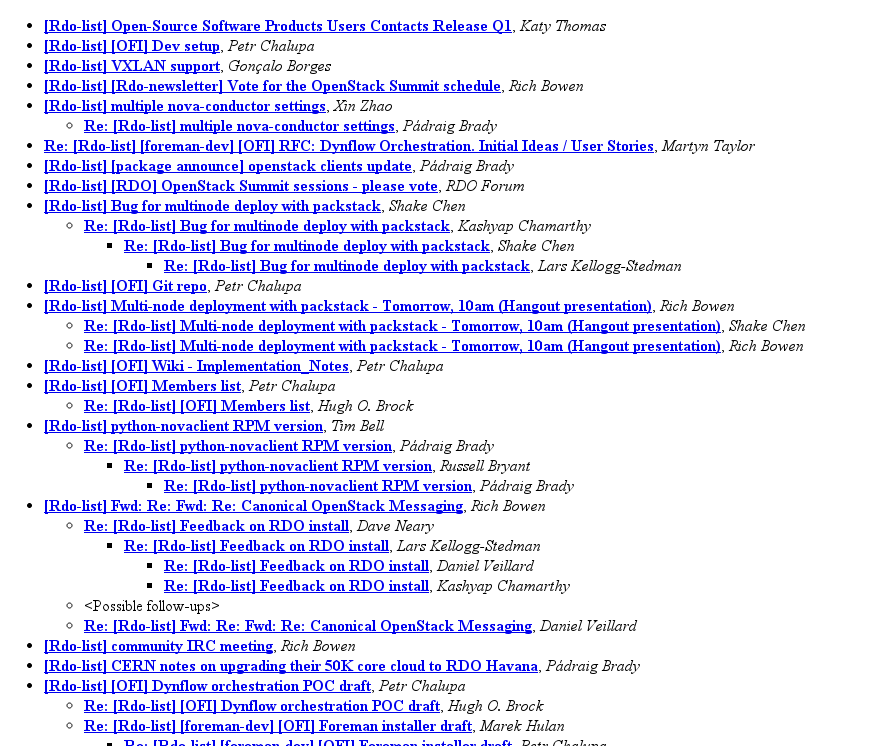
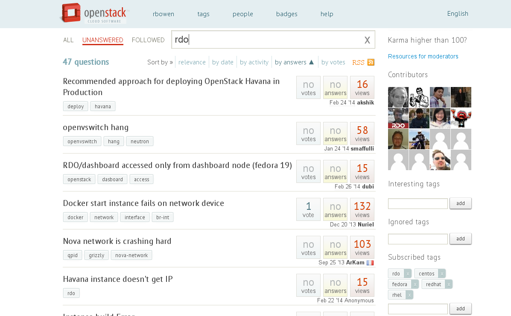

# RDO 

An OpenStack Distribution

http://openstack.redhat.com/

---

- A distribution of OpenStack for Fedora, CentOS and RHEL
- A community of OpenStack users, helping one another
- Documentation, mailing lists, IRC channel

---

http://openstack.redhat.com/

---

http://openstack.redhat.com/stats/

---

# Getting started

http://openstack.redhat.com/Quickstart

    # yum install -y http://rdo.fedorapeople.org/rdo-release.rpm
    # yum -y install openstack-packstack
    # packstack --allinone

---

## What happened?

- Installs a bunch of packages
- Configures the various parts of OpenStack
- Configuration in `/etc/{nova,glance,cinder,neutron,...}/`
- Firewall rules, databases
- Starts up services

---

---

---

# Get Involved

- [rdo-list] mailing list
- [ask.openstack.org][]
- [rdo-newsletter] mailing list
- [Events][]

[rdo-list]: http://www.redhat.com/mailman/listinfo/rdo-list
[rdo-newsletter]: http://www.redhat.com/mailman/listinfo/rdo-newsletter
[ask.openstack.org]: http://ask.openstack.org/
[Events]: http://openstack.redhat.com/Events

---

---

---

# Stay Informed

- [@rdocommunity][]
- [Google+][]
- [planet.openstack.org][]
- [Facebook][]

[@rdocommunity]: http://twitter.com/rdocommunity
[Google+]: https://plus.google.com/communities/110409030763231732154
[planet.openstack.org]: http://planet.openstack.org/
[Facebook]: http://facebook.com/rdocommunity

