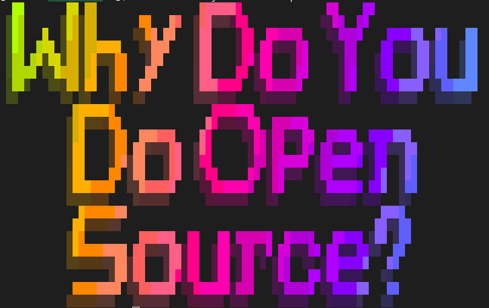

class: center, middle
# Talking To Management About Open Source

Rich Bowen, (Apache|AWS)

Slides: BoxOfClue.com/presentations/talking-to-management and github.com/rbowen/presentations

???

* Introduce yourself. AWS, Apache, 20+ years in FLOSS
* There are many motivations for writing open source software. Your company's motivations are entirely different.

---

# What I'm going to tell you, and why you should care

* How to talk to management about open source

### Because

* You like getting paid to work on open source
* So you want your company to have a positive experience with it
* And it's up to you to persuade management to do this correctly

### Also 

* You should want your company to **succeed**

---

# So ... why are you here?

???

* What do you want to learn?
* Are you in a specific scenario you want help with?

---

# Why do you do open source?

???

* Ask the question
    * Fun
    * Scratching your own itch
    * Socialization
    * "Giving back"
    * Make the world a better place, and possibly be remembered for it
    * Resume building, education
    * Oh, and because it's your job

---

Source: OpenSource.com survey

???

Main reasons:
* Learn something new, or career opportunities
* Fun
* Altruism

---

???

* The great thing about FOSSAsia, and events like it, is that we can sit
around the campfire and speak a common language.
* We all have stories about corporate types who Just Don't Get It, and
  we can laugh at them together.

---

# That is not why your company does open source

* Profit
* Customers
* Shareholders
* Profit
* Employees (If you're lucky)
* Profit

???

* Probably in that order
* Clarification - "doing" open source can mean
  * Contributing to existing projects
  * Open sourcing an internal project

---

# Disclaimer: 

## Obviously not **YOUR** manager!

???

* I am sure you have a wonderful manager, and that they understand open
  source. Otherwise you wouldn't be at this event. But somewhere up the
  management chain is someone with different priorities.

---

# Disclaimer 2:

Every project is weird, in its own special way

???

* Nothing in open source is a guarantee. You can do everything right, and
  still have a bad experience with an open source project. The maintainers
  could be awful people. The project could be run by a company that has
  their own reasons for ignoring you. Maybe you have some weird corporate
  policy that makes it impossible for you to do the right thing. And maybe
  your manager isn't awesome as mine after all.
* Open source, as you already know, is part culture, part religion, part
  science, part law, and part ego, with a lot of language, timezone, and
  network latency thrown in.
* Nothing in this presentation should be construed as a promise

---

???

* When you are talking to management about open source, you must speak
their language.

* Note: This is translation, not lying. Open source is, above all,
  *practical*. It's an objectively better way to build software, and
  what's good for the customer is also the right thing to do.

---

# What's in it for the company?

???
* The customer
* The product/service
* The company
    * Cost/Profit
    * Recruiting
    * Reputation

---

# Philosophy

???

Don't talk philosophy, unless they ask. Certainly not in a first
conversation.

* Licenses
* Jargon
* "Free" vs "Open"

---

# Got a minute?

???

* You have a limited amount of time to make your point - or, at least, 
  to persuade your audience that you are worth listening to. Spending that time
  on the nuances of Free/Libre/Open/Puppies will work against you, and
  persuade your manager that you are don't care about the same things she
  does.
* Miguel De Icaza presentation, OSCon, long long ago.

---

# "Giving back"

* You are building your company on the back of "free" labor
* Giving back is a moral obligation

### But ...

* Your company is not a charity

???

* Management often sees open source as a renewable resource that they can
  take and take and take, with no end in sight.
* Your attitude that open source contribution is a moral obligation, or
  "for the greater good" or any such thing, comes across as nonsense
  unless there is an actual business benefit.

---

# Instead talk about the supply chain

???

* Sustainability
* Supply chain security

* Your manager loves talking about the supply chain. They read an
  article about SBOMs last month, and have been looking for an
  opportunity to bring it up in conversation.

* When you use a natural resource, you need to ensure that it's still
around next year.

* If your company is betting millions (billions?) of dollars on
  something that relies on an open source project, shouldn't they be
  concerned that the project is healthy and sustainable?

* Demonstrate, with numbers, how this project is a critical part of your
  supply chain. Data is your friend here.

* Talk about supply chain horror stories. There are so many from which
  to choose.

* This is **long term** thinking, not about solving immediate problems.
  That looks good to managers.

---

# Obligatory XKCD

<small>https://xkcd.com/2347/</small>

???

* Understand that your company is one of those things teetering on top.

---

# Data is your friend

*Apache Commons is a critical component in our product ZYX, which earned
$27M last year. If the project were to fail, we would have to replace it
with something else, which would take approximately six months of work by 4
engineers, assuming we could find a comparable project with which to
replace it, rather than developing what we need from scratch. Therefore, it is
in the best interests of our customers, and our bottom line, to
participate in the sustainability of that project by contributing bug
fixes, feature enhancements, and PR reviews.*

???

* Be specific. Use numbers. Reference reports.
* Tie it to a company priority - in this case, profitability and budget

---

# What is sustainable open source?

* Multiple vendors
* Multiple maintainers
* Responsive to user (customer) needs
* Stakeholders participate!

???

* Multiple vendors protects you from one vendor changing priorities, and
  killing the project, or relicensing it to something that precludes
  your use.
* Multiple maintainers protects you from skiing accidents
* Participating ensures that you, and your customers, are heard in
  decisions
* Focus on what you're good at, collaborate on what's common

---

# Earning merit and reputation

* Your company is not in it to be *popular*, but to be *successful*
* They certainly don't care if *you* are popular

<small>The Breakfast Club, 1985</small>

???

Yes, I know I'm the only person in the room old enough to remember The
Breakfast Club.

---

# Instead talk about earning trust and influence

* Steering/leading the project in our direction
* Championing our out customers' needs

???

* This can be dangerous, though, if your company doesn't understand open social norms
* Don't claim you own/lead/invented an open source project.
* Also, there's no guarantee that your contributions/recommendations
  will be accepted, so be careful about promising too much
* Surveys show (reference needed) that customers view open source
  participation as an indication of trust, expertise, and ability to
  provide good customer service.

---

# And talk about adoption

* Open sourcing to drive adoption of our solution
* Influence in the larger tech space

???

* eg Kubernetes/CNCF projects where one project drives the use of
  another, and earns trust in the ecosystem as a whole
* (Possibly) Controversial opinion: Open core is anti-community, because
  it draws lines around what is, and is not, appropriate to contribute
  to the project. Use extreme caution before pursuing this model

---

# Fun

???

Open source is an endless party, and can be a source of lifelong
friends. Right?

---

# Instead talk about recruitment

* Your company is not interested in you having fun, despite what they
  said in your interview.

* Talking about your open source work makes your employer an attractive
  place to work

???

* Warning: If you hire someone with the (implied?) promise that they'll
  get to work on open source, breaking that promise will immediately be
  public information, and damage your reputation
* Also, open source people (whatever that means) can be very
  opinionated, lean libertarian/anarchic, and can be difficult to
  manage.

---

# Resume building

???
* Your employer is **very** not interested in you building your resume

---

# Instead talk about continuing education

* Expertise in software your company relies on
* General programming skills
* A lot of open source is about people skills, rather than technical
  skills
* Even better, it's free (Disclaimer: Nothing is free)

???

* People skills - and you can practice on strangers!

* And, speaking of free ... (next slide)

---

# But, isn't open source free?

???

Free as in puppies!

---

# Instead talk about customer value

## Software is easy, people are hard. Customers come to you because they trust you.

???

* Your company is your product. Everything else is just a delivery
  mechanism
* Participation in open source establishes that expertise
* Open source is also a way to comodotize your competitor's product, and
  make the conversation about expertise, not software
* If you sell software, open source is a way for the customer to
  directly influence the feature set, and helps them trust your solution

---

# Can't we just ... ?

* Fork it? (This is an entire other presentation)
* Throw money at it? (Yes, but ...)

???

* Situations to avoid at all costs
  * Fork, internal vs external
  * Throwing money at a project solves only a small part of the problem.
    Also it maintains a situation where your employees are powerless to
    make needed changes.

---
class: center,middle
## finis

rbowen@apache.org

@rbowen

@AWSOpen

Slides: BoxOfClue.com/presentations/talking-to-management

---
Credits

Lever image, By Koltepranita, CC BY-SA 3.0, https://commons.wikimedia.org/w/index.php?curid=17198274
