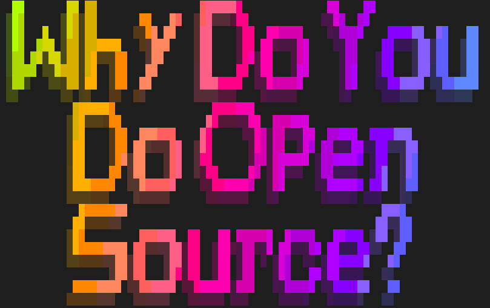
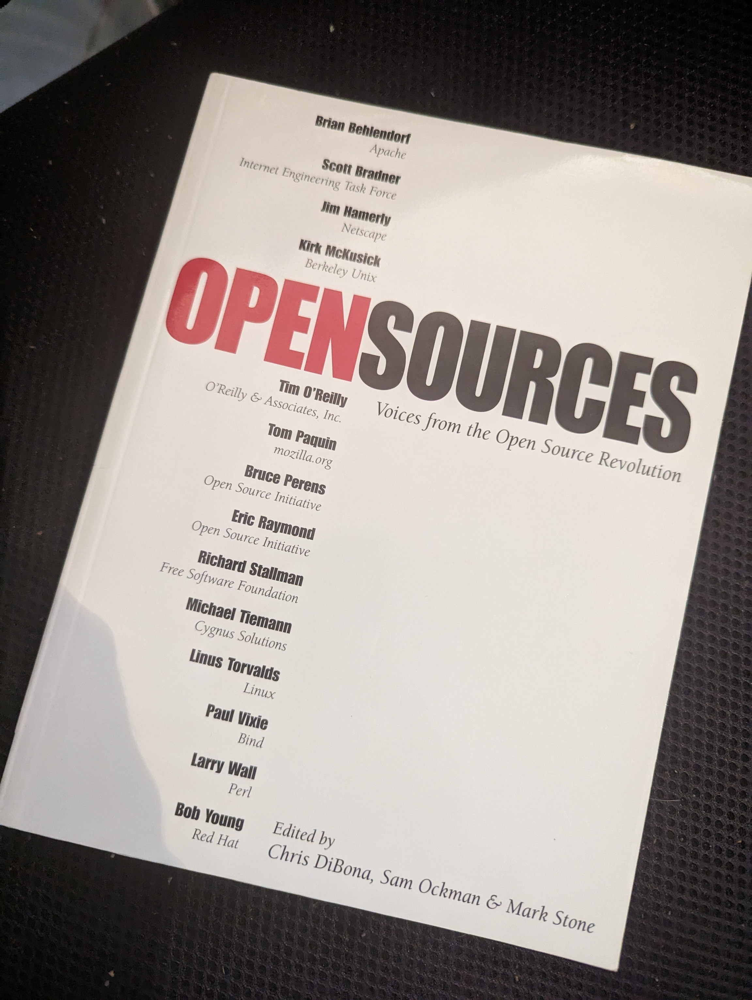
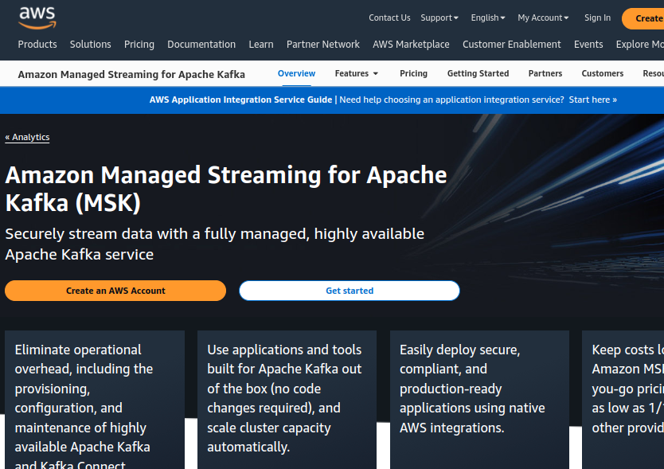

class: center, middle
# Talking To Management About Open Source

Rich Bowen, (Apache|AWS)

Slides: github.com/rbowen/presentations

???

* Introduce yourself. 
    * Apache, 20+ years in FLOSS
    * Open Source Strategist at AWS
    * Open Source zealot trying to communicate to prosaic managers
* There are many motivations for writing open source software. Your company's motivations are entirely different.

---

# Agenda:

### You care about open source
### Your manager cares about results
### These things are not at odds

???

* You like getting paid to work on open source
* So you want your company to have a positive experience with it
* And it's up to you to persuade management to do this correctly

* You should want your company to **succeed**

* Ideally, you are interested in the success of your company. Correct
  understanding of open source is a long-term investment in the success
  of your company, as well as in your own career.

---

???

* Ask the question
    * Fun
    * Scratching your own itch
    * Socialization
    * "Giving back"
    * Make the world a better place, and possibly be remembered for it
    * Resume building, education
    * Oh, and because it's your job

---

<small>Source: OpenSource.com survey - http://tm3.org/fl</small>

???

Main reasons:
* Learn something new, or career opportunities
* Fun
* Altruism

---

???

* The great thing about OSSummit, and events like it, is that we can sit
around the campfire and speak a common language.
* We all have stories about corporate types who Just Don't Get It, and
  we can laugh at them together.

---

# That is not why your company does open source

* Profit
* Customers
* Shareholders
* Profit
* Employees (If you're lucky)
* Profit

???

* Probably in that order
* Clarification - "doing" open source can mean
  * Contributing to existing projects
  * Open sourcing an internal project
  * Adopting an open source solution

---

# Disclaimer: 

???

* Obviously not **YOUR** manager!
* This is my manager
* I am sure you have a wonderful manager, and that they understand open
  source. Otherwise you wouldn't be at this event. But somewhere up the
  management chain is someone with different priorities.

---

???

* When you are talking to management about open source, you must speak
their language.

* Note: This is translation, not lying. Open source is, above all,
  *practical*. It's an objectively better way to build software, and
  what's good for the customer is also the right thing to do. I am not
  telling you to lie to your management. Merely to understand where they
  are coming from, as you attempt to understand where you are coming
  from.

---

## What's in it for the company?

???

It would be reductionist to say that your company only cares about
profits. It's more complicated than that.

* The customer
* The product/service
* The company
    * Cost/Profit
    * Recruiting
    * Reputation
    * Legacy

---

???

## Philosophy

This is a great book, but ...

Don't talk philosophy, unless they ask. Certainly not in a first
conversation.

* Licenses
* Jargon
* "Free" vs "Open"

---

???

## Got a minute?

* You have a limited amount of time to make your point - or, at least, 
  to persuade your audience that you are worth listening to. Spending that time
  on the nuances of Free/Libre/Open/Puppies will work against you, and
  persuade your manager that you are don't care about the same things she
  does.

---

???

Giving back is a moral obligation

...but

Your company is not a charity

* Management often sees open source as a renewable resource that they can
  take and take and take, with no end in sight.
* Your attitude that open source contribution is a moral obligation, or
  "for the greater good" or any such thing, comes across as nonsense
  unless there is an actual business benefit.

* Dawn Foster: If you talk about what you do as though it's charity,
  then it's going to be the first thing cut when there are budget
  conversations.

---

???

### Instead, talk about the Supply chain

* **WHY** is giving back the right thing to do? Because you derived good
  from it, and so should nurture it in return.
* Not because of a moral obligation, but because of sustainability
* Your manager loves talking about the supply chain. They read an
  article about SBOMs last month, and have been looking for an
  opportunity to bring it up in conversation.
* When you use a natural resource, you need to ensure that it's still
around next year.
* If your company is betting millions (billions?) of dollars on
  something that relies on an open source project, shouldn't they be
  concerned that the project is healthy and sustainable?
* Demonstrate, with numbers, how this project is a critical part of your
  supply chain. Data is your friend here.
* Talk about supply chain horror stories. There are so many from which
  to choose.
* This is **long term** thinking, not about solving immediate problems.
  That looks good to managers. It shows you care about the company, not
  just about your own personal needs.

---

???

## Don't be afraid to tell scary stories

* log4shell
* The list goes on
* Caution: Be sure to communicate that in each case, these happened
  because of little community engagement, not because they were open
  source.

---

## Obligatory

<small>https://xkcd.com/2347/</small>

???

* Understand that your company is one of those things teetering on top.
* Shoring up that bottom layer is an investment, not charity

---

# Data 

Apache Commons is a critical component in our product ZYX, which earned
earned <big><strong>$27M last year</strong></big>.
If the project were to fail, we would have to replace it
with something else, which would take approximately <big><strong>six
months of work by 4 engineers</strong></big>,
assuming we could find a comparable project with which to
replace it, rather than developing what we need from scratch. Therefore, it is
in the best interests of our <big><strong>customers</strong></big>, and our bottom line, to
participate in the sustainability of that project by contributing bug
fixes, feature enhancements, and PR reviews.

???

* This is an example report to your manager about why it's important tat
  you contribute to the sustainability of a project.

* Be specific. Use numbers. Reference reports.
* Tie it to a company priority - in this case, profitability and budget

---

# Sustainable

???

* Multiple vendors
* Multiple maintainers
* Responsive to user (customer) needs
* Stakeholders participate!

* At AWS, we call this "undifferentiated heavy lifting", but it means
* Focus on what you're good at, collaborate on what's common

---

## Single-vendor projects

???

This is an entire other presentation

Short version: Single-vendor projects tend to be primarily about that
  vendor's priorities. (Sounds obvious when you say it ...)

* Multiple vendors protects you from one vendor changing priorities, and
  killing the project, or relicensing it to something that precludes
  your use.

---

## Single-maintainer projects

???

* Anyone know who the pink box is?

* Same as single-vendor, but so much moreso

* Multiple maintainers protects you from skiing accidents

---

???

* My beautiful kids, both of whom were very popular in highschool

* Your company is not in it to be *popular*, but to be *successful*
* They certainly don't care if *you* are popular

---

???

## Instead: trust and influence

* My other beautiful kid, who is far less concerned with being popular

* Talk about *driving* the project's direction on behalf of our
  customers

* This can be dangerous, though, if your company doesn't understand open social norms. Be sure to ask someone here at this conference if you yourself are unsure how to interact with an open source project.
* Don't claim you own/lead/invented an open source project.

    XYZCo. is a driving force behind Apache Thingy™.

* Also, there's no guarantee that your contributions/recommendations
  will be accepted, so be careful about promising too much
* Surveys show (reference needed) that customers view open source
  participation as an indication of trust, expertise, and ability to
  provide good customer service.

---

# Adoption

???

* The tide lifts all boats

* We contribute to Kafka in order to make it better for the customer,
  and drive adoption of the technology. Then, we're available to help
  with the deployment, if customers need that.

* Influence in the larger tech space

* eg Kubernetes/CNCF projects where one project drives the use of
  another, and earns trust in the ecosystem as a whole
* (Possibly) Controversial opinion: Open core is anti-community, because
  it draws lines around what is, and is not, appropriate to contribute
  to the project. Use extreme caution before pursuing this model

---

# Fun

???

DroidCon Kenya, 2022!

Open source is an endless party, and can be a source of lifelong
friends. Right?

---

# Instead talk about recruitment

### Your company is not interested in you having fun, despite what they said in your interview.

### Talking about your open source work makes your employer an attractive place to work

???

* Warning: If you hire someone with the (implied?) promise that they'll
  get to work on open source, breaking that promise will immediately be
  public information, and damage your reputation
* Also, open source people (whatever that means) can be very
  opinionated, lean libertarian/anarchic, and can be difficult to
  manage.

---

# Resume building

???
* Your employer is **very** not interested in you building your resume

---

# Education

???

* Expertise in software your company relies on
* General programming skills
* A lot of open source is about people skills, rather than technical
  skills
* Even better, it's free (Disclaimer: Nothing is free)

* People skills - and you can practice on strangers!

* And, speaking of free ... (next slide)

---

# Free as in kittens

???

Free as in puppies!

---
# Customer value

???

* Software is easy, people are hard. 
* Customers come to you because they trust you.
* This is doubly true if your product is based on open source

* Your people are your product. Everything else is just a delivery mechanism
* Customers tend to select technology first, and the company second

* Participation in open source establishes expertise
* Open source is also a way to comodotize your competitor's product, and
  make the conversation about expertise, not software
* If you sell software, open source is a way for the customer to
  directly influence the feature set, and helps them trust your solution

---

# And another thing ...

* Can't we just ...
    * ... fork it?
    * ... write our own?
    * ... throw money at it?
    * ... hire the maintainer?

* Won't this help our competition?

* What about our secrets?

???

* As you discuss open source with your manager, they will have lots of
  objections, and lots of brilliant new ideas that nobody has thought of
  before. It's important, as in any conversation, to be patient, polite,
  and kind.

* Remember that things that you think everyone knows may be completely
  foreign to people outside of our little bubble.

* Each of these is another whole presentation
* Earn trust gradually with your employer. These are complicated
  conversations

---

## Not a sprint

???
* Open source investments take a while to pay off
* Investments in open source take 3 years to pay off
    * It takes a while to become a committer/maintainer
    * It take a long time to master the code base
    * It takes a long time to change company culture
* Most companies are not good a patience
    * Especially if they have to produce a quarterly earnings report

---
class: center,middle
## finis

rbowen@apache.org

@rbowen

@AWSOpen

Slides: github.com/rbowen/presentations

