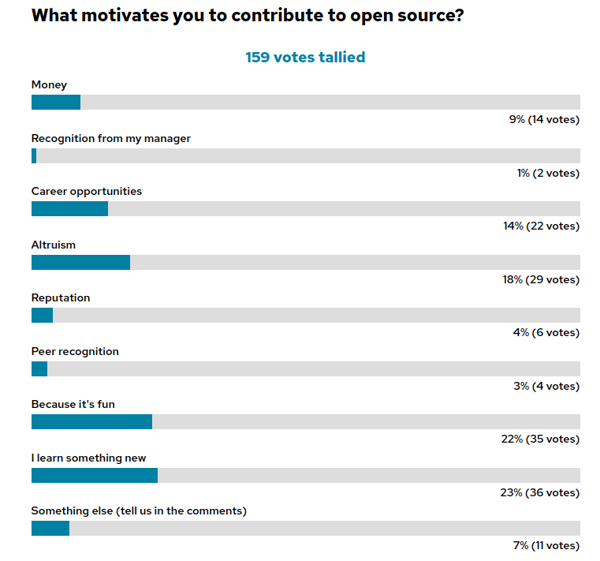

class: center, middle
# 和管理层聊开源

Rich Bowen, (Apache|AWS)

Slides: github.com/rbowen/presentations

???

* Introduce yourself. 
    * Apache, 20+ years in FLOSS
    * Open Source Strategist at AWS
    * Open Source zealot trying to communicate to prosaic managers
* There are many motivations for writing open source software. Your company's motivations are entirely different.

---

# 我要讲的，也是你要关注的

* 如何与管理层聊开源

### 原因如下

* You like getting paid to work on open source
* So you want your company to have a positive experience with it
* And it's up to you to persuade management to do this correctly

* 你想为开源工作
* 希望公司积极开源
* 那你得说服管理层正确开源

### 同时 

* You should want your company to **succeed**
* 你要和公司勠力同心，**取得成功**

???

* Ideally, you are interested in the success of your company. Correct
  understanding of open source is a long-term investment in the success
  of your company, as well as in your own career.

---

# Why do you do open source? 为什么要搞开源？

???

* Ask the question
    * Fun
    * Scratching your own itch
    * Socialization
    * "Giving back"
    * Make the world a better place, and possibly be remembered for it
    * Resume building, education
    * Oh, and because it's your job

---

<small>Source: OpenSource.com survey - http://tm3.org/fl</small>

???

Main reasons:
* Learn something new, or career opportunities
* Fun
* Altruism

---

???

* The great thing about OSSummit, and events like it, is that we can sit
around the campfire and speak a common language.
* We all have stories about corporate types who Just Don't Get It, and
  we can laugh at them together.

---

# That is not why your company does open source 这些都不是公司要开源的原因

* Profit
* Customers
* Shareholders
* Profit
* Employees (If you're lucky)
* Profit
* 利润
* 客户
* 股东
* 利润
* 员工 (如果你够幸运)
* 利润

???

* Probably in that order
* Clarification - "doing" open source can mean
  * Contributing to existing projects
  * Open sourcing an internal project
  * Adopting an open source solution

---

# Disclaimer: 免责声明

## Obviously not **YOUR** manager!  显然不是**你的**经理！

???

* I am sure you have a wonderful manager, and that they understand open
  source. Otherwise you wouldn't be at this event. But somewhere up the
  management chain is someone with different priorities.

---

???

* When you are talking to management about open source, you must speak
their language.

* Note: This is translation, not lying. Open source is, above all,
  *practical*. It's an objectively better way to build software, and
  what's good for the customer is also the right thing to do. I am not
  telling you to lie to your management. Merely to understand where they
  are coming from, as you attempt to understand where you are coming
  from.

---

# What's in it for the company?  对公司有什么好处呢？

???

It would be reductionist to say that your company only cares about
profits. It's more complicated than that.

* The customer
* The product/service
* The company
    * Cost/Profit
    * Recruiting
    * Reputation
    * Legacy

---

# Philosophy 哲学

???

This is a great book, but ...

Don't talk philosophy, unless they ask. Certainly not in a first
conversation.

* Licenses
* Jargon
* "Free" vs "Open"

---

# Got a minute? 长话短说 

???

* You have a limited amount of time to make your point - or, at least, 
  to persuade your audience that you are worth listening to. Spending that time
  on the nuances of Free/Libre/Open/Puppies will work against you, and
  persuade your manager that you are don't care about the same things she
  does.

---

# "Giving back" 回馈

* You are building your company on the back of "free" labor
* Giving back is a moral obligation

* 使用“免费”劳力为公司做贡献
* 回馈是道义

### 但 ...

* Your company is not a charity
* 公司不是慈善机构

???

* Management often sees open source as a renewable resource that they can
  take and take and take, with no end in sight.
* Your attitude that open source contribution is a moral obligation, or
  "for the greater good" or any such thing, comes across as nonsense
  unless there is an actual business benefit.

* Dawn Foster: If you talk about what you do as though it's charity,
  then it's going to be the first thing cut when there are budget
  conversations.

---

# Supply chain 供应链

???

* **WHY** is giving back the right thing to do? Because you derived good
  from it, and so should nurture it in return.
* Not because of a moral obligation, but because of sustainability
* Your manager loves talking about the supply chain. They read an
  article about SBOMs last month, and have been looking for an
  opportunity to bring it up in conversation.
* When you use a natural resource, you need to ensure that it's still
around next year.
* If your company is betting millions (billions?) of dollars on
  something that relies on an open source project, shouldn't they be
  concerned that the project is healthy and sustainable?
* Demonstrate, with numbers, how this project is a critical part of your
  supply chain. Data is your friend here.
* Talk about supply chain horror stories. There are so many from which
  to choose.
* This is **long term** thinking, not about solving immediate problems.
  That looks good to managers. It shows you care about the company, not
  just about your own personal needs.

---

# Don't be afraid to tell scary stories 善用“危言耸听”

???

* log4shell
* The list goes on
* Caution: Be sure to communicate that in each case, these happened
  because of little community engagement, not because they were open
  source.

---

# Obligatory XKCD  关键又脆弱的依赖

<small>https://xkcd.com/2347/</small>

???

* Understand that your company is one of those things teetering on top.

---

# Data is your friend  充分利用数据

*Apache Commons is a critical component in our product ZYX, which earned
$27M last year. If the project were to fail, we would have to replace it
with something else, which would take approximately six months of work by 4
engineers, assuming we could find a comparable project with which to
replace it, rather than developing what we need from scratch. Therefore, it is
in the best interests of our customers, and our bottom line, to
participate in the sustainability of that project by contributing bug
fixes, feature enhancements, and PR reviews.*

*Apache Commons 是我们众多产品中的一个关键组件，去年创造了2700万美元的收益。如果这个项目失败，我们就需要替换成其他组件；如果我们找到一个合适的项目替换 Apache Commons，大概需要4名工程师6个月的时间，这还不是从0开始构建我们需要的功能。所以，考虑到客户利益和我们的底线，我们需要参与到这个项目中，修复 bugs、增强功能、审核 PR。*

???

* This is an example report to your manager about why it's important tat
  you contribute to the sustainability of a project.

* Be specific. Use numbers. Reference reports.
* Tie it to a company priority - in this case, profitability and budget

---

# What is sustainable open source? 

* Multiple vendors
* Multiple maintainers
* Responsive to user (customer) needs
* Stakeholders participate!

# 开源如何可持续发展？

* 多个供应商
* 多个维护者
* 响应用户（客户）需求
* 干系人共同参与！

???

* At AWS, we call this "undifferentiated heavy lifting", but it means
* Focus on what you're good at, collaborate on what's common

---

# Dangers of single-vendor projects

* This is an entire other presentation

Short version: Single-vendor projects tend to be primarily about that
  vendor's priorities. (Sounds obvious when you say it ...)

# 单一供应商的危险

这要展开讲，又能讲一节课了
简单地说：如果项目只有一个供应商，那项目会被供应商的优先级牵着鼻子走（这么一说，你就懂了...）

???

* Multiple vendors protects you from one vendor changing priorities, and
  killing the project, or relicensing it to something that precludes
  your use.

---

# Dangers of single-maintaner projects

* Same as single-vendor, but so much moreso

???

* Multiple maintainers protects you from skiing accidents

# 单一维护者的危险

* 和单一供应商项目类似，情况会更糟糕。

---

# Earning merit and reputation

* Your company is not in it to be *popular*, but to be *successful*
* They certainly don't care if *you* are popular

# 赢得声誉和口碑

* 公司参与开源不是为了“受欢迎”，而是为了“成功”
* 当然公司不在乎*你*是否受欢迎

---

# Instead: trust and influence

* Steering/leading the project to benefit our customers

# 赢得信任和影响力

引导/领导项目会让我们的客户受益

???

* This can be dangerous, though, if your company doesn't understand open social norms. Be sure to ask someone here at this conference if you yourself are unsure how to interact with an open source project.
* Don't claim you own/lead/invented an open source project.

    XYZCo. is a driving force behind Apache Thingy™.

* Also, there's no guarantee that your contributions/recommendations
  will be accepted, so be careful about promising too much
* Surveys show (reference needed) that customers view open source
  participation as an indication of trust, expertise, and ability to
  provide good customer service.

---

# And talk about adoption

* Open sourcing to drive adoption of our solution
* Influence in the larger tech space

# 聊聊应用

* 开源可以普及我们的解决方案
* 影响更广的技术领域

???

* eg Kubernetes/CNCF projects where one project drives the use of
  another, and earns trust in the ecosystem as a whole
* (Possibly) Controversial opinion: Open core is anti-community, because
  it draws lines around what is, and is not, appropriate to contribute
  to the project. Use extreme caution before pursuing this model

---

# Fun 乐趣

???

DroidCon Kenya, 2022!

Open source is an endless party, and can be a source of lifelong
friends. Right?

---

# Instead talk about recruitment

* Your company is not interested in you having fun, despite what they
  said in your interview.

* Talking about your open source work makes your employer an attractive
  place to work

# 聊聊招聘

* 尽管面试中公司提到开心工作，但公司并不关心你工作是否开心。
* （和管理层说）开源会吸引更多应聘者

???

* Warning: If you hire someone with the (implied?) promise that they'll
  get to work on open source, breaking that promise will immediately be
  public information, and damage your reputation
* Also, open source people (whatever that means) can be very
  opinionated, lean libertarian/anarchic, and can be difficult to
  manage.

---

# Resume building 个人履历

???
* Your employer is **very** not interested in you building your resume

---

# Instead talk about continuing education

* Expertise in software your company relies on
* General programming skills
* A lot of open source is about people skills, rather than technical
  skills
* Even better, it's free (Disclaimer: Nothing is free)

# 聊聊继续教育

* 掌握公司软件的专业知识
* 具备通用的编程技能
* 开源项目不仅锻炼技术技能，还能锻炼人际交往能力
* 更重要的是，它免费（免责声明：天下没有免费的午餐）

???

* People skills - and you can practice on strangers!

* And, speaking of free ... (next slide)

---

# But, isn't open source free? 难道开源不免费吗？

???

Free as in puppies!

---

# Instead talk about customer value

* Software is easy, people are hard. 
* Customers come to you because they trust you.
* This is doubly true if your product is based on open source

# 聊聊客户价值

* 开发软件容易，抓住客户很难。
* 客户来找你是因为他们信任你。
* 如果你的产品基于开源，信任就更为重要。

???

* Your company is your product. Everything else is just a delivery
  mechanism
* Customers tend to select technology first, and the company second
* Participation in open source establishes that expertise
* Open source is also a way to comodotize your competitor's product, and
  make the conversation about expertise, not software
* If you sell software, open source is a way for the customer to
  directly influence the feature set, and helps them trust your solution

---

# Other things to talk to your management about

* Can't we just ...
    * ... fork it?
    * ... write our own?
    * ... throw money at it?
    * ... hire the maintainer?

# 和管理层讨论的其他事项

* 难道我们不能...
   * ...fork 吗？
   * ...自己开发一套吗？
   * ...投入更多资金吗？
   * ...雇佣项目维护者吗？

???

* Each of these is another whole presentation
* Earn trust gradually with your employer. These are complicated
  conversations

---

## Final caution: It's a marathon, not a sprint
## 再次提醒：这是一场马拉松，不是短跑。

???
* Open source investments take a while to pay off
* My manager suggests that investments in open source take 3 years to
  pay off
    * It takes a while to become a committer/maintainer
    * It take a long time to master the code base
    * It takes a long time to change company culture
* Most companies are not good a patience
    * Especially if they have to produce a quarterly earnings report

---
class: center,middle
## finis

rbowen@apache.org

@rbowen

@AWSOpen

Slides: BoxOfClue.com/presentations/talking-to-management
